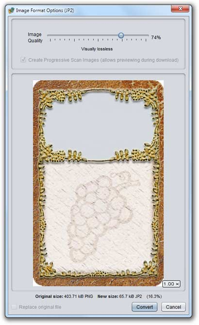

# Converting and compressing images

Image files can be converted and (re)compressed between the standard Strange Eons image formats (PNG, JPEG, and JPEG2000). You can also convert a few other image types (BMP, GIF) to one of the standard formats. Right click on the image file in the [project pane](um-proj-intro#the-project-pane.md), choose **Convert To**, then choose the desired output format.

> You can “convert” an image to its current format. This can be used to recompress the file with a different quality setting or change other format options.

When converting an image, a dialog appears showing the available options. As you alter the quality settings, a preview will update to show you what the new image will look like and allow you to compare the old and new file sizes. Once satisfied, choose **Convert** and the new file will be saved in the project next to the original.

## Conversion options

The dialog box offers the options below. Some of these may be disabled depending on the target format.

### Quality

The quality slider applies to *lossy* formats. A lossy image does reproduce the original image exactly. Instead, it tries to drop some details of the image in a way that allows the image to be compressed to a smaller file size. The types of details that are dropped are based on [which types of details the human visual system is least sensitive to](https://cgjennings.ca/articles/jpeg-compression.html). With lossy images, the lower the quality setting, the more information is lost, resulting in progressively smaller but less accurate files. 

> You may well wonder why anyone would bother with lossy formats if the image quality suffers. The answer is that lossy images of any substantial size are generally *much* smaller than their lossless counterparts. This can greatly reduce the size of whatever content you are producing. For example, if you are creating a plug-in, converting your images to JPEG2000 can greatly reduce the plug-in size (and therefore the download size) without significantly affecting the quality of the game components that the plug-in produces.

Be aware that each time you convert an image to a lossy format, more information is lost. Repeated conversion will therefore cause the image to degrade in quality each time it is performed. The best way to avoid this is to keep a “master” version of the image stored in a lossless format somewhere safe. You can then use this “master” image as the source for any conversions.

> Note that JPEG2000 files can be either *lossy* or *lossless*: setting the quality slider to 100% will engage their special lossless mode.

### Progressive Scan

This option is mainly useful if the image will be displayed on a Web page. It alters the order that the different parts of the image are stored in so that Web browsers can produce a progressively improving preview of the image as it downloads. PNG images are typically significantly larger if this option is selected. JPEG images can actually be slightly smaller. JPEG2000 images are always progressive (this is a side effect of how JPEG2000 compression works), although most Web browsers do not support displaying JPEG2000 images.

### Replace original file

This option, found at the bottom of the dialog, is only available when “converting” an image to the same format as the original file. If checked, the original file will be replaced by the converted file. Otherwise, a new file name will be generated by tacking a number onto the original file name.

## The image preview panel

Beneath the main conversion settings, the preview panel shows you what the converted image will look like. After moving the quality slider, the preview will update in a moment so that you can judge for yourself how much a given quality level degrades the image and whether the reduction in file size is worth it. As with other image viewer panels, you can zoom in and out using the mouse wheel if necessary.

Below the preview image is a comparison of the changes in file size, including the old size, new size, and percent change. Note that if the percent change is greater than 100%, the converted image will be *larger* in size than the original.

## Summary of target image formats

### PNG (`.png`)

The PNG format is designed to store line art efficiently. It has low overhead and can be read quickly, making it a good choice for storing small images such as icons. Converting to the PNG format in Strange Eons is always lossless, meaning that the compressed image will be identical to the original. PNG is widely supported by image editing software.

### JPEG (`.jpg`)

The JPEG format is designed to store photorealistic images efficiently. JPEG is a lossy format, meaning that the compressed image will not be identical to the original; if you compress and recompress the same file multiple times, even at the same compression setting, it will degrade in quality. JPEG images do not include an alpha channel. If the original image includes transparent or translucent pixels, *they will not convert correctly*. JPEG is widely support by image editing software.

### JPEG2000 (`.j2k`)

The JPEG2000 format is intended as a more capable replacement for the JPEG format. Although it has never been as widely supported, it has several advantages over JPEG. One key advantage is support for an alpha channel, so images with transparency and translucency work as expected.

Converting to JPEG2000 is *lossless* if you set the quality setting to the highest setting (100%); otherwise it is *lossy*. When in lossy mode, the final file size is proportional to the quality setting. If the file size is 10 kiB at 50% quality, it will be about 5 kiB at 25% quality. Lossy JPEG2000 compression is much improved over original JPEG; generally the loss in quality is negligible except at very low quality settings. When operating in lossless mode, it usually produces smaller images than the equivalent PNG image as well, unless the source image is very small.

> In some cases, lossy compression of very small images can fail. This is a side effect of how image quality is interpreted in JPEG2000. If this occurs, either switch to JPEG2000’s lossless mode or use the PNG format.

The main disadvantage of JPEG2000 compared to other formats is that the compression method is far more complex, which means that image loading takes longer. This is more noticeable on less powerful devices. However, Strange Eons caches most images once loaded, so it is generally not a huge problem in practice.

> Strange Eons only supports a subset of the full JPEG2000 standard, in part due to patent restrictions. If you have trouble loading a JPEG2000 image saved from another tool, your best bet is to first save it from that tool using another format (PNG is ideal), then use **Convert To** to create the JPEG2000 image right from Strange Eons.

## Converting Photoshop PSD files

Photoshop PSD (`.psd`) files are not directly supported by the **Convert To** action. Strange Eons does not regard them as image files because they are not simple bitmaps but rather a composite of layers and effects. However, most PSD files can be viewed and converted indirectly using the image viewer tool: double click the PSD file in the project to open it, then choose the **Save As** button. It is recommended that you start by saving the image as a PNG image since that is lossless. Once in PNG format, use **Convert To** as you would for any other PNG image to complete the conversion as desired.

## Reducing a plug-in's footprint

You can significantly reduce the download size of a plug-in by simply converting the image resources to high quality JPEG2000 images. Almost all images will compress smaller as JPEG2000s, the main exception being some small icons. The best targets are images with fine detail, like photographs or textured art. Start by setting the quality slider to about 74% and check the resulting file size. In most cases you won't be able to see any difference at this setting, but for small images you need to start higher to avoid artifacts. (You can also set the slider to 100% to reproduce the original image exactly, but the savings in file size is typically much smaller.)

Once you have replaced your original images with `.jp2`s, you should move the originals to another folder outside of the plug-in task so you still have them for reference but they will no longer be included in the final bundle. Use the [project search field](um-proj-search.md) to find instances of the old file names and replace them with their new `.jp2` counterparts.

> If you have a lot of small PNG icons to compress and their JPEG2000 counterparts are larger, use the [PNG Packer plug-in](https://github.com/CGJennings/se3docs/blob/master/Plug-in%20Authoring%20Kit/Project%20Examples/PNG%20Packer/resources/cgj/PNGPack.js) included with the [Plug-in Authoring Kit](dm-pak.md) to pack every PNG image in a folder with a single click.