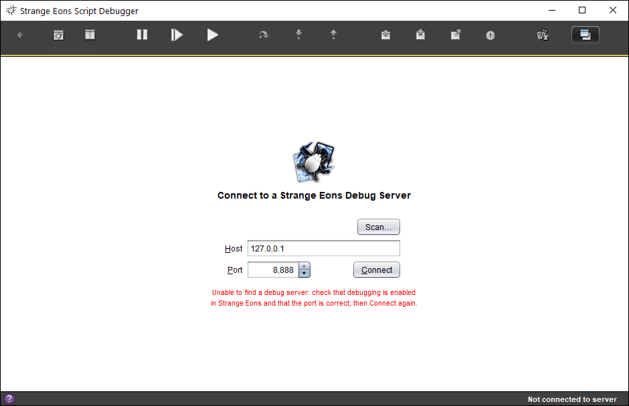

# Script debugger

Strange Eons includes a *source-level debugger* to help you find and solve bugs in your script code. It allows you to run scripts line-by-line and observe how the values of script variables change, what values your functions are returning, and what decisions are being made at branch points like *if* statements. This lets you verify whether your code is doing what you think it is doing, and if not, why not. This page will show you how to get the debugger running and provide some strategies you can use to fix (and prevent!) bugs.

## Setting up

The debugging system has two parts: a *client* and a *server*. The server runs inside Strange Eons. The client is a separate app that talks to the the server to get information about the state of the script system and pass on your debugging commands. It takes the information that it gets from the server and presents it to you in a sensible way.

To *enable debugging in Strange Eons*, follow the steps below. You only need to do this once.

1. Open the [Preferences dialog](um-ui-preferences.md) and choose the **Plug-ins** category.
2. Scroll down to the **Script Debugger** section and ensure that **Enable Debugger** is checked.
3. When the debugger is active, you will see a small bug icon in the upper right corner of the application window. Moving the pointer over the bug icon will display the information needed to connect to the debugger client.


Once you change these settings, you can continue using Strange Eons normally. You only need to start the separate debugger app (the *client*) when you actually want to use it.

## Starting a debugging session

Once debugging is enabled as described above, you can launch the client app to start a debugging session. There are a few different ways to start the debugger client: from inside Strange Eons, by launching it separately, and manually from the command line.

#### From the app

To *start the debugger from Strange Eons*, click on the little bug icon that appears when debugging is enabled. In the majority of cases, this will "just work."

> If clicking the bug doesn't work, you can fix how it launches the client by setting the `script-debug-client-launch` key to an appropriate command.

#### From the desktop

To *start the debugger by launching it as a separate app*, just double click its app icon as usual:


> Depending on how you installed Strange Eons, you might not have an app icon. In this case, start the debugger manually from the command line.

#### From the command line

To *start the debugger manually from the command line*, use a command similar to the following in the Strange Eons installation directory. (The command should be [similar to a command you might use to start Strange Eons itself](um-install-other.md), but with `debugger` replacing `strangeeons`.)

```bash
java -Xms64m -cp strange-eons.jar debugger
```

> When starting from the command line, you can append the options `--host` and/or `--port` to specify the address and port of the debug server you wish to connect to (as described below). If you are not sure where the server is located, you can use the `--search` option, which will scan the local host (or the specified `--host`) for debug servers and list any that it finds. This is similar to using the **Scan** button described below, except that results are printed to the console.


---

```
Host:         127.0.0.1, port 8888
ID:           21308.4b0d8096
Version:      build 4165 (3.2)
Test bundles: 

Host:         127.0.0.1, port 58765
ID:           28608.cc648ab8
Version:      build 4165 (3.2)
Test bundles: C:\Users\UserName\Documents\PluginProject\CoolGame.seext
```

This indicates that two debug servers were detected. The **Host** field identifies which host and port to use to connect to a particular server; the **ID** field is a unique string that can be used to help identify a specific instance of the app; the **Version** field describes which version of the app is running; and the **Test bundles** field lists the bundles that the instance has loaded in test mode, if any.

> **Tip:** You can also print this list from the app (if unblocked) by running the following line in the Quickscript window:  
> `arkham.Subprocess.launch("debugger", "--search").start();`

### Connecting to Strange Eons

A soon as the client starts it will try to connect with the server running in Strange Eons. This happens over a local network connection. If you are running Strange Eons on the same device and you have enabled debugging using the default settings, it will normally connect automatically within a few seconds.

(If the client connected automatically for you, you can [skip the rest of this section](#the-debugger).)

> Enabling the debugger *does not* expose Strange Eons to the entire Internet. In fact, you don't even need to be able to connect to the Internet for debugging to work. Using the default settings, it will only be visible to apps on the same device. There is, however, a preference option to **Enable remote debugging** that will let you debug Strange Eons using a copy of the debugger running on another computer. This can be convenient (for example, each app can have its own screen), but if you use this option you should also set up an appropriate firewall.

#### Manual connections

Rarely, you will need to connect to Strange Eons manually. For example, if a different app is already using the *port* that Strange Eons uses by default, then the debugger won't be able to find Strange Eons where it expects to. In that case you will see a screen like the one below. You will have to give the debugger a hand, but don't panic! It's easy:



To connect you just need to know the *host* and *port* to connect to. Fill these in, choose **Connect**, and the client will complete the connection.

The host is the device where the server is running. If you are using the default settings, this is just `localhost`. If you are allowing connections from other devices, then this is your device's IP address. The port is a specific address on your device where the debug server is listening for connections from a client. You can think of the host as being like the telephone number for a business, and the port being the particular extension where Strange Eons will pick up the phone. You can't easily guess the port number, but you can find it:

##### Getting the host and port from Strange Eons

Switch to Strange Eons and look for the bug icon  near the upper right corner. Hover over the icon and observe the note that pops up. It will say something like "Listening at localhost:8888". The part after the last colon is the port number (8888 in this case). The part before that colon (and after *Listening at*) is the host name. It could be a name or a string of numbers. In either case, enter this information in the appropriate fields on the connection screen in the debugger app, then choose **Connect**.


##### Scanning for servers

Sometimes you can't use the bug icon. For example, the Strange Eons user interface may be frozen if a running script has already been interrupted. Or, the main window might not be available yet if a plug-in script has been interrupted during startup. And sometimes you may have multiple copies of Strange Eons open, each with its own debug server running (for example, when testing a plug-in). You can search your device for debug servers from the connection screen by choosing **Scan**. A small dialog box will open and the client will start scanning. The scan consists of checking the ports on your device for a debug server, which can take *several minutes* to complete.  However, you do not usually have to wait for the entire scan. As each debug server is discovered, it is added to the list. You can connect to a listed server at any time by choosing its **Connect** button.


Each discovered server will be listed with:

1. A unique ID string. The string for a given instance of Strange Eons never changes. You can use this to differentiate servers if needed.
2. The host and port number that will connect to that server.
3. The build number and version number.
4. If the server was started in plug-in test mode, the file names of the plug-in bundles it is testing.

> **Important:** During scanning, the progress bar may appear to stall for long periods of time. This is normal. It usually indicates that the scanner has found a port that is connected to some *other* kind of server. The client is asking it if it is a debug server, but it is not saying anything back so the client waits a while for an answer before moving on.

#### Switching between multiple servers

If you have multiple instances of Strange Eons running, each will have its own debug server. To switch between multiple servers, choose the back arrow from  the debugging screen. This will take you back to the connection screen. From here, enter the host and port for the target instance and press **Connect** to switch servers.

## The debugger

Once the debugger has connected to Strange Eons, you can use it to inspect and step through scripts. To step through a script, the script must first be *interrupted*. There are several ways to do this, depending on where you are when you start out. Here are some:

> When a script is *interrupted*, in most cases Strange Eons will appear be frozen. It isn't really, it is just waiting for the script, and since the script is paused Strange Eons is effectively paused, too. As soon as you let the script finish from the debugger, Strange Eons will "thaw" again and run normally.

To *interrupt a script at the next opportunity from the debugger*, click the  **Pause** button in the tool bar along the top of the window.

To *debug a script from the script editor,* choose the **Debug** command instead of **Run**. The script will start to run, and it will be interrupted at the first opportunity.

To *debug the script for a game component in an installed plug-in*, from the [**New Game Component** dialog](um-gc-intro.md), choose the desired component and then Shift+click the **Create** button.

To *debug the current Quickscript*, click **Debug Script** in the Quickscript window.


### Stepping through the script

The following tool bar buttons let you run the script one step at a time so you can watch everything that happens:

 **Step Over**  
Run just the highlighted line (the point of the interruption), then interrupt the script again.

 **Step In**  
Run the highlighted line like **Step Over**, but if the line calls any functions, also step through those.

 **Step Out**  
Finish running the current function, then interrupt the script again as soon as it is done.

Once you are done stepping through the script, use one of the following tool bar buttons to resume:

 **Continue**  
Continues running the script normally until it completes or it is interrupted again.

 **Walk**  
Continues running the script, but runs it slowly, pausing briefly and highlighting each line as it goes. This can be useful for novice programmers to better understand the flow of execution.

### Interrupting on certain events

The debugger can interrupt scripts automatically when certain events occur. The most common such event is whenever a certain line in the script is reached. Such lines are called *breakpoints*, and you can set as many as you like. Suppose you are stepping through some code and you reach a loop that will run 1000 times. It would be tedious to step through all 1000 runs of the loop, so you set a breakpoint just after the end of the loop and then click  **Continue**. Strange Eons will zip through the loop, then stop again at the breakpoint.

To *set a breakpoint*, first, choose the script from the **Scripts** panel in the debugger if necessary. Next, scroll down to the line you want to stop on in the **Source** panel. The line number of suitable lines will appear as a hyperlink. Click the link to set a breakpoint. The background of the line number will turn pink.

> If your script does not appear in the **Scripts** panel, you may need to start it once to make Strange Eons "aware" of it. For example, use the **Debug** or **Run** commands from the script editor.

To *clear a previously set breakpoint*, click the line number again. It will turn back from pink to grey.

Besides breakpoints, the tool bar has toggle buttons that let you interrupt scripts on some other common events:

 **Break on Function**  
Interrupts a script whenever any function is called.

 **Break on Return**  
Interrupts a script whenever any function returns.

 **Break on Throw**  
Interrupts a script whenever an **Error** is thrown using the `throw` keyword.

 **Break on Debugger**  
Interrupts a script whenever a `debugger;` statement is reached. This is the only break type that is turned on by default.

### Watching how variables change

When a script is interrupted, you can examine the current value of variables and expressions.

To *examine the current value of a variable in the **Source** panel*, hover over the identifier with the mouse pointer.


To *track how a variable or other expression changes over time*, click **New watch** in the **Watch Expressions** panel, then enter an expression to track, such as `x` or `diy.name` or even `(pixels[x][y] & 0xff)/255`. Each time you take another **Step** or otherwise interrupt the script, the expressions will be re-evaluated and their string values displayed in the table.

To *edit an existing watch expression*, click the expression, edit it, and press <kbd>Enter</kbd>.

To *stop tracking a watch expression*, click on its **Value** column and press <kbd>Delete</kbd>.

### Exploring the local scope

A *scope* is the set of variables and other identifiers that can be "seen" from a given point in the script. For example, suppose you write a function that declares a variable named *horsies*. That variable is only visible to other code defined inside of that function, and only after it is declared. If you refer to it outside of the function you will get an error.

```js
function equestrian() {
    let horsies = "neighbours";
    // OK
    println(horsies.substring(0,5))
}
// ERROR, no "horsies" variable is visible (in scope) here
println(horsies.length);
```

Scopes in JavaScript can get weird, but generally, if you avoid the `var` keyword then whenever you see braces `{` ... `}` a new scope has been created. The code inside the braces can refer to the variables declared outside of the braces, but not the other way around.

```js
let a = 1;
{
    let b = 2;
    // this will work fine
    println(a+b);
}
// this will not; b effectively ceased to exist at the }
println(a+b);
```

To *explore the graph of identifiers that are in scope (and their values)*, open either the `<scope>` or `<this>` branch of the **Local Scope** panel. To explore the children of the value assigned to any of the revealed identifiers, open that branch in turn. For example, if a variable has an object assigned to it, you can open that variable's branch to see a list of the names of that object's properties.

To *go to specific location in the graph*, click the **Property** field and enter the path using dot notation, for example, `bindings.component` would locate `bindings` under the `<scope>` branch, and if found, open that branch and then locate `component`.

Continuing from the example above, if the script was interrupted inside the `equestrian()` function, you would find `horsies` listed under the `<scope>` branch of the tree once the `let horsies ...` line completed.

### Examining the call stack

It is common for one function to call another function, and that function to call another function, and so on. And it is often the case that while a problem is *discovered* deep inside such a chain of function calls, the actual *source* of the problem is higher up the chain: function A calls function B with bad data, function B passes the bad data on to function C, and function C tries to use the bad the data and goes haywire. It is therefore useful to be able to go back up this chain of calls to see where in the code a function is being called from. The **Call Stack** panel lets you do this.

To understand this panel, it helps to know the term *call site*. A call site is simply *a location from which a function is called*:

```js
function binco(n,k) {
    // Each of these let statements is a call site
    // for the factorial function
    let nFact = factorial(n);
    let kFact = factorial(k);
    let dFact = factorial(n-k);
    return nFact / (kFact * dFact);
}

// This is the factorial function
function factorial(n) {
    if( n > 1 ) {
        // This is also a call site for
        // the factorial function!
        return factorial(n-1) * n;
    }
    return 1;
}

// And this is a call site for the binco function
// (and also for the println function)
println(binco(4,2));
```

When a script is interrupted, the **Call Stack** panel will show a list of one or more script locations. The first entry is the point of interruption: the line that will be run if **Step Over** is clicked. The second entry in the list (if any) is the call site of the function that contains the point of interruption. That is, the location where the function that is currently interrupted was called from. The third entry is the call site for the function that contains the call site listed as the second entry, and so on. (If this seems confusing, take a moment to play with the call stack when you have a script interruption and there are 4 or 5 entries in the list!)

To *examine a call site in the call stack and its scope,* click the relevant entry in the **Call Stack**. The **Source** panel will switch to the call site, the **Watch Expressions** will be re-evaluated using the scope of the call site, and the **Local Scope** panel will be changed to reflect the contents of that scope.

To *return to the point of interruption and its scope*, click the top entry in the **Call Stack**. Or, click any of the **Step** buttons in the tool bar.

## Practicing with an example

Let's try putting this together with some practice:

1. If you haven't enabled debugging in Strange Eons yet, [do so now](#setting-up).
2. Select and copy the "binco" script in the previous section.
3. Switch to Strange Eons and open the Quickscript window (in the **Toolbox** menu).
4. Delete any existing script (<kbd>Ctrl</kbd>+<kbd>A</kbd>, <kbd>Delete</kbd>), then paste in the "binco" script (<kbd>Ctrl</kbd>+<kbd>V</kbd>).
5. Click on **Debug Script** in the Quickscript window.
6. If the debugger app is not already running, Strange Eons will try to start it automatically. If it doesn't come up in a few seconds, [start it yourself](#starting-a-debugging-session).
7. Once [connected](#connecting-to-strange-eons), the debugger will show your script and the last line will be highlighted because that is where the script is interrupted.
8. Click on **Step In**. Since the last line is a function call, we will step inside of that function. Now we are at the function declaration for the `binco()` function, because that is the function we *stepped into*.
9. Click on **Step Over**. This will go to the next line with code on it, `let nFact = factorial(n);`.
10. Click on **Step Over** again. Again this stops on the next line, `let kFact = factorial(k);`. Unlike with **Step In**, we did not step through the `factorial(n)` call line by line. We just called the function normally and got the result.
11. Since the last line assigned the value of `factorial(n)` to the variable `nFact`, that variable has a value now. Hover the mouse pointer over the `nFact` variable in the **Source** window. A note pops up showing that the value of this variable is now `24`, the result of the function call.
12. Now hover the mouse over the `kFact` variable on the next line. This variable is `undefined`. The line is about to run, but it hasn't run yet, so `kFact` has not been assigned a value yet.
13. Click on **Step In**. Now we have stepped into the `factorial()` function, which was called from the previous line.
14. Notice that the **Call Stack** has three entries. The top entry is where we are right now. The next entry is the location that the `factorial()` function was called from (inside the `binco()` function). The last entry is the location that the `binco()` function was called from, the last line of the script. Click on each entry in turn and the **Source** window will show that location.
15. The function we are in revolves around the variable *n*. Let's watch what happens to it. Click **New watch** in the **Watch Expressions** panel, and enter the value `n`. An new row is added that shows the expression `n` and its current value, `2`. (Recall that this function was called with the value of `k`, which was `2`.)
16. Click **Step In** until you reach the line `return factorial(n-1) * n;`.  Notice that this line calls the `factorial()` function from inside the `factorial()` function.
17. **Step In** to it, and you will be back at the top of `factorial()`, but notice that now there is another entry in the **Call Stack** and the value of `n` in the **Watch Expressions** is now `1`. 
18. Click **Step Over** so to reach the `if` statement. Now click **Step Over** again and you will see that the test in the `if` statement evaluated to `false`. You know this since, if the expression was `true`, the debugger would have stopped at the statement inside the braces `{` ... `}`.
19. As an exercise, add a new watch expression using the condition inside the `if()` statement (`n > 1`).
20. Click **Step Out** and we will leave this function. Notice that back in the `binco()` function, the watch expression shows that `n` is `4`. This is a different `n` (in a different scope) than the one inside the `factorial()` function. Namely, it is the value passed to the function as the argument `n`. You can click the bottom entry of the **Call Stack** to verify that this was called as `binco(4,2)`, so indeed `n` should be `4` and `k` should be `2`.
21. Set a **breakpoint** on the next line (Line 7) by clicking its line number link. It should turn pink.
22. Click **Continue**. The script will run normally until it reaches the breakpoint, then it will stop again. It just so happens that the effect is the same as if we had clicked **Step Over**, but it didn't have to be. As long as the breakpoint is set, the script will be interrupted *whenever it reaches this line*.
23. If we kept stepping, we would return from this function back to the line `println(binco(4,2));`. Because we *stepped into* the call to `binco()`, this line isn't done yet: it still has to call the `println` function and pass it the result of the call to the `binco(4,2)` function. But suppose we have learned what we wanted to learn, and we want to finish up. Click **Continue** to let the script complete normally.
24. Back in Strange Eons, what do you think will happen if you click **Run Script**? Try it.
25. It may surprise you that the script gets interrupted again, but in a different spot. This is because *there is still a breakpoint set*. In the debugger, remove the **breakpoint** by clicking the line number again. Click **Continue** to let the script complete normally. Then try clicking **Run Script** again to verify that it runs uninterrupted.

## Debugging strategies

Let's say you have a plug-in that isn't behaving as you expect. How do can you fix it? To answer that, let's first describe the situation more clearly. When you have a bug in your script, you don't know right away what the cause of the bug is. Instead, you have signs or symptoms that the script is not behaving as intended. You have to work backwards from the symptoms to the cause. This may not be easy: there might be more than one possible cause that for the symptoms you are observe, and the symptoms may be far removed from the root cause. Here are some basic strategies that can help you find that root cause:

### Keep it together

To fix a bug you will need to engage the logical and creative parts of your mind. Both of these get "deactivated" when you are upset, which makes debugging that much harder. Take a deep breath. Try to approach the process like you are solving a puzzle: solving problems is an inseparable part of the programming process. When you find that you are upset, research shows that naming what you are feeling can help re-engage the rational part of your mind: "I'm frustrated because I keep stepping through this and I can't find where the problem is."

### Learn to reproduce the bug reliably

Sometimes a bug manifests intermittently. In such cases, a good strategy is to experiment with the program to look for cases where the symptoms do and do not appear, until you know the exact combination of conditions are necessary to reproduce the bug. This will not only help you to form hypotheses about the underlying cause, but it also gives you a reliable way to test whether the problem still occurs after you think you have fixed it.

### Narrow down the problem code

The source of a bug often proves elusive. In the end it may come down to a single character hidden somewhere in hundreds or thousands of lines. It is therefore vital to systematically narrow down the code that it may be hiding in. The debugger is useful here, as you can step around line by line or function by function until you see the necessary conditions to produce the bug. Keep an eye on the values of suspect variables by adding them to the watch list. Other tips for identifying the problem code:

- Suspect the most recently written code first. It has been tested the least.
- Suspect code close to the symptoms first. By tracing backwards from the symptoms, you can identify intermediate causes and work your way back to the root cause.
- Sometimes you can find a well-hidden bug through repeated *bisection*: Identify a known good point at which you know the bug *is not* present, and a known bad point at which you know the bug *is* present. Then divide the code that gets executed in between those two points roughly in two. Put a breakpoint there, then see if the bug has shown up at that point. If yes, repeat with the code between the safe point and the breakpoint. If no, repeat with the code between the breakpoint and the known bad point.

### Form and test hypotheses 

As you explore and experiment during debugging, different hypotheses about the root cause may occur to you. You'll need to test these hypotheses in order to narrow down the possible causes. Sometimes this is simple, such as using the debugger to change the value of variable. Sometimes it is more involved, such as writing a little script in the Quickscript window to test your assumptions.

### Verify all fixes

Once you think you have fixed the root cause, always verify that the bug no longer manifests (and that your fix didn't add new bugs of its own!).

### Early detection and prevention

It is easier to find and fix problems while you write new code than it is to hunt down bugs after the fact. Try to break your program into small functional units that can be reused, and make them into functions. (This is a skill that you'll get better at with practice.) Then, thoroughly test each function to ensure that it behaves as expected. Make sure that you test the function with typical cases, edge cases, and invalid cases. An edge case is one that uses an extreme value for the possible inputs: if your function expects a non-negative number, what happens if you pass `0`? Or `Infinity`? An invalid case is one that shouldn't work. What happens if you pass `-1`? Or `null`? Or a `string`? If you detect illegal inputs and throw a descriptive Error, it can help you track down the source of buggy code. Here is an example:

```js
function setId(id) {
    // use a regular expression to verify that id matches the pattern we expect
	if(!/(\d|\_)+/.test(id)) {
	    throw new Error("id must consist of digits and _: " + id);
	}
	this.id = id;
}
```

#### Errors and script traces

When an error (or other exception) is thrown but not caught by your script, a *script trace* will appear in the script output window. This will show the chain of function calls that led to the error being thrown, along with source file names and line numbers of those calls. You can click on these lines in the source output window to open the source file at the indicated line. (Depending on where the source file is located, it may be opened read-only so that you cannot edit it.) If you use the technique above to throw your own errors, the second element in the script trace will be the function that passed you the the invalid argument, so you can start your investigation there.

## Tips

### A script is "stuck"

A rogue script can cause Strange Eons to stop responding. For example, it is easy to accidentally create an infinite loop that will run forever. However, things might not *actually* be stuck. It may be that your script reached a breakpoint or a `debugger;` statement and it is waiting for you to resume the script from the client app. Try connecting the client first to check the situation out (use **Scan** if needed). Choose the **Pause** button and wait to see if a script gets interrupted. You may be able to simply continue the script or modify the state of some variables to work around the cause of the issue. Failing that, you can force the connected Strange Eons instance to close.

If the debugger is not running, you can forcibly quit Strange Eons.  Use <kbd>Ctrl</kbd>+<kbd>Alt</kbd>+<kbd>Delete</kbd> on Windows, <kbd>Command</kbd>+<kbd>Option</kbd>+<kbd>Escape</kbd> on macOS, or the **System Monitor** on Linux.

If the issue was caused by a plug-in, you can prevent Strange Eons from trying to start it by opening the [user folder](um-install-user-folder.md), and either deleting or temporarily renaming the problem plug-in (for example, add a `.x` extension).

### Debugging an extension

To debug an extension script that fails while the app is starting, you can follow these steps:

1. Add the line `debugger;` at the top of the extension plug-in script.
2. [Build the plug-in bundle](dm-first-plugin.md#building-the-plug-in-bundle), then right click on it and choose **Test Plug-in**.
4. Restart the app. When it loads the extension plug-in script and reaches the `debugger;` line, the script will be interrupted. Progress on starting the app will stop the script completes.
4. Start the debugger client, if it is not already running.
5. The client will likely connect to the main Strange Eons debug server, not the plug-in test instance. You will need to find and enter the correct host and port to connect. There are a few ways to do this:
   1. Look at the script output window in the main Strange Eons app. Amongst the logging information will be a message like the following: `WARNING: default debug server port in use; switched to port 50,429`. Enter the port number on the connection screen and **Connect**.
   2. From the **Connect** screen, press **Scan** and wait. Multiple servers will be detected, one at a time, one for each running instance of Strange Eons. You can identify the test instance because it will list the test plug-in bundle name (it will be using a temporary file name generated by the test command).
6. Once connected, you can step through the extension script as you would with any other debugging. Once the script completes, the test instance will be complete its startup process.
