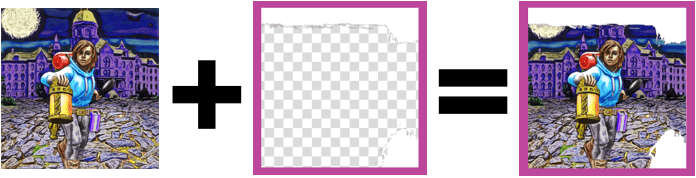
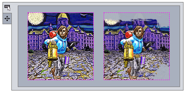

# Add portraits to game components

A [portrait](um-gc-portraits.md) is a user-supplied image that appears on a game component, such as a card illustration. There are two ways to add portraits to a [DIY component](dm-diy.md). Using the simple method, you add support by defining some additional keys for the component. The advanced method lets you handle everything yourself for maximum flexibility. Both methods are covered below.

## Simple portrait handling

DIY components use a base key name to look up settings such as the template image used by a sheet. Support for portraits can be added by defining some additional keys formed by appending a suffix to the same base name.

### Setting keys

Keys with the following suffixes must be defined to enable simple portrait handling and cause a portrait to appear:

`-portrait-template`  
A resource path that points to a default image for the portrait.

`-portrait-clip-region`  
The region where the portrait will be drawn on the component face.

You may optionally define keys with the following suffixes to customize the location and scale used by the default portrait image. If not specified, the portrait will be centered in the clip region and  scaled to cover it. The values can be set by copying them from the portrait editing control with the default image loaded.

`-portrait-scale`  
The scale factor to apply to the default image, relative to the scale that would have been calculated by default (1=100%).

`-portrait-panx`  
The number of units to shift the default portrait image horizontally; positive values move the image to the right.

`-portrait-pany`  
The number of units to shift the default portrait image vertically; positive values move the image downward.

### DIY properties

The following properties of the DIY instance (passed to your functions as `diy`) can be modified to alter the default portrait-drawing behaviour:

`diy.portraitBackgroundFilled`  
When `true` (the default), the clip region will be filled with solid white before the portrait is painted. If set to `false` any graphics drawn behind the portrait will remain visible.

`diy.portraitScaleUsesMinimum`  
When set to `false` (the default), the default scale of a portrait is chosen so that the portrait is scaled as small as possible while still completely covering the clip region. When set to `true`, the default scale is chosen so that the portrait touches either the left/right or top/bottom edges of the clip region, but not necessarily both, so that no part of the image lies outside of the clip region.

`diy.portraitClipping`  
When `true` (the default), the portrait image will be clipped to the clip region so that any part of the image that would lie outside of the region is not actually drawn. When set to `false`, the region is used to determine where the image is drawn and what its initial scale should be, but not to clip it. The entire image will be visible as long as it actually fits within the bounds of the component face.

### Card-and-marker components

For components set to `FaceStyle.CARD_AND_MARKER`, a matching set of keys and properties are used to configure the marker. These are formed by replacing `-portrait` with `-marker` in the key names above (for example, `-marker-clip-region`), and by replacing `portrait` with `marker` for properties (for example, `diy.markerBackgroundFilled`). There is no key `-marker-template`, since the marker uses the same image as the main portrait.

### Drawing the portrait

When using the simple method, an editing control will be added to the editor tab automatically. You do still need to add code to paint the portrait, however. This is done by calling the sheet's `paintPortrait` method. The following code could be used to paint a portrait, then paint a template image over top of it:

```js
function paintFront(g, diy, sheet) {
    sheet.paintPortrait(g);
    sheet.paintTemplateImage(g);
}
```

For this code to work as expected, the template image must have a transparent window cut out of it for the portrait to show through, like this:



If the template did not have a transparent window, you could reverse the order of the statements to draw the portrait over the template.

## Manual portrait handling

If you choose to handle portraits yourself, you will also need to create the related support structures, such as creating a `PortraitPanel` to edit the portrait features and providing implementations of the `PortraitProvider` interface so that Strange Eons can learn what it needs to know about the portrait. The API provides helper classes to simplify this process, but it will involve more work than the simple method. Here are some of the situations that would justify this effort:

1. You want the component to display more than one portrait.
2. You want to enable non-default features, such as portrait rotation.
3. You need to customize the *clip stencil* used in the portrait panel. By default, the area of the template image under the clip region is examined for transparent pixels. If any are found, then this region is used as a mask when drawing the portrait in the portrait panel. This image shows a portrait panel editing a portrait without (left) and with (right) a clip stencil derived from the template above:



### Enabling custom handling

To enable custom portrait handling, enable it on `create` (and, [if this is a change from a previous release](dm-compatibility.md), in `onRead`):

```js
diy.customPortraitHandling = true;
```

When enabled, you must also add two new functions to the DIY script. These implement the [PortraitProvider](assets/javadoc/ca/cgjennings/apps/arkham/component/PortraitProvider.html) interface and are called as needed to access the component's portraits:

```js
function getPortraitCount() {
    // returns the number of portraits
}
function getPortrait(index) {
    // returns a portrait object for portrait[index]
}
```

The first function simply returns the total number of portraits that your component will use. These portraits will be numbered from 0 to `getPortraitCount()` - 1, inclusive. The `getPortrait` function is passed an index in this range and returns a [Portrait](assets/javadoc/ca/cgjennings/apps/arkham/component/Portrait.html) instance that represents that portrait's configuration and state. You can create your own Portrait implementation if you wish, but normally you will use the [DefaultPortrait](assets/javadoc/ca/cgjennings/apps/arkham/component/DefaultPortrait.html) class.

### Creating DefaultPortraits

In the `create` function, create a DefaultPortrait instance for each portrait the component will have:

```js
useLibrary('diy');
importClass(arkham.component.DefaultPortrait);

var aPortrait;
var anotherPortrait;

function create(diy) {
	// ...
    aPortrait = new DefaultPortrait(diy, aKeyBase, allowRotation);
    anotherPortrait = new DefaultPortrait(diy, anotherKeyBase, allowRotation);
    // ...
}

function getPortraitCount() {
    return 2;
}

function getPortrait(index) {
    return index === 0 ? aPortrait : anotherPortrait;
}

// ...
```

#### The setting key base

The key base parameters are strings, the base name of a setting key that will be combined with suffixes to look up settings that determine how the portrait will behave. This is just like a simple DIY portrait, except that you can pick any base you want for the setting key.

#### Rotation support

If the `allowRotation` argument is `true` then the user will be allowed to rotate the portrait as well as scale and pan it. In this case, you must define an additional setting:

`-portrait-rotation`  
Specifies the default rotation used by this portrait, in degrees, with positive angles turning anticlockwise.

#### Painting options

DefaultPortrait instances also support the same painting options as standard DIY portraits, without the `portrait` prefix: `backgroundFilled`, `scaleUsesMinimum`, and `clipping`.

#### Faces to paint

Each default portrait must be told which faces it will be appear on by passing it an array of face indices. For example:

```js
// appears on front and back faces
aPortrait.facesToUpdate = [0,1];
// appears only on the back face
anotherPortrait.facesToUpdate = [1];
```

#### Completing setup

Once you have finished setting up a DefaultPortrait, you must call its `installDefault()` method to read in and apply the initial values using your setting keys.

### Painting the portrait

If necessary, you can get the portrait's current image, scaling, pan, and rotation values from the portrait instance and paint it yourself. However, DefaultPortrait provides a painting method that will nearly always be sufficient:

```js
let renderTarget = sheet.getRenderTarget();
aPortrait.paint(g, renderTarget);
anotherPortrait.paint(g, renderTarget);
```

### Adding save file support

Custom portraits are not automatically read and written to save files: you must extend the save file yourself using `onWrite` and `onRead`. This is trivial if you are using DefaultPortrait:

```js
function onWrite(diy, oos) {
    oos.writeObject(aPortrait);
    oos.writeObject(anotherPortrait);
}

function onRead(diy, ois) {
    // make sure you read and write them in the same order,
    // or you'll change which portrait is which
    aPortrait = ois.readObject();
    anotherPortrait = ois.readObject();
}
```

### Adding panels to the editor

Portraits are typically edited using a standard control, the [PortraitPanel](assets/javadoc/ca/cgjennings/apps/arkham/PortraitPanel.html). Like other interface controls, the [uicontrols](assets/jsdoc/uicontrols.html) library includes a function to help you create them:

```js
function createInterface(diy, editor) {
    // ...
    let aPortraitPanel = portraitPanel(diy, 0);
    aPortraitPanel.panelTitle = "A Portrait";
    let anotherPortraitPanel = portraitPanel(diy, 1);
    anotherPortraitPanel.panelTitle = "Another portrait";
    // add panels to a layout container
    // ...
}
```

There is no need to add a portrait panel to your Bindings instance. The panel will handle the binding itself. You set this up when you set the `facesToUpdate` property.

### Customizing the panel's clip stencil

The shape of the portrait frame shown in the panel is defined by a clip stencil. This is an image the same size as the portrait's clip region. The alpha channel (transparency) of this image defines the clip stencil: where it is opaque, the portrait will not show through; where it is transparent, the portrait will show through. If the portrait area is partially obscured by artwork that is drawn overtop of it, you should set an appropriate stencil so the user can adjust the portrait more accurately.

If the frame is defined by an image which is drawn directly over the portrait area, and if that image is the same size as the portrait's clip region, you can simply set that image as the clip stencil. Otherwise, DefaultPortrait includes helper methods you can use to create the stencil:

```java
BufferedImage createStencil(BufferedImage template, Rectangle portraitRegion)
BufferedImage createStencil(Settings s, String templateKey, String portraitRegionKey)
```

Both of these take an image and a region that describes the portion of the image that covers the portrait area; both return a suitable clip region stencil. The first version is passed an actual image and region rectangle. The second version is passed a source of settings (use `diy.settings`) and setting keys used to locate an image and region. To get behavior similar the simple portrait handling behaviour, pass the template image and portrait clip region.

Once you have a clip stencil image, you can apply it to the portrait using code like this:

```js
let stencilImage = createStencil(sourceImage, region);
aPortrait.clipStencil = stencilImage;
```

Assigning null as the clip stencil will clear any stencil, leaving the portrait fully unmasked in the portrait panel. The stencil image is not saved as part of a DefaultPortrait; it should be recreated and assigned every time as part of `createInterface`.

### Linking portraits

You can create a DefaultPortrait that is *linked* to another portrait. This is similar to the marker portrait of a character-and-marker component: the second portrait will have its own scale, pan, and rotation as the first portrait but will take its image from the portrait it is linked to. To create a linked portrait, pass the parent portrait and base key in the constructor:

```js
aPortrait = new DefaultPortrait(diy, aKeyBase, allowRotation);
linkedPortrait = new DefaultPortrait(aPortrait, linkedKeyBase);
```

The associated PortraitPanels will detect the relationship between the linked portraits and behave accordingly.