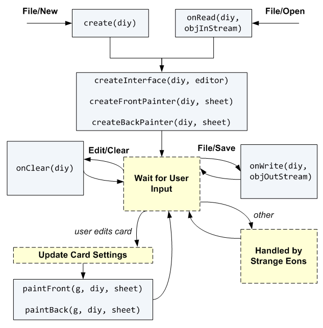

# Create new DIY game component types

This section focuses on creating new game component types using script code. Scripted game components are also known as *DIY components*, and the infrastructure for creating them is generally called the *DIY system*.

> If your card design follows a fairly standard layout of including a name, picture, and some descriptive text, you might want to look into the [prefab library](dm-diy-prefab.md), which lets you create a DIY script without having to write code.

With DIY components, you have complete control over how the card is drawn and how design options are presented to the user. That freedom does mean putting in some effort on your end, and it can look a little daunting at first, but once you get going you’ll soon get the hang of it.

> It is also possible to implement new components with compiled code. Most of the material here still applies if that is your goal. The main difference is that you would implement/subclass the relevant classes directly ([`GameComponent`](assets/javadoc/ca/cgjennings/apps/arkham/component/GameComponent.html), [`Sheet`](assets/javadoc/ca/cgjennings/apps/arkham/sheet/Sheet.html), and [`AbstractGameComponentEditor`](assets/javadoc/ca/cgjennings/apps/arkham/AbstractGameComponentEditor.html)). The purpose of the DIY system is to bridge this gap for script writers in more accessible way.

There are two aspects to creating a DIY component. The first is setting up the needed infrastructure, and the second is writing the actual script for the component.

## Setting up the infrastructure

New game components are always part of an *extension* plug-in, the kind that is loaded when Strange Eons starts up. That’s because it’s the only time you can register new component types. Your plug-in bundle will have one script file for the plug-in itself, and a separate script file for each new game component.

If your components are for a new, previously unsupported game, one of the jobs of your plug-in script will be to [register that game](dm-register-game.md) so you can mark your new components as belonging to it.

Likewise, the plug-in script is used to register each of your new component types with Strange Eons so it knows what they are called and how to create them (in this case, which of your script files to use for each component).  You do this in your plug-in by registering a [class map file](dm-res-classmap.md). The class map file is a separate, simple, text file that lists each new component type and provides the information needed to create it.

If you are providing your own fonts, the plug-in script is also where you will want to [register them](dm-res-font.md). You‘ll also set up your language databases here if you are providing your plug-in in multiple languages.

As you work you will also add other resources to your plug-in folder, such as [images](dm-res-image.md). And you may want to use [settings files](dm-res-settings.md) to store default configurations and other options for your components (though this is optional). [There is a whole section of this manual devoted to working with the different kinds of resources.](dm-resources.md)

> There are several examples in the [Plug-in Authoring Kit](dm-pak.md) that you can refer to for examples of how these parts fit together.

## The DIY script

The heart of each new component type is its DIY script. This is where you will define what the features of your component are, how the user can change them, and how they get painted onto your component’s different faces.

**Note:** From here on let’s agree to call your new component a “card.” Most new components *are* cards, after all, and being concrete will make the discussion easier to follow.

Like any script file, a DIY script can define functions that it calls to perform some task. In addition, there are certain functions with specific names that Strange Eons will call when it needs your card to handle certain tasks. We’ll look at each of these in detail, but let’s start with the big picture.

### Life cycle of a DIY card

The following diagram illustrates how Strange Eons will call into your script. The first function to be called will always be one of the two shown at the top of the diagram, `create` or `onRead`.



When a new instance of your card is created for the first time, the script’s `create` function is called. This is only ever called once for each new card: if the user abandon’s the card without saving it, then that particular instance is lost. On the other hand, if they save the card to work with it again later, your `onOpen` function is called when they reopen the file.

No matter how the card gets (re)created, Strange Eons will then call a series of functions to let you set things up. If the card is being opened for editing, then `createInterface` is called so you can create the controls the user needs to edit the card and link them up to the card’s state. In either case `createFrontPainter` (and then, if applicable, `createBackPainter`) will be called so you do any set up you need to perform in order to draw the card faces.

If all Strange Eons needs to do is get images for your card faces (for example, if you are adding a card to a deck), then it will call `paintFront` (and, if applicable, `paintBack`) so you can draw the images, and that’s it.

> Notice that only the `create…` functions that are needed actually get called. For example, `createInterface` is only called if Strange Eons actually needs an editing interface. Organize your set up code accordingly. For example, don’t set up something that you need for painting in `createInterface`, and don’t refer to an editing control that you define in `createInterface` from `paintFront`. If you do, your script will fail when the card is used in ways you didn’t anticipate.

The more complex case is that the user is editing your card. In that case, an editor for the new card will be added to the open document tabs. The editor will contain all of the controls you set up in `createInterface` as well as a preview area. Strange Eons will call your `paintFront`/`paintBack` functions to create the initial preview images. Then it wait for the user to make changes.

If the user saves the card, the `onWrite` function is called so that you can write custom data. (Usually none is needed and this function is empty.) If the user clears your card to a default state using the **Edit/Clear** menu item, your `onClear` function is called so that you control what that means. If the user interacts with one of your controls, then Strange Eons will update the state of your component according to the rules you set up earlier (when `createInterface` was called) and then repaint the preview by calling `paintFront` and/or `paintBack` depending on what needs to be updated. Any other actions the user performs are handled for you automatically by Strange Eons.

### Script functions in detail

Now that you have an overview of how a DIY component operates, let’s look at each function in more detail. For more information, refer to the [diy script library documentation](assets/jsdoc/diy.html), and the corresponding [`ca.cgjennings.apps.arkham.diy`](assets/javadoc/ca/cgjennings/apps/arkham/diy/package-summary.html) Java package.

#### `create(diy)`

This function is called exactly once, when the component is first created. You have two jobs to do before it returns. First, the new DIY object that you are passed has a number of basic properties that will determine the component's essential character. You can only change those attributes in this function or in `onRead`. Second, you must set initial values for all of the component attributes that the user will be able to edit later (like *name*, *gender*, *speed*—whatever is appropriate for the card).

Key properties that you need to set include the face style, the front and back template keys, and the portrait key (if any). The *face style* is set by assigning [certain values](assets/javadoc/ca/cgjennings/apps/arkham/diy/DIY.FaceStyle.html) to `diy.faceStyle`. The most common values are:

`FaceStyle.ONE_FACE`  
For cards with only one face (a front but no back).

`FaceStyle.PLAIN_BACK`  
For cards with a plain back (a fixed image that SE draws for you).

`FaceStyle.SHARED_FACE`  
For a card with two identical faces.

`FaceStyle.TWO_FACES`  
For a card with two different faces (you get to draw both sides).

`FaceStyle.CARD_AND_MARKER`  
For a card with three faces (actually four in practice) interpreted in a specific way: the first two faces are the front and back of a card, while the third face is one side of a marker. (The maker will have an identical obverse side.) If the component has a *portrait key* set (see below), then the card and marker will share the  same portrait image, but each can adjust the image with a separate position and scale.

`FaceStyle.FOUR_FACES`  
For a component with four faces; for example, two closely related cards or a folding panel.

The *front template key* defines the base name for a family of settings keys. This family of keys will determine the basic look, shape, and physical size of the front face of the component. The key is set by assigning a string to `diy.frontTemplateKey`. Strange Eons will use this base to form a *set* of settings keys that store the information needed to define the look of the face. The most important of these are as follows:

`diy.frontTemplateKey` + `"-template"`  
This is the resource path of an image used to draw the background decoration of the face. (The image can be blank if you wish to paint everything yourself.)

`diy.frontTemplateKey` + `"-dpi"`  
This specifies the resolution of the template image is pixels per inch (2.54 cm). It is optional; if not defined the default is 150. The physical size of the face is determined by dividing the width and height of the template image by this number. (So, a template image that is 300 pixels wide will have a physical width of 2 inches or about 5 cm when using the default value of 150.)

`diy.frontTemplateKey` + `"-expsym-region"`  
If present, this describes the rectangle where [expansion symbols](dm-register-game.md#expansions) will be drawn (when using the built-in expansion symbol painter). If missing, no expansion symbol is drawn.

There are several ways to define the value of these “setting keys”. One way is to specify them altogether in a separate file which you can load in your plug-in script and define all at once. A simpler way when you are getting started is to define them directly on the component with code like the following:

```js
diy.settings.set("my-card-face-template", "my-card/front-face.jpg");
diy.settings.set("my-card-face-dpi", "300");
diy.settings.set("my-card-face-expsym-region", "320,600,75,75");
```

This gets boring to type and hard to read after a while, so there is a shortcut: with [$-notation](dm-dollar-notation.md) you can access the card’s settings as if they were regular variables. To do this you just write `$` followed by the setting name. However, since `-` means “subtract” in JavaScript, you have to write any `-` characters as `_` instead. So the equivalent of the above is:

```js
$my_card_face_template = "my-card/front-face.jpg";
$my_card_face_dpi = "300";
$my_card_face_expsym_region = "320,600,75,75";
```

As you might guess, the *back template key* serves the same purpose as the *front template key*, but is used for the back face of a component with two or more faces. It is set via `diy.backTemplateKey`.

> If your component has more than two faces, the terms *front* and *back* may no longer be helpful. You can instead call `diy.setTemplateKey(n, baseKeyName)` where `n` is a number for the desired face. Face numbers start from 0 (which is the same as `frontFaceKey`). If your component has four faces, they are numbered 0, 1, 2, and 3.

If your component is going to include a *portrait image* (a picture that the user chooses), you will also need to set `diy.portraitKey`. Like the front template key, this is a base key name to which various suffixes are appended to create setting key names. [Portraits are dealt with on the next page](dm-diy-portraits.md).

The other major task of your `create` function is to define the user-editable attributes that the component will have. The are the in-game properties that the user will be able to edit, like *strength*, *gold*, or *hit points*. The values you set in `create` are the ones that the component will have when it is first created. Usually these are set up to create a simple example so that the user can quickly see what the purpose of each control is and how it is connected to content on the card faces. It can also help demonstrate any conventions you may have for markup tags.

Usually you will use the component’s private settings to store these properties. The reason is simple: changes to settings are automatically saved with the rest of the component. If you don’t use settings, you will need to add code to `onWrite` and `onRead` to store and restore these values yourself. As mentioned above, the easy way to access settings is using $-notation. So, for example, you might set up your new component like this:

```js
$armour = "Chainmail";
$hitpoints = "10";
$gold = "0";
```

Notice that I put all the values in quotes, meaning that they are strings (text) rather than numbers. Settings are always stored as strings internally. If you assign something to a setting that is not a string, it is always converted to a string first. This can lead to some surprises if you forget. For example, the following does not print “2” as you might expect but “1.01.0”:

```js
$x = 1;
println($x + $x);
```

Unless you are familiar with JavaScript’s implicit type coercion rules (actually, even if you *are* familiar with them), it’s a good idea to always be explicit about the fact that the setting value is a string.

> Note that you *can* use settings to store as other types of data, from simple numbers to rich types like rectangles, colours and more. The “strings-only” rule only applies when using $-notation to access the settings. 

Besides the user-editable attributes that you define, every game component has a special *name* attribute. This isn’t stored in a setting: it has its own special property `diy.name`. The *name* attribute means just what you think it does: the name of the object, character, card effect, or whatever it is that the card represents. Every component is required to have a name defined in this standard way so that it can be used for things like tab titles, suggested file names, and so on.

#### `onClear(diy)`

This function is called when the user selects **Edit/Clear** from the menu. Its purpose is to reset the component’s user-editable attributes to a “blank” state. This may or may not be the same as the state you set in `create`. For example, using the same example attributes as above, the function might look like this:

```js
function onClear(diy) {
  $armour = "None";
  $hitpoints = "1";
  $gold = "0";
}
```

#### `createInterface(diy, editor)`

This function is called when creating an editor window for the component. The purpose of this function is to add user interface (UI) controls and then create a two-way link between the editor and the DIY component so that:

* the editor can make the values in its controls match the current value of the user-editable attributes of the component, and;
* when the user interacts with one of those controls, the matching attribute(s) of the component are updated accordingly and the appropriate card faces are repainted.

For example, a character card might have a attribute for “race” (human, elf, dwarf, walrus, etc.) that is stored in `$race`. If the race can be anything the user wants, the control for this might be a simple text field. The `createInterface` function would need to create the text field and add it to the editor, set up the editor so that it can read the value of `$race` and use it to fill in that text field, and set up the text field so that when the user changes the text, the new text gets stored in the `$race` setting and then the card face where the race is shown gets repainted.

Fortunately, Strange Eons provides a number of script libraries to make this process fairly painless:

[uicontrols](assets/jsdoc/uicontrols.html)  
Defines functions for creating UI controls like text fields, dropdown boxes, and so on.

[uilayout](assets/jsdoc/uilayout.html)  
Defines functions for arranging UI controls in groups.

[uibindings](assets/jsdoc/uibindings.html)  
Defines a script class, `Bindings` that can build and manage the two-way links between interface controls and component settings for you.

There is also a script “library” called [ui](assets/jsdoc/ui.html) that simply loads all three of these libraries for you in one go.

The `createInterface` function will typically follow these steps:

1. Create a new `Bindings` object to link up the controls with their settings (uibindings).
2. Create one or more containers to hold and lay out the UI controls (uilayout).
3. Create one or more UI controls (uicontrols).
4. Add the controls to the layout container(s).
5. Add the controls to the `Bindings` object. For each control, the `Bindings` object is told which setting key the control is linked to which card faces need to be redrawn when the user changes the control’s value.
6. Tell the `diy` component which text field (if any) will be used to edit the component’s special *name* attribute (`diy.name`). This is done by calling `diy.setNameField(textField)`. Again, name is a special field, and it can be managed automatically by the component (no `Bindings` required).
7. Call the layout container’s `addToEditor` method to add it to the editor tab’s interface.
8. Call the `bind` method of the `Bindings` object to create the links between the UI controls and the properties.

For complex components, `createInterface` may start to get big and hard to follow. Don‘t forget that you can always split it up into smaller subfunctions which you then call from `createInterface`. You may also find it helpful to write you own custom script libraries that perform common set-up tasks that you need to repeat for different component types in your plug-in.

#### `createFrontPainter(diy, sheet)`<br>`createBackPainter(diy, sheet)`  

These functions are called before the relevant sheet is painted for the first time. (A sheet is an object that is responsible for painting one face, or side, of a component.) They give you an opportunity to perform any setup needed before painting begins. A common use for these functions is to configure any markup boxes that will be used to draw formatted text on a component face: setting the initial alignment, text style, fonts, and so on. (The `sheet` parameter is described under `paintFront`/`paintBack` below.)

> For a component with three or more faces, even-numbered sheets (0, 2, 4, ...) will use `createFrontPainter` and `paintFront` while odd-numbered faces (1, 3, 5, ...) will use `createBackPainter` and `paintBack`. You can test which sheet these functions are being called for by checking `sheet.sheetIndex`.

#### `paintFront(g, diy, sheet)`<br>`paintBack(g, diy, sheet)`

These functions are called when faces of your component need to be repainted. The `g` parameter is a [Graphics2D](https://docs.oracle.com/javase/8/docs/api/java/awt/Graphics2D.html) context that can be used to draw the component content. The graphics context will be scaled so that 1 unit is equal to 1 pixel on the template image, regardless of the resolution that the card is being drawn at. The **sheet** parameter is the [DIYSheet](assets/javadoc/ca/cgjennings/apps/arkham/diy/DIYSheet.html) instance that is being drawn. (In fact, it is the sheet which is actually invoking your painting function.) The sheet provides a number of helper methods to assist with drawing. For example, the following code might be used to draw a basic component that includes a portrait image:

```js
// clip, scale, translate, and paint the current portrait image
sheet.paintPortrait(g);
// paint the template image defined by this faces's template key
// (the template image includes a transparent "window" where the
// the portrait that was just painted can show through)
sheet.paintTemplateImage(g);
```

Typically, after painting the template image you will want to paint some more text or graphics on overtop in order to reflect the current user-editable state of the component. For example, if the user gets to write rules for a special ability in a text area, you might have bound that text area to the setting named *SpecialAbility*. Then you might have have set up a markup box for drawing the text of that ability in `createFrontPainter`. Your painting code might then include code like the following that would actually paint the text:

```js
// tell the box it will draw the text currently stored in the SpecialAbilit setting
abilityBox.markupText = $SpecialAbility;
// draw the text within the rectangle defined by the setting blah-card-ability-text-region
abilityBox.draw(g, diy.settings.getRegion("blah-card-ability-text"));
```

If your component has been set up to use the built-in [expansion symbol painting procedure](dm-register-game.md#expansions), any expansion symbols will be painted after the relevant painting function returns.

#### `onRead(diy, objectInputStream)`<br>`onWrite(diy, objectOutputStream)`

These functions are called when the component is opened or saved, respectively. They provide your component with a chance to load special objects that are not stored in settings. They also allow you to [upgrade existing save files when you add new features to the component](dm-compatibility.md).

The input and output stream objects passed to the functions are instances of [SEObjectInputSteam](assets/javadoc/ca/cgjennings/io/SEObjectInputStream.html) and [SEObjectOutputStream](assets/javadoc/ca/cgjennings/io/SEObjectOutputStream.html). These can be used to directly read and write objects that cannot easily be stored in settings. Most commonly, this means images (with `readImage`/`writeImage`).

> Use caution when writing objects. JavaScript objects are technically serializable, but their serialization format is *not stable*. Whenever the JavaScript parser is updated, previously written objects may no longer be readable. Instead of writing raw JavaScript objects using `writeObject`, call one of the primitive type methods (such as `writeDouble`, `writeFloat`, `writeInt`, or `writeBoolean`). To write a string, you can convert the JavaScript string to a Java string: `writeObject(new java.lang.String(jsString))`. In practice it is easier to simply store most value in settings, including complex JavaScript structures (using [JSON](https://developer.mozilla.org/en-US/docs/Web/JavaScript/Reference/Global_Objects/JSON)).

## Testing DIY scripts

DIY scripts can often be tested without all the effort of building and testing the entire plug-in bundle. Add a call to the function `testDIYScript()` to the end of the script file, then **Run** the DIY script. This function will create an instance of the component and open it in a new editor. *Saving and opening will not work correctly.* However, your script will still be able to locate any resources that it loads. When trying to locate a resource, if it cannot be found in an installed plug-in, Strange Eons will search the open project for task folders with `resoruces` subfolders and search for the resource there. You will run into issues if you rely on the plug-in script to set some things up for you, though. For [settings files](dm-res-settings.md) and [string tables](dm-res-string-table.md), you can right click on the file and **Merge** the content to make it available. Alternatively, you can make write a dummy plug-in that performs the needed setup, or you can check whether the required setup has been done and perform it on the fly as needed.

> When updating an existing plug-in, you should [uninstall the older version](um-plugins-manager.md) so it doesn't interfere.

For a more accurate test of the plug-in, right click on its task folder or bundle and choose **Test Plug-in**. This will launch a separate copy of Strange Eons which will load your plug-in as if it was installed. The test instance uses a special brown-green theme so it is easy to identify.