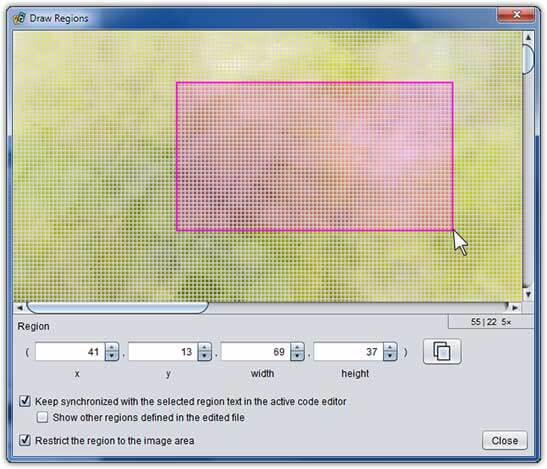

# Draw Regions

Draw Regions is a small pop-up tool that eases the job of defining region setting values. Open it by right clicking on any image in a project and choosing **Draw Regions**. The selected image will be displayed in a zoomable pane and you can define regions by dragging over the surface. Although it can be used standalone, the most efficient way to use it is to synchronize it with a [code editor](dm-code-editor.md) as described below.

To *define a region*, left click and drag a rectangle shape over the part of the image that the region should contain.

To *adjust a region‘s location*, left click within the rectangle shape and drag it its new position.

To *adjust a region‘s size*, left click and drag from any corner of the rectangle.

To *fine tune the region*, use the text field spinner controls below the image pane.

To *copy the current region to the clipboard*, choose the copy button to the right of the spinner controls.

To *zoom in or out of the image*, turn the mouse wheel.

## Synchronizing with a code editor

You can directly edit regions defined in a text file from a Draw Regions window:

1. Right click the image that contains the regions of interest and choose **Draw Regions**.
2. Ensure that the **Keep synchronized…** option is checked.
3. Open the text file containing the region(s) you wish to edit from the project pane.
4. Select the text that defines the regions you want to edit (such as `16,20,100,100`) in the code editor.
5. Switch back to the Draw Regions window. The region you selected in the code editor will appear in the in the image as a rectangle. (If you can’t see it you may need to scroll or zoom out.)
6. As you resize or move the rectangle in the Draw Regions window, the text of the selected region will immediately update in the code editor.
7. To edit a different region, just select its text in the code editor and switch to the Draw Regions window again.
8. Once you are satisfied with all of your changes, you can **Close** the Draw Regions window and **Save** the changes in the code editor.