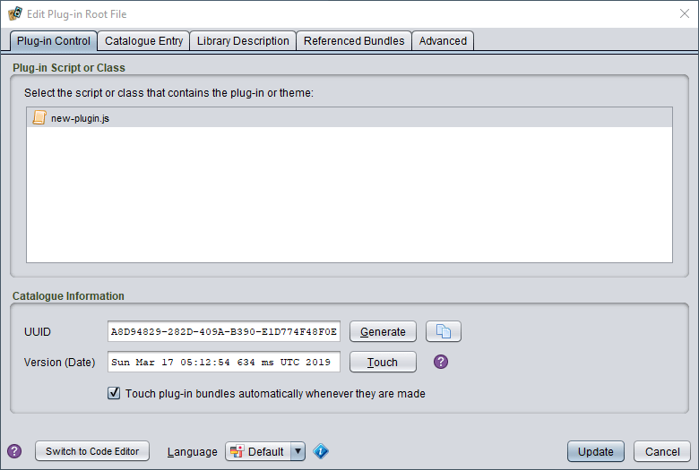
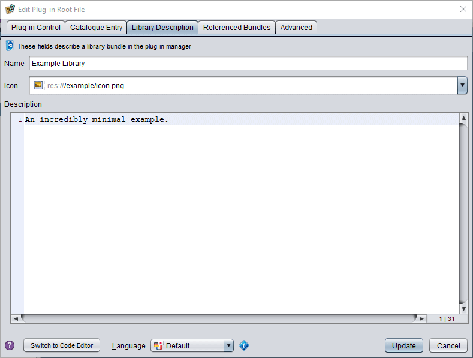

# The plug-in root file

All Strange Eons plug-ins must have a plug-in root file. This is a file named `eons-plugin` located in the root folder of the plug-in bundle (that is, it must not be inside any subfolder, such as `resources`, within the plug-in's task folder).

The root file is a plain text file (UTF-8 encoded) that contains the essential information Strange Eons needs to load and start the plug-in. It also contains the description of the plug-in that will be used for its entry in the [plug-in catalogue](um-plugins-catalogue.md).

To *create a plug-in root file*, right click the plug-in's task folder in the project and choose **New/Plug-in Root**. Note that a root file is normally created for you automatically when you add a new plug-in task to a project.

To *edit a plug-in root file*, double click on the file in its task folder. This opens the root file editor, described in more detail below.

## The root file editor

The easiest way to edit the root file is with the editor included in Strange Eons itself. This various properties defined by the root file are divided into categories, each with its own tab. To edit the file, open it in the plug-in's task folder in the project pane. Make the desired changes, then choose **Update** to save the changes back to the root file and close the editor. Choose **Cancel** to discard your changes and close the editor.

### Plug-in control

This tab lets you set all the most important information required by the plug-in. If the information on this tab is not correct, your plug-in will either fail to load or will not function as expected.

#### Plug-in script or class

In this section you must select the script or compiled class file that defines your plug-in. It must contain the special functions called by the plug-in system to load and unload the plug-in. (Or in the case of a compiled class file, it must implement the `Plugin` interface.) Although rare, it is technically possible to package multiple plug-ins in a single bundle, so multiple selection is allowed.

The list will display scripts and classes in your plug-in, and it will run some simple tests to check which ones look like they might be plug-ins. Files that appear to fit the bill will be shown normally, while others will be shown in grey. You can still select a grey file: this lets you declare which file will contain your plug-in code before you actually write the code.

> Theme plug-ins cannot choose script files; they must be compiled classes that subclass `Theme`. Library plug-ins do not have a plug-in script or class, so nothing should be selected here.

#### Bundle settings

This section contains settings that control how the bundle is loaded or installed.

The **Bundle Priority** value lets you change the order that bundles of the same type load in. For example, all extension plug-ins are started as a block during application startup; within that block, bundle priority is used to determine the order individual extensions are started in. You can use this to make sure that some other bundle is loaded before yours, or vice-versa.  For `ACTIVATED` plug-ins, this order determines the order that plug-ins are listed in the **Toolbox** menu. It is also used to manage dependencies by `EXTENSION` plug-ins. For example, if your plug-in defines a new game, you should use the `GAME` priority. Then if someone else writes a plug-in that relies on that game already being loaded and registered, they can set their bundle's priority to `EXPANSION`. Instead of using one of the built-in names, you can also use a number. Bundles are started in order from lower values to higher ones. The named values map to the following numbers:

| Name        | Numeric value | Description                                              |
| ----------- | ------------: | -------------------------------------------------------- |
| `HIGH`      |         -1000 |                                                          |
| `GAME`      |           100 | use for bundles that add a new game                      |
| `EXPANSION` |           500 | use for a plug-in that adds expansion material to a game |
| `NORMAL`    |          1000 | default for bundles that don't specify any priority      |
| `LOW`       |         10000 |                                                          |

> If your bundle contains multiple plug-ins, the bundle priority applies to all of them. Plug-ins with the same priority are started in an unspecified order chosen by Strange Eons. Therefore, if you need to ensure that two or more plug-ins are loaded in a certain order, put them in different bundles and give them different bundle priorities.

The **Install Script** control lets you choose a script file in the plug-in to use as an [installation script](dm-installation.md). An installation script is run when the bundle is installed or uninstalled from within the app. (If users manually copy the file into the plug-in folder, or delete the bundle file from the plug-in folder, the script won't run.) Most plug-ins do not require any special installation steps, so this can be left set to **none**.

#### Languages

If your bundle supports more than one language, name the languages here as a list of locale codes. There are separate fields for user interface locales and game locales; you must list both even if they are the same. Strange Eons combines all of the languages declared by all the plug-ins and uses this to decide which languages to list as [preference options](um-ui-preferences.md). The locales that you list as interface languages will also be available on the **Metadata** tab in the root editor, so you can provide translated catalogue descriptions.

The following list would declare that you support generic English, French, and German translations:

`en,fr,de`

And the following list would declare that you support separate variants for Australian, Canadian, UK, and US English:

`en,en_AU,en_CA,en_GB,en_US`

#### Catalogue Information

Every plug-in should define a **Catalogue ID**. This consists of two parts, a string called the UUID (Universally Unique IDentifier) and a timestamp. The UUID uniquely identifies a plug-in. This lets Strange Eons know that two bundles represent the same plug-in even if the file name or other details change. It also gives you a handle to refer to other plug-ins; for example, to declare that one plug-in requires another. The timestamp captures which version of a plug-in the bundle describes. If two plug-ins have the same UUID but different timestamps, then the one with the later timestamp is the newer version. This is used by the catalogue to detect when its version of a plug-in is newer than the one you have installed.

There are two buttons in this section that you need to understand, **Generate** and **Touch**. Here is what they do and how they are used:

**Generate**
This will replace the bundle's UUID (unique identifier) with a new identifier. After this, Strange Eons will treat this as a different plug-in from any other copy of the plug-in that uses the old UUID. You almost never want to press this button. One time you would want to use it is if you were using another plug-in as a template for creating a new plug-in. For example, if you using an example from the plug-in authoring kit as a starting point.

**Touch**
This will update the timestamp portion of the **Catalogue ID** with the current time and date. This is used before making the plug-in bundle to mark it as a distinct version. Once uploaded to the catalogue, this version will appear as an update of any bundle with the same UUID but an older timestamp.

Below the **Touch** button is an option to automatically *touch* a plug-in's timestamp whenever you make it into a plug-in bundle. This option is turned on (checked) by default, and unless you have a specific reason to turn it off you should leave it set.

> If you open a root file that does not declare a **Catalogue ID** in the root file editor, one is immediately generated. If you really don't want to set one, you must switch to the code editor view and manually delete it.

This section also includes a button with a copy icon. Pressing this will copy the plug-in's complete Catalogue ID to the clipboard. This can be useful when creating an [`eonscat` link](um-plugins-eonscat.md) or when working on the **Advanced** tab.

### Metadata

This section lets you write the plug-in's catalogue description, and to provide the in-app description for libraries.

#### Catalogue Entry

This fields allow you to edit the description of the plug-in that will be shown to the user when they view it in the catalogue. You can provide a name, author credits, and optional home page. Beneath that you can write a longer description of the plug-in and its features. This can make use of basic HTML tags to style text or create numbered or bullet lists.

#### Library Description

These fields should only be filled in for library bundles. For other bundle types, simply leave these blank. The purpose of these fields is to allow you to provide a name, representative image (icon), and description for the bundle when it is listed in the plug-in manager. This information would normally be requested directly from the plug-in when it is loaded, but library bundles do not contain any plug-ins.

#### Localizing the metadata

At the bottom of this section is a **Language** drop-down which will include options for any **Interface Languages** listed on the **Plug-in Control** tab. Choosing a language here allows you to enter translated versions of the information in this tab. Fields that can be localized will be shown with a yellow background. When these fields are blank, Strange Eons will fall back to whatever values are entered under the **Default** language.

### Advanced

This tab gives you more control over the bundle's catalogue entry and behaviour.

#### Referenced Bundles

This section lets you declare other plug-in bundles that this plug-in bundle is related to. It consists of a list of bundles for each type of relationship. The controls for each list work the same: to add a bundle, first copy its **Catalogue ID** to the clipboard, then add it to the list by choosing the paste button. To remove an entry, select it an choose the cut button. You can copy a bundle's full **Catalogue ID** text using the copy button from the **Plug-in Control** tab when editing its root file, or from its catalogue or plug-in manager listing by selecting it, right clicking on the information panel, and choosing **Show Expert Information**. Look for text matching this format:

`CATALOGUEID{xxxxxxxx-xxxx-xxxx-xxxx-xxxxxxxxxxxx:yyyy-m-dd-hh-mm-ss-ms}`

##### Requires

If this bundle requires that other bundles be installed for it to work correctly, you can add them here. When a bundle is added to this list, it will automatically be installed or updated when this bundle is installed from the catalogue. Note that the timestamp is significant: the requirement is met only if a bundle with the same UUID and the *same or newer* timestamp is installed.

##### Replaces

If this bundle effectively replaces one or more bundles, you can add them here. For example, if you create a new plug-in that is different from an existing plug-in but makes the older plug-in obsolete, you could add it to the list. Entries added here will automatically be uninstalled when this bundle is installed from the catalogue. You should only add entries here when necessary; for example, if the obsolete plug-in is broken in newer versions of the app.

#### Advanced Catalogue Features

##### Requires Build

If this bundle requires a certain minimum version of Strange Eons, you can add the build number here. Only include the digits, not the α or β indicating alpha or beta versions (if any). If in doubt, you can always put the current build number here.

##### For Game

If your bundle is associated with a particular game, you can add that game's code here. This lets users search the catalogue for entries relevant to that game. It does not prevent the bundle from being installed without also having the relevant game installed. To do that, add the game's bundle to the **Requires** list as described above.

##### Hidden

This can be used to hide the bundle entry in the catalogue. The only time you would set this to anything other than **No** in normal circumstances would be when you want to split a large plug-in bundle up into multiple plug-ins. (This can be done to make updates faster: the main bundle is expected to change often, and the auxiliary bundles change rarely or not at all.) In this case you would add the auxiliary bundles to the **Requires** list, making sure to update the listed timestamp when you update them, and then set this to **Depends**. This setting means that the bundle is only listed when it has an update available.

##### Core

This marks a bundle as one the core plug-ins central to the basic operation of Strange Eons. Normal bundles will never use this field.

##### Tags

This is a comma-separated list of tags that users can use when searching the catalogue. You can include any terms here that you feel will be helpful. There are some standard tags which you can add and remove by clicking the arrow, then checking or unchecking the desired item to add or remove the tag from the list.

#### Comments

This tab provides a field where you can enter any human-readable comments you want to save in the root file. In the raw text file, these are included at the top of the file. Comments anywhere else in the raw file are not preserved when using the root file editor.

## Editing the raw file

Instead of using the controls in the root file editor, you can also edit the root file in its raw text form. Normally the only reason to do this is if you need to use some new feature not yet supported by the editor.

To *edit the raw text of the root file*, choose **Switch to Code Editor** at the bottom left of the editor.