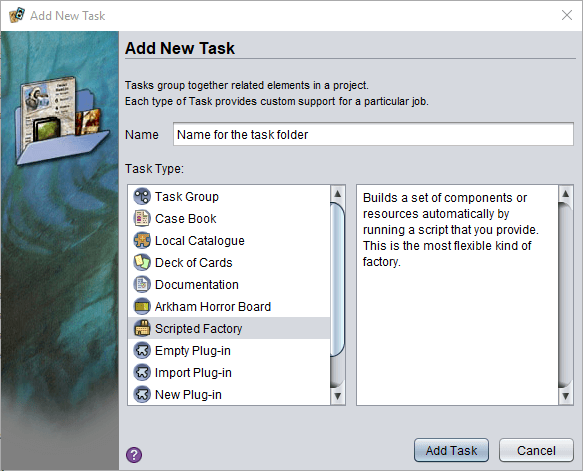

# My First Plug-in

This page will guide you through all the steps needed to create and build a plug-in without having to worry about what the plug-in does. This will give you a handle on the basic workflow needed to develop a plug-in before getting into the details, so that you have a frame of reference when reading other pages in this manual.

Plug-ins are typically developed within a [project](um-proj-intro.md). If you are not familiar with projects, you should spend a little time getting comfortable with them before proceeding.

## Creating the plug-in task

In projects, plug-ins are developed within a plug-in task folder. Everything inside the task folder will be included in the finished plug-in. Strange Eons includes a wizard to guide you through the process.

To *start adding a plug-in task*, right click on the project root in the project pane and choose **New/Plug-in**. The project root is the folder that the project is stored in, at the top of the list.

This will open the [Add New Task dialog](um-proj-intro.md#adding-tasks):

Fill out the dialog:

1. In the **Name** field, enter `My First Plugin`.
2. In the **Task Type** list, choose **New Plug-in**.
3. Choose **Add Task**.

### Plug-in wizard, page 1

This will create a new, empty task folder named *My First Plugin*, then open the New Plug-in Task wizard. You will step through the wizard one page at a time to provide some basic configuration details.

The plug-in wizard is extensible. One the first page, you choose the kind of plug-in you want to make and this determines which wizard you will use. However, only one wizard "kit" is included in the base installation of Strange Eons, **Basic Plug-in**.

1. Select **Basic Plug-in** if it is not already selected.
2. Choose **Continue**.

### Plug-in wizard, page 2

On the second page of the wizard, you choose the type of plug-in you want to create. Choosing one of the types will display a brief description of that choice to the right. For this example, you will create an activated plug-in (a plug-in that the user *activates* from the **Toolbox** menu). However, extension plug-ins are the most commonly created type, and the type you would create if you wanted to define new kinds of game components.

1. Select **Activated Plug-in** if it is not already selected.
2. Choose **Continue**.

### Plug-in wizard, page 3

On the third page of the wizard, you will select how you want to write the code for the plug-in. You can either use script code written with a dialect of JavaScript, or compiled code written in Java. Script code requires no additional tools. For Java code, you will need to install a JDK (Java Development Kit) and will probably want to install other tools as well (such as a Java IDE). This will be a scripted plug-in.

1. Choose **Scripted** if it is not already selected.
2. Choose **Continue**

### Plug-in wizard, page 4

On the fourth and final page of the wizard, you provide a few details about the name and structure you want to use. The name, description, and icon you provide will determine how the plug-in is listed in the [plug-in manager](um-plugins-manager.md). The bundle name is the file name of the finished plug-in; this file is what the end user will install in order to use your plug-in. The script name is the name of the script file that hold your plug-in code. The location defines where in your plug-in bundle the script and other resources will be stored. You should use a subfolder of `resources` with a unique name, perhaps based on your own name or the plug-in you are creating. This is because plug-in resources are [visible to each other](dm-resources.md), so if two of them have the same path name they will interfere with each other. The wizard will suggest a default name based on the account name you are logged in under on your device.

1. In the **Plug-in Name** field, enter `My First Plug-in`. This will automatically fill in some of the other fields with suggested values.
2. In the **Description** field, enter `A simple example` or another short description.
3. Drag and drop an image file onto the **Plug-in Icon** image chooser. You can use this: 
4. You can leave the **Bundle Name** and **Script Name** fields set to the defaults generated from the **Plug-in Name**.
5. In the **Location** field, enter `resources/example`. If this was a real plug-in, in place of `example` you would enter the unique string you want to use to prevent file conflicts with other plug-ins.
6. Choose **Finish**. The plug-in task folder will be filled in with some starter files and the wizard will close.

## Examining the generated files

{: .float-left} After the wizard completes, the new task folder will be filled in with files. The main plug-in files are stored in the `resources/example` subfolder you entered as the **Location**. These are the plug-in’s script file, `MyFirstPlugin.js` and the icon for the plug-in, stored in `MyFirstPlugin.png`. If your plug-in required [images](dm-res-image.md), [fonts](dm-res-font.md), or other [resources](dm-resources.md), you would also store them in this folder (or in a subfolder of this folder). The third file, named `eons-plugin` is called the plug-in's [root file](dm-eons-plugin.md). This file contains the information Strange Eons needs to locate the plug-in script when loading the plug-in. When a plug-in is going to be added to the [plug-in catalogue](um-plugins-catalogue.md), this file also contains the information needed to create its catalogue listing.

Double click the main plug-in script, `MyFirstPlugin.js`, to open it in the [code editor](dm-code-editor.md). Plug-in scripts must define functions with specific names; Strange Eons will call into the script using these function names when it needs the plug-in to carry out the associated action. You can scroll through the code and examine the functions. Each has comments above it to describe its purpose.

## Building the plug-in bundle

When a plug-in is ready to be installed, its files are packaged up into a single file called a *bundle*, similar to a ZIP archive.

To *create a bundle from a plug-in task folder*, right click the task folder and choose **Make Plug-in Bundle**.

If the plug-in includes a lot of large files, this may take several seconds. For this example, it will be nearly instantaneous. Once packed, the new bundle will appear in the project pane, selected.

To *install a bundle from a project*, double click the bundle file and choose **Install** in the dialog that appears.

## Trying out the plug-in

Once installed, the plug-in will be loaded. Since this is an *activated* plug-in, its purpose is to add a new command to the **Toolbox** menu. You will be able to find it listed there now. If you choose the item, the `run()` function in the plug-in script will be called, printing a message to the script console. Once you are done, [uninstall the plug-in](um-plugins-manager.md#uninstalling-a-plug-in).

## Testing the plug-in

Often, a plug-in bundle can't be installed multiple times without restarting Strange Eons. To make development easier, you can test plug-ins using a separate test edition of Strange Eons. Once you are done testing, you can close it and pick up where you left off. However, depending on the type of plug-in you are developing, there are usually ways to avoid having to fully install the plug-in. For example, in an activated plug-in you could temporarily add code to the script to call `run()` and then test the script by running it directly from the code editor.

To *test a plug-in*, right clicking on a task folder or bundle and choose **Test Plug-in**.