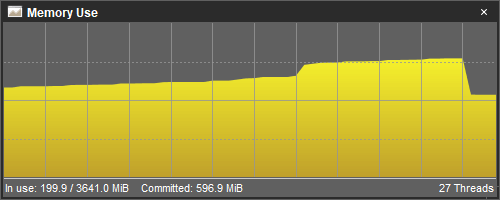
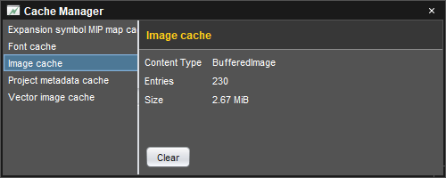

# Memory use and cache control

The application uses garbage collection to manage memory use and caching to balance memory use with performance. The **Developer Tools** plug-in (`eonscat:6574`) includes tools to monitor memory and cache use.

To *monitor memory use*, choose **Window/Memory Use**.

The graph charts changes in memory use over time. The status bar at the bottom of the window displays the amount of memory in use and the [maximum amount of memory](um-install-command-line-options.html#vm-options) that the application is allowed to use. The lower right corner displays the number of active threads. Garbage collection can be forced by clicking the graph.

To *monitor and clear caches*, choose **Window/Cache Manager**.

The left side of the window lists the different types of the caches used by the application. Choose a cache type to display the available information about the cache. When supported by the cache type, choosing **Clear** will empty the cache and free the related memory and other resources.

