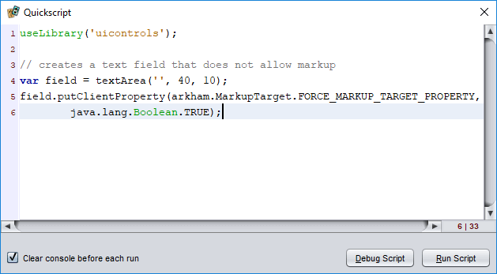
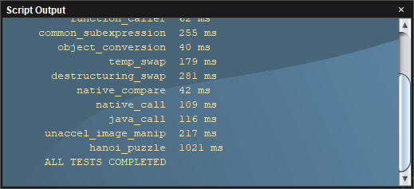

# Quickscript and the script console

The Quickscript tool and script console make it easy to try out code and see the result.

## Quickscript

Quickscript features a prominent [code editor](dm-code-editor.md) that you can use to enter and run code snippets for exploration, experimentation, [debugging](dm-debugger.md), and game component hacking.

To *open the Quickscript window*, choose **Toolbox/Quickscript** from the menu.

To *run the current script*, choose the **Run Script** button or press <kbd>F5</kbd>.

To *debug the current script*, when debugging is enabled, choose the **Debug Script** button or press <kbd>F3</kbd>.



### Printing of last expression's value

When a script is run from the Quickscript window, the result of the last expression to be evaluated is printed to the script console automatically. For example, if the Quickscript window contains the single line `1+2`, then running the script would print the sum.

### Detecting how a script is run

It can be helpful to know whether a script is being loaded and run by Strange Eons (for example, when loading a plug-in) versus being run from a code editor. Running scripts define a global variable named `sourcefile`. When a script is loaded and run normally, it points to the location of the source file. However, when run from the Quickscript window or by the code editor's **Run** command, this will contain the value `"Quickscript"`.

For example, suppose you are writing a script for an `ACTIVATED` plug-in. When the user chooses your menu item, your script's `run()` function will be called. To make testing easier, you could add the following lines to the bottom of the script to simulate this when the script is started from a code editor:

```js
if(sourcefile === "Quickscript") {
    run();
}
```

## The script console window

The script console window can display output from running scripts. Although the window will be shown automatically when new content is sent to it, it can also be shown manually by selecting **Window/Script Output**.



### Printing to the console

The [built-in functions](assets/jsdoc/modules/common.html) `print(object)`, `println(object)`, and `printf(object)` are the most common way that text is written the console window. For example:

```js
for(let i=10; i>0; --i) {
	println(i);
}
println("Blastoff!");
```

The `print` function prints a representation of the object(s) passed to it to the console. The `println` function behaves the same way but automatically starts a new line afterward. The `printf` function behaves like the similarly-named C function. Example:

```js
printf("Grade: %.0f percent\n", 97.8);
```

The built-in [`Console`](assets/jsdoc/modules/common.html#Console) script object provides more complete control of the console and console output. For example `Console.clear()` can be used to clear the contents.

### Uncaught script errors

When a runtime error occurs in a script, and it is not intercepted by a `try`...`catch` block, the error is logged to the script output window. Script errors are printed in a different colour from regular text, and a *stack trace* of the sequence of function calls that was active at the time of the error is included below the error message when available. Trace entries can be clicked to jump to the relevant source line if a hand cursor appears when the mouse pointer is moved over them.

When a function "escapes" from the context that ran the script, uncaught errors are swallowed by the script engine. For example, if your script implements a Java interface and the resulting object is registered with some part of Strange Eons, then it is no longer part of the original script's call stack. Uncaught errors from such code can be logged by wrapping them in code like the following:

```js
try {
    // ...
} catch(err) {
    Error.handleUncaught(err);
}
```

The most common case where this occurs is when writing your own user interface code; event listener functions attached to UI controls will implicitly implement the relevant Java interface and will be called from outside of the script context.

### Script output and threading

Scripts normally run in the same *thread* as the user interface. This means that the user interface can't update while the script is still running, including updates to the console. If you want to print messages about the status of a long-running script to the console, you can use `Console.flush()` to force repainting, but the most effective method is to run your script in another thread:

```js
useLibrary("threads");

function task() {
	for(let i=10; i>0; --i) {
		println(i);
		sleep(333);
	}
	println("Blastoff!");	
}

Thread.run(task);
```

### Viewing the application log

The application log contains debugging information and traces of uncaught exceptions from the entire application (not just your script code). You can print the tail end of the log in the console window by right clicking over it and choosing **Print Application Log**. The log level can be controlled from a [command line option](um-install-command-line-options.md#standard-options). For more complete access to the log, install the **Developer Tools** plug-in (`eonscat:6574`)  and choose **Window/Log Viewer**.