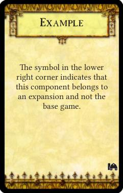
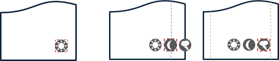

# Register new games and expansions

Strange Eons uses games primarily as a sorting and filtering mechanism. The [**New Component Dialog**](um-gc-intro.md) can filter components by game. [Decks](um-deck-intro.md) alter the paper sizes they display, the tiles and decorations that they list, and the default style settings used for deck objects based on the game associated with the deck. Even generic components like markers and tokens are associated with a special “game” named **All Games**.

Expansions are discrete add-on products for an existing game. They typically add new rules and components to the base game in order to extend its replay value. In many games, the components associated with a particular expansion are marked by an *expansion symbol*, an icon that marks the component so that it can be readily distinguished from components that belong to the base game or other expansions.

Classes related to games and expansions are defined in the `gamedata` package. When writing a plug-in script, you can call `useLibrary("extension")` to import them in one go. Then you can simply refer to them by their class name (for example, `Game` instead of `gamedata.Game`). Here is a summary of some of the most commonly used classes:

[Game](assets/javadoc/gamedata/Game.html)  
Represents a unique game. Can be used to register new games or look up information about existing games.

[Expansion](assets/javadoc/gamedata/Expansion.html)  
Represents an expansion for a game. Can be used to register new expansions or look up information about existing expansions.

[ExpansionSymbolTemplate](assets/javadoc/gamedata/ExpansionSymbolTemplate.html)  
This can optionally be used by games to provide information about different variants used by expansion symbols. For example, some games might have both light and dark variants of their expansion symbols, with each component using the variant that best suits its design. The helper class [AbstractExpansionSymbolTemplate](assets/javadoc/gamedata/AbstractExpansionSymbolTemplate.html) makes it easier to define a template of your own.

[ClassMap](assets/javadoc/gamedata/ClassMap.html)  
Class maps are used to register new kinds of game components. Each entry in a [class map file](dm-res-classmap.md) includes a section for specifying the game that the component belongs to.

## Games

Each game is associated with a short unique string that can be used to refer to that game when needed. For example, the string `"AH"` is used for the game *Arkham Horror*.

> Different editions of a game should usually be treated as different games as far as Strange Eons is concerned. They usually have different graphics and their game components will have different requirements to reflect rule changes.

To *look up a Game instance from its unique code*, call `Game.get(code)` with the relevant game’s unique string. This will either return the Game instance for that code or `null` if no game is associated with the code (for example, if the relevant plug-in is not installed).

> The special game code `"*"` is reserved to mean “all games”.

### Registering a game

Games can only be registered by extension plug-ins when Strange Eons is starting. To register a game, call one of the static `Game.register` methods. The most general one version takes these parameters:

`code`  
The short unique code that will represent the game.

`uiName`  
The name of the game (in the UI language, if you support multiple languages).

`gameName`  
The name of the game (in the game language, if you support multiple languages).

`iconImage`  
A image, typically [loaded from the plug-in’s resources](dm-res-image.md), used to represent the game in the user interface. Game icons are typically 18 by 18 pixels. If `null`, a default image is used.

`expansionSymbolTemplate`  
An optional template to describe any expansion symbol variants. If you pass `null` then a default template is used which allows for a “dark” and “light” variant of each symbol. If you want to paint the symbols yourself or you need different variants, you will need to implement a custom template. This is described further down the page.

The [Plug-in Authoring Kit](dm-pak.md) includes several examples of registering games, including [`DIY Examples/Register Game`](https://github.com/CGJennings/se3docs/blob/master/Plug-in%20Authoring%20Kit/DIY%20Examples/Register%20Game/resources/example/register-game-plugin.js).

## Expansions

Strange Eons provides sophisticated support for expansions and expansion symbols. Users can associate a component with one or more expansions for a game using commands in the [**Expansion**](um-gc-expansions.md) menu. Plug-in developers can register new expansions for a particular game, and can define how expansion symbols are painted on components that they define.

Like a game, each expansion is associated with a short code that can be used to look it up. To prevent conflicts, it is recommended that you combine the the game code and a short mnemonic string to derive the expansion code. For example, if the game *Star Donkeys* uses the game code `"STDK"`, its expansion *Meteor Mules* might use the expansion code `"STDK-MM"`.

> The special expansion code `"NX"` is reserved for use when no expansion is in use (for example, to indicate that a component belongs to the base game).

To *look up an expansion by its code*, call `Expansion.get(code)`.

To *get an array of all of the expansions associated with a particular game*, call `Expansion.getExpansionsForGame(game, false)`. Pass `true` to include expansions that apply to all games, such as the base game “no expansion” expansion.

### Registering an expansion

Registering an expansion is similar to registering a game. Call `Expansion.register` with:

`forGame`  
The Game instance that the expansion should be associated with.

`code`  
The unique code that will identify the expansion.

`uiName`  
The name of the expansion (in the UI language, if you support multiple languages).

`gameName`  
The name of the expansion (in the game language, if you support multiple languages).

`iconImage`  
A image, typically [loaded from the plug-in’s resources](dm-res-image.md), used to represent the expansion in the user interface. If `null`, a default image is used.

`symbols`  
An array of images to use when drawing the expansion’s symbol on game components. There should be one image for each variant specified by the game’s [ExpansionSymbolTemplate](assets/javadoc/gamedata/ExpansionSymbolTemplate.html).

> The main plug-in for a game will typically register expansions for any official expansions that are available. Users can also define their own [custom expansions](um-gc-expansions.md#custom-expansions).

### Expansion symbols

The main purpose of registering expansions is to allow game components to include expansion symbols. Selecting an expansion from the **Expansion** menu will cause the component to be repainted with one of the symbols that was registered for the expansion.

In most cases, Strange Eons can handle the details expansion symbol painting for you. The main restriction is that expansion symbols are always painted last, so if you need to paint anything overtop of them you will need to handle this yourself.

#### Standard expansion symbol painting

The built-in painting mechanism is suitable for most games. The following checklist summarizes what you need to do to take advantage of it:

1. Register your game, if applicable. If you want to use symbol variants other than the default, define a custom [ExpansionSymbolTemplate](assets/javadoc/gamedata/ExpansionSymbolTemplate.html) that describes them and register that along with the game.
2. Register any standard expansions for the game, defining an icon (for the user interface) and a symbol image (for the components, one for each variant).
3. For any component face that should display an expansion symbol, add a settings key with the same base name as the face’s template key but ending in `-expsym-region` instead of `-template`. Set the value of this key to the region where the symbol should be painted.
4. If the component should use one the variant symbol designs by default, also add a settings key with the suffix `-expsym-invert` and set it to the numeric index of the default variant.
5. If some expansion symbols are drawn in a different location, add variant regions for those expansions (see below).
6. If the game’s design allows for multiple expansion symbols to be used on a single component, test components with multiple symbols and set the `-expsym-margin` if required (see below).

##### Detailed description of the standard symbol painting procedure

The built-in expansion symbol painting algorithm proceeds as follows:

1. After painting the card normally, check to see if an expansion symbol region is defined by looking for the `-expsym-region` setting (see above). For example, if a face has the template key `my-front-template`, look for `my-front-expsym-region`. If this setting key is not defined, the procedure ends here.
2. Look up the value of the component’s `GAME` setting to determine the code for the game this component belongs to.
3. Get the matching Game instance by calling `Game.get(code)`.
4. Get the ExpansionSymbolTemplate for the game by calling `Game.getSymbolTemplate()`.
5. If the template’s `isCustomDrawn()` method returns `true`, the procedure ends here.
6. Determine which expansions are actively assigned to the component by reading the `active-expansion` settings key. See [`Expansion.getComponentExpansionSymbols`](assets/javadoc/gamedata/Expansion.html#getComponentExpansionSymbols-ca.cgjennings.apps.arkham.component.GameComponent-). If this key is not defined, it is equivalent to having the `"NX"` no expansion value.
7. If one or more expansions are set, determine which variant to use. First check is the user has specified a variant by looking up the setting key `active-variant `. If not, look up the `-expsym-invert` key, which defines the numeric index of the default variant when present. If all else fails, variant 0 will be used.
8. Once the expansion code(s) and symbol design variant are known, look up the Expansion for each of the active expansions by calling `Expansion.get(expansionCode)`. For each expansion, if it exists, get the correct expansion symbol to paint by calling `Expansion.getSymbol(variantIndex)`.
9. By default, the drawing region for the symbol is the one given by the `-expsym-region` key. However, if the more specific key `-expsym-EXP-region` (where `EXP` is the code of the active expansion), then that region is used instead.
10. The symbol(s) are drawn using the selected region (either the default region or the more specific region selected in the previous step). This is done differently depending on how many symbols will be drawn:
    1. If there is only one expansion symbol, it is drawn to cover the selected region.
    2. If there are multiple symbols, they drawn in a row. Each is the width and height specified by the region. The row of symbols is initially centered over the middle of the selected region. Then the row is checked to ensure that still fits on the card. Neither the left or right edge can extend past the bleed margin (if any) or card edge, less a small additional margin. By default this is 6 points, but a custom margin can be defined with the `expsym-margin` key. If the symbol row extends past this margin, the row is moved so that it just touches the margin instead. If there are so many symbols that the row is wider than the space between the margins, the row is scaled down until it just fits the available space.

The following image illustrates step 10 graphically. The dashed red box shows the location of the selected region. The card face on the left shows a single expansion symbol being drawn to fit the region. The pair of card faces on the right show multiple symbols first being centered over the middle of the region (dashed blue line), then adjusted so that the row does not extend past the left and right margins (dashed green lines).

#### Custom expansion symbol painting

If a Game’s `ExpansionSymbolTemplate.isCustomDrawn()` method returns `true` (see below), Strange Eons will not paint any symbols at all (see Step 5, above). It is then up to you to paint the symbols as part of your standard code for painting the component face. You can refer to the standard procedure above as a starting point.

## Custom ExpansionSymbolTemplates

If you want to handle expansion symbol painting yourself, or if you want variants other than the default “dark” and “light” ones, you will need to implement your own ExpansionSymbolTemplate and pass it along when you register your game. Your template will be consulted in the following situations:

**Check who is responsible for painting symbols on component faces**  
After your face painting code returns, StrangeEons will call the template’s `isCustomDrawn()` method. If this returns `false` it will proceed with its built-in symbol painting procedure. If it returns `true` it will assume that you have already painted the symbols yourself.

**Determine the names and icons to use when describing variants in the user interface**  
The method `getVariantCount()` is called to determine how many variants you support. For each variant, the methods `getVariantIcon(index)` and `getVariantName(icon)` are called to get the icon and/or name used to describe the variant.

**The user creates a new expansion with the New Expansion dialog**  
This dialog shows a row of symbol graphics, one for each variant, and allows the user to drag and drop their own images to use for each variant. The default image shown for each variant is determined by calling `getDefaultSymbol(index)`. The background shown behind the symbol is determined by calling `getDesignBackdropForVariant(index)`. (This can return `null` for a default checked background.)

### Optional automatic symbol generation

To make it easier for users to generate a complete set of symbols in the New Expansion dialog, templates can optionally generate an entire set of variants from one sample image. To enable this,  `canGenerateVariantsAutomatically()` must return `true`. In this case, when the user supplies a sample image the method `generateVariant(sampleImage, index)` will be called to generate each symbol variant in turn. The class [SymbolVariantUtilities](assets/javadoc/gamedata/SymbolVariantUtilities.html) defines some helper methods that can help you implement a symbol generator.

### Logical variants versus visual variants

Strange Eons allows games to distinguish between *visual variants* (different expansion symbol styles) and *logical variants* (different semantic variants). For example, a game might use symbols that are different colours depending which component they appear on (for example, light symbols on dark backgrounds, dark symbols on light backgrounds). Those are visual variants. At the same time, it might draw the symbol in different locations depending on whether the component is *part of* or *requires* the relevant expansion. Those are logical variants.

The **Expansion/Variant** menu lists the available *logical* variants, and these must be mapped to *visual* variants when the symbol is painted. The default symbol painting procedure simply assumes that the logical and visual variants correspond exactly: choosing a logical variant in the list implicitly selects the visual variant with the same index.

If you wish to distinguish between logical and visual variants, you must implement the following methods: `getLogicalVariantCount()`, `getLogicalVariantIcon(index)`, and `getLogicalVariantName(index)`. The base implementation in [AbstractExpansionMenuTemplate](assets/javadoc/gamedata/AbstractExpansionSymbolTemplate.html) simply forwards to the visual equivalents of these methods (`getVariantCount()`, `getVariantIcon(index)`, and `getVariantName(index)`). Note that icons and names for the visual variants are still required for some features, such as the New Expansion dialog.