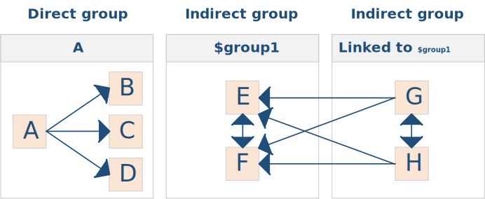

# Conversion map resources

**File extension:** `.conversionmap`

A conversion map file is used to register new kinds of component conversions.  Component conversions automate the process of converting one type of component to another. When the currently edited component has applicable conversions, they will be listed under the [**Edit/Convert to**](um-gc-convert.md) menu item.

To *register the contents of a conversion map file with Strange Eons*, call [`gamedata.ClassMap.add(path)`](assets/javadoc/gamedata/ClassMap.html#add) using the resource path of the class map file. This can only be done in extension plug-ins.

> Game components can also be converted automatically when they are loaded as part of a version upgrade process. This is [initiated by the component's class or script directly](dm-compatibility.html#transitioning-to-a-new-component-class) and does not involve a conversion map, but the rest of the conversion process is similar.

## File format

The format of class map files is similar to that used for [class maps](dm-res-classmap.md). They can be edited with the [code editor](dm-code-editor.md). Lines starting with `#` are comments that are ignored by Strange Eons.

Other lines either define the start of a *group* or *define a conversion*. Conversion entries include a `=` to separate the conversion's description from its parameters. Groups do not include a `=`.

> By convention, conversions are indented while groups are not, and a blank line is added between groups. This makes it easy to see which group a conversion belongs to.

### Groups

Groups determine the kinds of components that a conversion can *start* from. When you are editing a component, all conversions listed under a group that matches the type of component being edited will be offered as targets under the **Convert to** menu. This applies across all extensions: different plug-ins can register conversions for the same group, and they will all be combined into a single "superlist" of possible conversions.

There are two basic types of group: *direct* and *indirect*. A direct group defines **one-way** conversions from a single source component type to one or more destination component types. An indirect group defines a set of **mutual** conversions: any component type in the group can be converted to any other component type in the group. In addition, an indirect group has a *label* called its *group ID*. One indirect group can *link* to another using its group ID. Linking to another group allows **one-way** conversions to any other component type in the linked group (in addition to the usual mutual conversions within the group).




#### Direct

**Syntax:** `class-or-script`

A direct group describes a group of conversions that apply to a single source component type. It is defined by simply naming the component class or script that the conversions apply to. Conversions listed under a direct group are one-way conversions from the type described by the group's class or script, to the types described by the classes or scripts listed in the conversions.

**Example:**

```properties
# Go from a Jeteye to a Sifth by choosing Convert to/The Dark Side
diy:sw/jeteye.js
    The Dark Side = diy:sw/sifth.js
    # the same idea, but using a translatable description
    @sw-conv-dark-side = diy:sw/sifth.js
    # and again, but requiring the indicated extension (or newer) to be installed
    @sw-conv-dark-side = diy:sw/sifth.js | CATALOGID{8c290a1f-3ed6-49ea-9830-fc5c967764ea:2021-10-23-0-0-0-0}
    # ...or requiring *any* version of that extension to be installed
    @sw-conv-dark-side = diy:sw/sifth.js | 8c290a1f-3ed6-49ea-9830-fc5c967764ea
```

#### Indirect

**Syntax:** `$groupid | [@]group-name [| $linked-group1[; $linked-group2...]]`

An indirect group consists of a unique group ID, which must start with `$`, and a `|` followed by the group's name as it will be displayed to the user in the **Convert to** menu.

If the group name starts with `@`, it will be treated as a key to be translated using the interface language. The actual name is looked up using this string (excluding the `@`) via [`Language.string(groupName)`](assets/javadoc/resources/Language.html#string).

Optionally, the group may end with a `|` followed by a list of one or more `;`-separated group IDs.

**Example:**

```properties
# Anything in this group can be converted to anything else in the group;
# if you are editing a Pie, the Convert to/Fruit menu will list items
# for Muffin and Bread
$bakedGoods | Baked goods
    Bread = diy:foods/bread.js
    Muffin = diy:foods/muffin.js
    Pie = diy:foods/Pie.js

# Anything in this group can be also converted to anything else in the group;
# in addition, anything in this group can be converted to any kind of baked
# good in the above group—but baked goods cannot be converted back into apples.
$apples | Apple | $bakedGoods
    Apple = diy:foods/apple.js
    Applesauce = diy:foods/applesauce.js
```

### Conversions

**Syntax:** `[@]description = class-or-script [| extension-id]`

A conversion consists of a description, a class or script (from the relevant class map) that describes what the component will be converted *to*, and, optionally, a `|` followed by the [**Catalogue ID**](dm-eons-plugin.md#catalogue-information) of the extension that defines that component. If a full **Catalogue ID** is given, then the extension must be at least the version described by the ID, or newer. Alternatively, you may list only the UUID part of the ID to accept any version.

> When a required plug-in is not installed or the installed version is older than the listed extension ID, that conversion is simply omitted from the **Convert to** menu.

If the description starts with `@`, it will be treated as a key to be translated using the interface language. The actual description is looked up using this string (excluding the `@`) via [`Language.string(name)`](assets/javadoc/resources/Language.html#string).

## Using a conversion map

As stated earlier, an extension plug-in can register a conversion map with `gamedata.ClassMap.add(resourcePath)`. Registering a map makes Strange Eons aware of the possible conversions and enables a default conversion behaviour that copies over some basic features. In most cases, though, you will want to customize the conversion request. The process is nearly the same as that for [transitioning to a new component class](dm-compatibility.md#transitioning-to-a-new-component-class):

1. Once the user requests a supported conversion, a component of the target type is created.

2. A [`ConversionSession`](assets/javadoc/ca/cgjennings/apps/arkham/component/conversion/ConversionSession.html) is created to support the conversion process. This object has methods to help you transfer features from the old component to the new one.

   > The session's `ConversionTrigger` will return `"manual"` for `getCause()`, and it will have a `getGroup()` method that returns the relevant group ID, if any. This information can be used to customize the conversion process for different contexts.

3. If the old component defines a function named `onConvertFrom`, it is called with the old component and the session object.

4. If the new component defines a function named `onConvertTo`, it is called with the new component and the session object.

5. Once both versions of the component have had a chance to influence the conversion process, some automatic conversion steps are performed. This consists of copying the component's name, design rationale comments, any expansion symbols set on the component (using the built-in [expansion symbol system](dm-register-game.html)), and the component's portrait images. The automatic conversion steps can be disabled, if required, from `onConvertFrom` or `onConvertTo`.

6. Finally, the now modified target component will be opened in a new editor tab.
