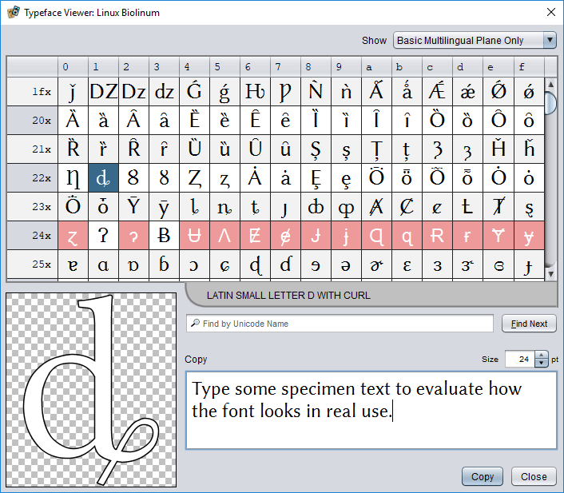

# Font resources

**File Extensions:** `.ttf`, `.otf`, `.pfm`, `.pfb`

Plug-ins that add new kinds of game components will often also want to provide custom fonts for the text on those components. In principle, you should be able to bundle TrueType, OpenType, and PostScript Type1 font resources. In practice, some font files may not work as expected. The easiest way to investigate a particular font is to copy it into a project and then double click the font file. This will open the Strange Eons typeface viewer to check compatibility. TrueType fonts (`.ttf`) are generally the most reliable.



## Raw Font instances

A single font file can be loaded directly to get a [Font](https://docs.oracle.com/javase/8/docs/api/java/awt/Font.html) instance. This has limited utility: you can use it in user interface components, and you can use it to render text directly to a graphics context. However, you can’t use it anywhere that the font must be identified by *family name*. This includes markup boxes.

[`ResourceKit.getFont(path, pointSize)`](assets/javadoc/resources/ResourceKit.html#getFont)  
Returns the font resource as a Font instance. The `pointSize` is the desired font size, in points (1/72 inch).

## Font families and registration

Typefaces normally come in families that are split over several files. For example, a typeface family named “Grouch” might include “Grouch regular”, “Grouch italic”, “Grouch bold”, and “Grouch bold italic”, each in its own file. To use such a family, it needs to be *registered*.

[`ResourceKit.registerFontFamily(commaSeparatedListOfPaths)`](assets/javadoc/resources/ResourceKit.html#registerFontFamily)  
This will attempt to register a group of font resources together as a family. You pass it a list of resource paths separated by commas (`,`). It is important that the first entry in the list is the path to the “regular” version of the font. For example: `"foo/fonts/grouch_regular.ttf,foo/fonts/grouch_bold.ttf"`.

> The first font in the list must use a complete path, such as `foo/fonts/grouch_regular.ttf`. After that, any entries in the list that don’t include at least one `/` will be assumed to be in the same folder as the first entry.

This method will return an array of [FontRegistrationResult](assets/javadoc/resources/ResourceKit.FontRegistrationResult.html) objects, one for each font in the list. These define the following methods:

[`getFamily()`](assets/javadoc/resources/ResourceKit.FontRegistrationResult.html#getFamily)  
This will return the name of the font family, which you will need to refer to the font when creating markup boxes. This is the “real” name of the font family, as stored inside the font resource. The file name of the resource is irrelevant and can be whatever you want.

[`getFont()`](assets/javadoc/resources/ResourceKit.FontRegistrationResult.html#getFont)  
Returns a Font instance for the resource. If the font was registered successfully, you can also get a Font instance using code like `new java.awt.Font(familyName, java.awt.Font.PLAIN, fontSize)`.

[`isRegistrationSuccessful()`](assets/javadoc/resources/ResourceKit.FontRegistrationResult.html#isRegistrationSuccessful)  
This returns `true` if the font was registered successfully. If this returns `false`, it is usually because the user already has a font with the same family name installed in their system font folder, or if a font with the same name was already registered. As long as the font with the same name really is the same font, this is usually not a problem. The system (or previously registered) font will be used instead of your font, but since they are *different copies* of the *same font* everything will still work as expected. However, if your font is different in some way (for example, if you have added some custom character glyphs), you won’t get the result you expect. For this reason, if you are modifying a font in any way you should also change the family names encoded within the font files.

A typical usage pattern for registering a font family will look something like this:

```js
let fontFiles = "path/regular.ttf,bold.ttf,italic.ttf,bold-italic.ttf";
let registrationResults = ResourceKit.registerFontFamily(fontFiles);
let familyName = registrationResults[0].getFamily();
// Now you can use familyName to get the right family when creating
// markup boxes and the like
```

Note that using this method does not “magically” create a family from font files that declare different family names internally.

### Registering single fonts

Many decorative fonts only come in one variant. When a “family” consists of only a single file, you can use [`ResourceKit.registerFont(path)`](assets/javadoc/resources/ResourceKit.html#registerFont) instead of `registerFontFamily`. This version expects a single resource path and returns a single registration result.

### Other font-related methods

The ResourceKit offers several other font-related methods. Some of the most commonly used ones are:

[`ResourceKit.isFamilyRegistered(familyName)`](assets/javadoc/resources/ResourceKit.html#isFamilyRegistered)  
Returns `true` if at least one font with the specified name was registered successfully.

[`ResourceKit.findAvailableFontFamily(commaSeparatedListOfFamilyNames, defaultFamily)`](assets/javadoc/resources/ResourceKit.html#findAvailableFontFamily)  
Returns the first family in the list that is available on this device, or the default family value if none of them is available. This is similar to how font family styles for Web pages work.

[`ResourceKit.getBodyFamily()`](assets/javadoc/resources/ResourceKit.html#getBodyFamily)  
Returns the family name of the standard serif font that is the default for markup on game components. This can be used as the `defaultFamily` argument for the previous method.

## Using fonts from Google Fonts

[Google Fonts](https://fonts.google.com/) is a great resource for finding quality free fonts for your projects. However, once you have identified the fonts you want to use, there is no direct way to get access to the `.ttf` or `.otf` files you need to use the fonts in a plug-in. However, the data for the Google Fonts site is built from an [open source project](https://github.com/google/fonts) that does contain the font files you need. Here is how to incorporate fonts on this site in your projects:

1. Make a note of the family name(s) of the fonts you are interested in.
2. Go to the [Google Fonts source repository on GitHub](https://github.com/google/fonts).
3. The fonts are organized into folders by license type, then in subfolders by family name. So you may need to hunt a bit. The license folders are named [apache](https://github.com/google/fonts/tree/master/apache), [ofl](https://github.com/google/fonts/tree/master/ofl), and [ufl](https://github.com/google/fonts/tree/master/ufl).
4. Check within each of the three folders above for a subfolder with the font family name you are looking for. Most of the fonts are under `ofl` so start there; only the Ubuntu font families are under `ufl`.
5. Once you find the correct family folder, click to enter it. The original source font file(s) should be found within.
6. For each font file that you want from the folder, click the font file name, then click **Download** in the page that appears. Once you have downloaded one file, you can use the browser’s back button to return to the folder to get the next one.

For example, the [Alice font on Google Fonts](https://fonts.google.com/?query=alice) can be found in the GitHub repository under `ofl/alice` as [Alice-Regular.ttf](https://github.com/google/fonts/tree/master/ofl/alice).

If you are comfortable using developer tools and you find yourself using Google Fonts a lot, you might find it convenient to create a local clone of the repository on your computer:

```bash
git clone https://github.com/google/fonts.git
```

## Font licensing

Be sure to check the license of any fonts you want to distribute with your plug-in. Although there are many freely distributable fonts available, most top quality fonts are only available by commercial license. Generally speaking, the cost to license these fonts for distribution in a plug-in would be prohibitive. (It costs much more to license a font for redistribution since this allows others to use the font in their own projects.) 

A common strategy when trying to replicate cards from a particular game that uses a commercial font is to find a reasonably similar font that is freely distributable to include with the plug-in. Although the results may be less than ideal, this is a legitimate approach so long as the freely distributable font is indeed original work and not simply a copy of a commercial font under a different name. (Note that if the fonts merely look similar, that does not necessarily mean that one is a direct copy of the other; both designs might have been inspired by one of the classic metal typefaces produced for the mechanical typesetting systems of yesteryear.)

Using the `findAvailableFontFamily` method described above, your plug-in can use the official font if it is installed on the user’s system and otherwise substitute a free replacement. Here is an outline for one way you could do this:

```js
let family = ResourceKit.findAvailableFontFamily("FancyCommercial", null);
if(family === null) {
    let substitutes = "my/fonts/Free.ttf,Free-italic.ttf,Free-bold.ttf";
    family = ResourceKit.registerFontFamily(substitutes)[0].getFamily();
}
```

