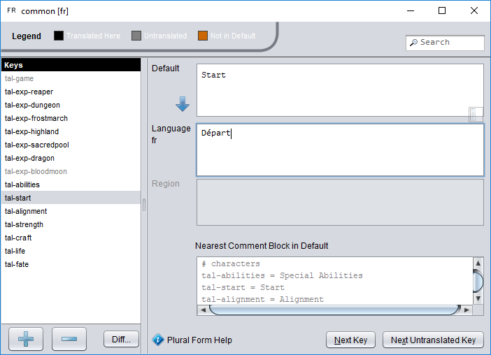

# String table resources

**File extension:** `.properties`

A string table stores translated text so that a plug-in, game component, or other feature can be used with different languages. A single collection of translatable strings is split over multiple files: one for the default translation (which is ideally English), and one for each translation.

To *add a new string table*, right click in a project resource folder and choose **New/String Table**.

To *add a new translation to a string table*, right click one of the files in the translation and choose **Add Locale**. The name of the new string table file will be the same as the name of the base file containing the default strings but with the locale name concatenated to the end (such as `example.properties` and `example_fr.properties`).

String tables are loaded and accessed using the [Language](assets/javadoc/resources/Language.html) class. For more information on localization, refer to the [Translation Manual](tm-index).

## Editing string tables

The default strings are defined using the [code editor](dm-code-editor.md). The format of the file is the same as that of [settings resource files](dm-res-settings.md). The “setting name” in a string table is the key used to look up the translated string, while the value is the default value that will be returned when no suitable translation is found.

To *edit a string table locale*, double click on the file for the relevant locale.

Translations are edited using the string table editor, which lists the keys defined in the base string table on the left side, and their default and translated values on the right.

### Translating strings

To *translate a string*, choose its key in the key pane. Read the default value (or base language value when adding a regional translation), then enter or edit the translation in the Language (or Region) field.

> When editing strings for a language (e.g., `fr` French), you will enter your translation into the middle field and the bottom field will be disabled. When editing strings for a region (e.g., `fr-CA` for Canadian French), you will enter your translation (if different from the language default) into the bottom field.

To *copy the text from the default (or language default)*, click the blue downward-pointing arrow left of the field you want to copy from. The text is copied to the next field down as a starting point.

#### Key colours

The list of keys on the left uses different colours to signal the key's translation status:

| Key colour                                    | Status                                                       |
| --------------------------------------------- | ------------------------------------------------------------ |
| **black**                                     | already translated                                           |
| **blue**      | not translated in this regional variant, but translated for the base language file |
| **grey**      | not translated, or the translation is identical to the default |
| **orange** | key does not exist in default translation (usually an error unless for additional [plural forms](tm-plurals.md)) |
| **red**        | default value has changed since previous version ([see below](#tracking-changes-between-versions)) |

#### Adding, removing, and navigating through keys

To *add a new key the locale*, choose the **+** button below the key list, then enter the desired key name. Note that the key is only added to the edited translation (and inherited into regional variants, if applicable). To add a key to the default translation, open it in the [code editor](dm-code-editor.md) and add it as a new line.

To *remove a key from the locale*, select the key from the list and choose the **−** button below the key list. Removed keys will revert to the default value (or the language value if defined and editing a region).

To *move to the next key*, choose **Next Key** near the bottom-right corner of the editor.

To *move to the next untranslated key*, choose **Next Untranslated Key** near the bottom-right corner of the editor.

> On supported platforms, you can use the underlined mnemonic keys to choose these buttons quickly from the keyboard. For example, on Windows you can press <kbd>Alt</kbd>+<kbd>X</kbd> to move to the next untranslated key.

## Tracking changes between versions

Plug-in authors often make changes to existing keys when releasing a new version. Although these are often minor corrections that do not impact your translation, you may need to update your translation to suit the new wording. Normally, such keys would simply show as having already been translated, and you are likely to miss them. To detect them, choose **Diff** from below the key list and choose the `.properties` file for the default translation from the previous version. Keys whose default value has changed will then be highlighted in red.

> If you don't have the default file from the previous version of the plug-in handy, but you do have the old version of the plug-in, copy it into your project, right click on it, and choose **Import Plug-in**. This will convert it into a task folder that will contain the file.