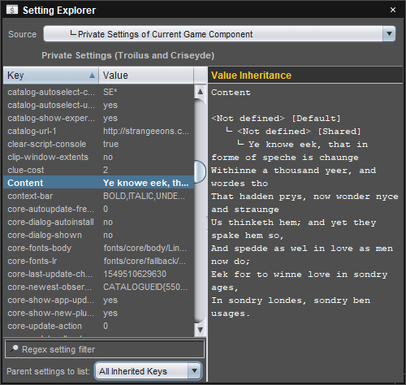

# Setting Explorer

Setting Explorer is a tool included as part of the **Developer Tools** plug-in (`eonscat:6574`). Once installed, the tool can be opened by choosing **Window/Setting Explorer**. The window can display settings from various sources in a table, which lists the setting keys and their values.

## Setting hierarchies

You can choose which hierarchy of settings to display in the window. Possible [hierarchies](dm-setting-hierarchies.md) include user settings ([preferences](um-ui-preferences.md)), task settings for the selected project member, and the private settings of the component in the selected editor tab (or any parent). The window will track changes to the selected component tab or project member when the relevant hierarchy is selected.

To *choose which setting hierarchy* the window displays, choose it from the **Source** drop-down list.

The setting table can display keys inherited from all ancestors, just the immediate parent, or only keys directly defined in the selected Settings instance. Inherited keys are listed in grey, while directly defined keys are listed in white.

To *choose whether settings inherited from ancestors are displayed in the table*, choose an option from the **Parent settings to list** drop down.

To *view a tree showing how a key's value changes up the hierarchy*, select the key name in the table. The inheritance tree is shown on the right under **Value Inheritance**.

## Editing settings

Using the table you can search, edit, create and delete setting keys in the key table.

To *filter the listed keys down to those matching a regular expression*, enter a regular expression in the **Regex setting filter** field. Both key and value are matched against the expression. If either matches, the key will be listed.

To *clear a previously set filter*, delete the text in the filter field.

To *edit the value of a key*, double click the value and enter a new value. If the key was inherited, the inherited value will be overridden by the new value, which will be directly defined in the selected setting source.

To *add a new key*, double click on an existing key and enter a new name. A new key with the same value as the edited key will be created. The old key is not affected.

To *delete a key*, click the key name and press <kbd>Backspace</kbd> or <kbd>Delete</kbd>.