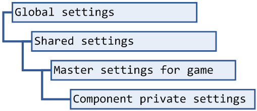

# Setting hierarchies

Settings are often organized into a hierarchy in which one collection of settings (a *child*) can *inherit* keys and values from another collection (its *parent*). When you look up a key in the child and it isn't defined there, the parent settings will be searched for the key in turn. If the key is defined there, the child will return the inherited value. If a setting with the same name is later set in the child, then the value set in the child is said to *override* the value that it would have inherited from the parent.

> A parent collection can also have a parent. The child inherits from both: when looking up a key, the child is checked first, then the parent, then the grandparent, and so on. The [Setting Explorer](dm-setting-explorer.md) can be used to visualize and trace setting hierarchies.

## Game component settings

An important example of a setting hierarchy is that formed by game components. Every game component has its own *private settings*. These are part of the component and are saved along with it. They can be used to override inherited settings with values specific to that component. This can be used to hack the layout or graphics used by a component to customize it. [DIY components](dm-diy.md) typically use their private settings to store the state of those parts of the component that the user can edit.

A component's private settings inherit from the master settings for the game that the component is associated with. This is often used to store the default settings used by all of the components defined by a particular game. These settings in turn inherit from the shared settings accessible from anywhere by calling `Settings.getShared()`, which in turn inherits all [global settings](dm-setting-collections.md).