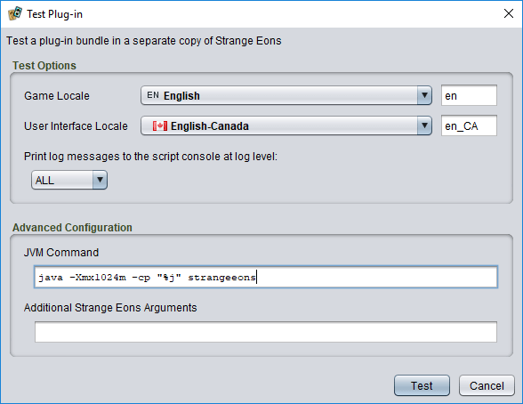
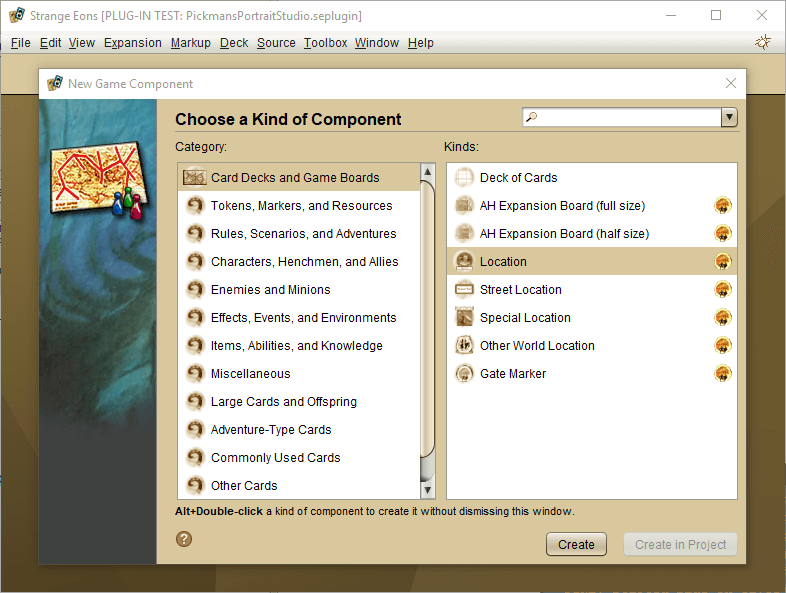

# Test Plug-in

The **Test Plug-in** project action can be applied to plug-in task folders and bundles. It launches a separate, special testing version of Strange Eons which loads the selected plug-in.

## Testing a plug-in

To *test a plug-in*, right click on the plug-in task folder or bundle you wish to test and choose **Test Plug-in**. If desired, change the options in the dialog window that appears, then choose **Test**.

### Test options

When testing a plug-in, you can choose the locales to use for the game and interface language. This is useful when localizing the plug-in. You can also select a level of detail for the log messages to be emitted from the test edition and printed in the [script console](dm-quickscript#the-script-console-window). Possible levels, from less detail to more detail, include `OFF`, `SEVERE`, `WARNING`, `INFO`, `CONFIG`, `FINE`, and `ALL`.

### ⚠ Advanced configuration options

The **Advanced Configuration** panel lets you configure the command used to start test mode. The first field configures how the app itself is started. It looks like a standard command and arguments, but a few of the values are actually stand-ins:

The `java` command name will be replaced with a command that will start an appropriate version of Java automatically. This should just work, but if necessary you can replace it with an explicit command.

The `%j` pattern will be replaced with the full path to the app's JAR file, which is typically the file `strange-eons.jar` in the installation folder.

The second field lets you specify additional [command line options](um-install-command-line-options.md#standard-options) to be passed to the test instance. Note that the `--plugintest`, `--glang`, `--ulang`, and `--loglevel` options will be set automatically using your **Test Options**.

> It is also possible to test multiple plug-in bundles simultaneously, but only by starting Strange Eons in test mode from the [command line](um-install-command-line-options.md#standard-options).

## Strange Eons in test mode

The test mode of Strange Eons behaves in most respects like a normal edition of Strange Eons, except:

* It loads and runs the test plug-in bundle in addition to any plug-ins that would load normally.
* It ignores the single instance setting, so it launches even if the app is already running.
* If started from an already running instance of Strange Eons, its output and error streams will be connected to the script output window of the host app. Once effect of this is that you can observe the entire application log from startup (the [Log Viewer](dm-quickscript.md#viewing-the-application-log) only displays the tail end).
* It will not attempt to re-open the last project or open file tabs.
* If the [script debugger](dm-debugger.md) is running in both the host instance of Strange Eons and the test instance, the test instance will use a random available port number. Hover the mouse pointer over the bug icon in the upper-right corner to see which port was selected. Clicking the bug should start the debugger, but if started manually you will need to [enter this port number](dm-debugger.md#manual-connections) to connect the debugger to the test instance.
* It uses a special brown-green theme. The distinctive colour scheme makes it clear from a glance which copy of Strange Eons has loaded the test bundle. The file name of the bundle also appears in the title bar.

