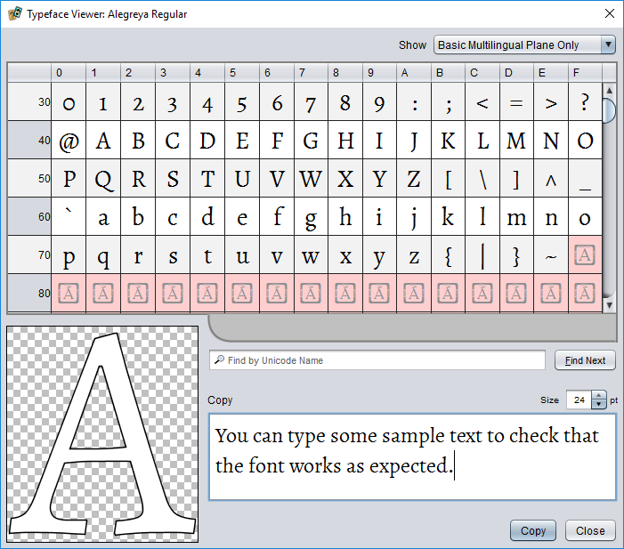

# Typeface viewer

The typeface viewer lets you explore and test compatible [font resources](dm-res-font.md) in a project.

To *preview a font file*, double click it in the project pane to open it in the typeface viewer.

## Exploring the available characters

The main area of the viewer consists of a table in which each cell is a Unicode *code point* (a code number for a character). Each row of the table covers 16 code points. The heading at the start of each row gives a base offset for the row. The code point for a given character can be calculated by adding its position in the row to this base. For example, the code point for A is U+0041. You will find it in the `4x` row in column `1`. The character, code point, and Unicode name can also be seen by hovering over the glyph's cell with the mouse pointer.

The colour of a cell indicates its status. Characters that are supported by the viewed font are shown in the cell for the appropriate code point using dark text on a light background. Code points that do not represent printable characters supported by the font use other colours:

 **Missing glyph**  
The code point is not supported by the font. (The viewer will try to display a fallback from another font so you can see which character is missing.)

 **Control code**  
The code point is a non-printable control code, not a character.

 **Unassigned**  
The code point has not been assigned a meaning under the Unicode standard. A character may or may not be assigned to this slot in the future. (If a whole row is unassigned, it is skipped in the table.)

### Previewing characters and text

Choosing any table cell will draw the associated glyph's outline in the large preview area in the lower-left corner of the dialog, print its Unicode name below the table, and insert it into the **Copy** field.

To *enter test text in the target font*, click in the **Copy** field and enter the desired text.

To *insert a selected character* into the **Copy** field, choose that character's cell in the table.

To *change the size of the preview text*, use the **Size** field above and to the right of the **Copy** field.

To *copy the sample text* to the clipboard, choose **Copy**.

### Searching for specific characters

You can search for characters by matching against their official Unicode name. Enter part of the name in the search field and press <kbd>Enter</kbd> or choose **Find Next**.

To *cycle through all matches*, choose **Find Next** repeatedly.

For example, to find all quotation characters, enter `quot` in the search field and use **Find Next** to select each match in turn.

> If you know the hexadecimal code point of the character you want to find, you can enter it directly in the search field. For example, to jump to the *non-breaking space* character, enter either `u+a0` or `0xa0`.  Letter case doesn't matter, and neither do leading zeros (so `U+00A0` has the same effect).

### Displayed character ranges

By default, the viewer shows only the characters in the Unicode *Basic Multilingual Plane*. This includes almost all of the characters used in modern languages, and will usually suffice. The dropdown list in the upper right corner of the dialog can be used to switch to the full Unicode range when required.
