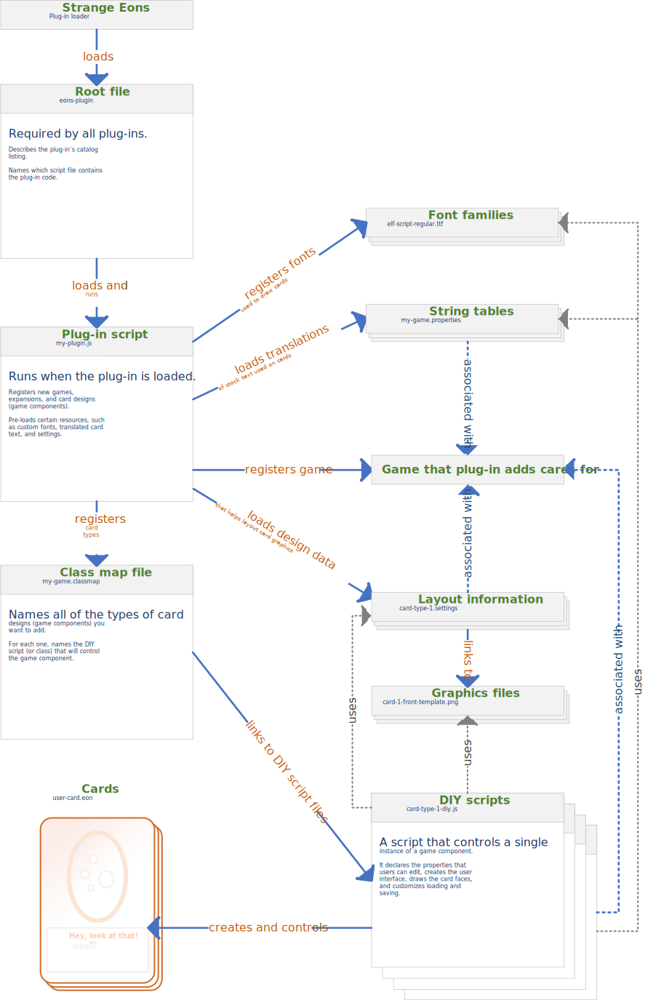
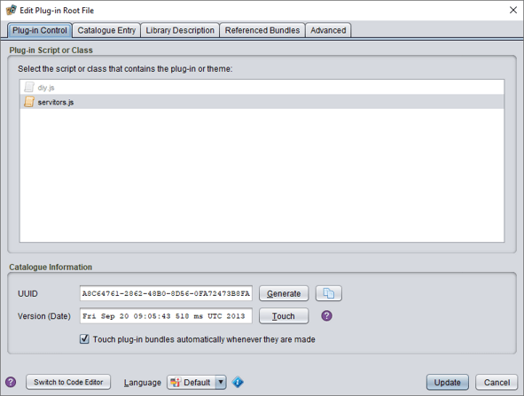
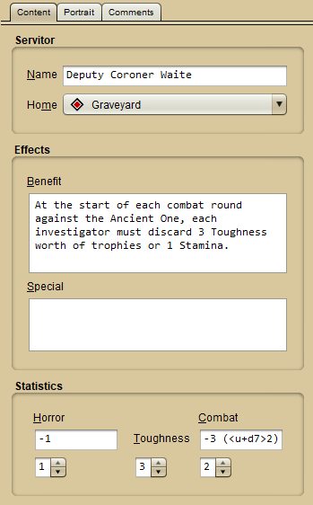

# Taking a tour of a plug-in

This article gives you a practical overview of plug-in development by exploring an existing plug-in. The goal is to get you familiar enough with the different parts of a real plug-in to give you a base to build your knowledge on. Depending on your learning style, you can then either read through the rest of this manual, or start making a plug-in right away but refer back to this manual as needed.

## The plug-in

The plug-in we are going to look at is "Rise of the Servitors" in the [Plug-in Authoring Kit](dm-pak.md). If you haven't already downloaded the kit, do so now. Open it as a [project](um-proj-intro.md) in Strange Eons (**File/Open Project**). You will find the **Rise of the Servitors** folder under **DIY Examples**.

Before we continue, it will help to know what the plug-in does, namely that it adds a new type of card (game component) to the board game Arkham Horror. The new card is called a "Servitor". It represents a kind of mini boss monster, but the game-related details don't matter. The card looks like this:


As you might be able to tell from this image, the card includes a portrait area at the top for a picture of the villain, a name (Deputy Coroner Waite in this example), a home or starting location, a "benefit" rule, a "special" rule (not used in the example), and some attributes: a horror modifier (and damage, the blue icon), a combat modifier (and damage, the heart icons), and a toughness value (the three blood drops).

The font for the card, and the small icons or the horror damage, combat damage, and toughness, are part of the plug-in for the main Arkham Horror game that this card expands. The images for this card's design, and the code that ties it together, are all included in this plug-in.

### Trying it out

It isn't strictly necessary, but it might help to play around with a Servitor card. First you'll want to install its required "Arkham Horror (2nd ed)" plug-in from the [catalogue](um-plugins-catalogue.md) and restart Strange Eons. Then you should be able to build and test the plug-in:

*Right click on the **Rise of the Servitors** folder and choose **Test Plug-in**.*

The plug-in files will be packed up into a plug-in bundle, then the test dialog will appear. The dialog's default settings should work fine.

*Click **Test** to [test the plug-in](dm-test-plugin.md) in a separate copy of Strange Eons.*

A special brown "test edition" of Strange Eons will open in a few moments. The instance of Strange Eons that you were working in is still running in its own window; you haven't lost any work and you can flip back to it at any time. In case your plug-in really goes off the rails and the test edition of Strange Eons stops working, you can close it from the original window using a control near the top of the window.

*In the test edition window, locate and click on the new Servitor card type under Enemies and Minions, then click **Create**.*

You can now play with the various controls to get a sense of what they do. When you are done, close the test edition window and continue in the original Strange Eons window.

## The big picture

We're about to explore the individual files that make up the plug-in, but first let's get a feel for the terrain. The diagram below shows, in general terms, the types of files used in a plug-in that adds new game components and how they are related. You might find it helpful to have this image open in another tab or window so you can refer back to it as you work through the rest of this page. Think of it as your map through the wilds that follow.



## The root

Let's explore the source code and resources that make up this plug-in, starting from the top-level folder and working inward.

*Open the **DIY Examples** folder, then the **Rise of the Servitors** folder, by clicking their dropdown arrows.*

In the root folder of the plug-in, you will find three entries:

 **resources**  
The meat of the plug-in will all be found in here. About the only exception is if the plug-in [includes Java code](dm-java-api.md#developing-a-compiled-plug-in), which is beyond the scope of this walkthrough.

 **index.html**  
This file contains the [blurb that pops up when the plug-in is installed](dm-installation.md). It's optional, but most plug-ins include one.

 **eons-plugin**  
This is the [plug-in root file](dm-eons-plugin.md). Every plug-in has one. Strange Eons looks at this file in order to figure out what files it needs to load in order to start the plug-in. We can use it for the same purpose.

*Double click **eons-plugin** to open the root file editor.*

In the root file editor, on the main **Plug-in Control** tab, you will see a list under **Plug-in Script or Class**. It is a list of script files found in the plug-in. You will see **diy.js**. (This is greyed out because Strange Eons can detect that it is not a valid plug-in script.) Under that you will see **servitors.js**. This script is selected, which tells us that **servitors.js** is the script that Strange Eons will load to start the plug-in. That is where we need to explore next, but where is it? We haven't seen it so far. We'll find it in a moment, but as a tip, if you hover the pointer over the script name, you will see the text `res://cgj/servitors/servitors.js` pop up. This [resource URL](dm-special-urls.md) tells us that the script is found inside the **resources** folder, under the path **cgj/servitors/servitors.js**.



*Have a quick look at the rest of the dialog:*

The **Catalogue Information** section is used by Strange Eons to tell different plug-ins, and different versions of the same plug-in, apart. If you were adapting this plug-in into something else, you would want to **Generate** a new **UUID** so that Strange Eons knows that your adapted code is a totally different plug-in and not an update of "Rise of the Servitors".

The **Catalogue Entry** tab lets us describe how the plug-in should be listed in the [catalogue](um-plugins-catalogue.md).

The **Library Description** tab is only used for the rare [library plug-in type](dm-plugin-types.md#library).

The **Referenced Bundles** tab can be used if your plug-in requires another plug-in to be installed. This particular plug-in is an expansion for the game Arkham Horror, so the plug-in for that game is listed as being required. We could click that entry and use the **Cut** button to the right to remove the requirement.

The **Advanced** tab has less commonly used options. This plug-in uses it to set the **Bundle Priority** to `EXPANSION` in order to ensure that this plug-in loads *after* the required Arkham Horror plug-in, and the **For Game** field marks this plug-in as being related to that game. The **Tags** field includes some tags that can be used when searching the catalogue.

*Click the **Cancel** button to close the dialog.*

## Folder structure

Using the root file, we figured out that the main plug-in file is called `servitors.js` and is stored somewhere under the **resources** folder. In fact, plug-ins typically store all of their key files in their **resources** folder.

*Use the dropdown arrow for **resources** to open that folder in the project view.*

 **cgj**  
This folder contains only one entry, a subfolder called **cgj**. This is because different plug-ins are intentionally allowed to access each others' files. To prevent two plug-ins from creating a conflict by storing two files with the same name in the same folder, every author is encouraged to store all of their files in their own unique subfolder of **resources**. In this case that folder is **cgj**, the initials of the plug-in author.

*Use the dropdown arrow for **cgj** to open that folder in the project view.*

 **servitors**  
This subfolder was created by CGJ (the plug-in author) in order to store all of the files related to this particular plug-in. Presumably CGJ has written (or plans to write) more than one plug-in. Like the **cgj** folder, this folder keeps files from different plug-ins from accidentally interfering with each other&mdash;in this case, other plug-ins written by CGJ.

*Use the dropdown arrow for **servitors** to open that folder in the project view.*

## The main plug-in files

Ah, we've finally dug down into the heart of the plug-in! The **servitors** folder doesn't have any more subfolders. This is reasonable since the plug-in only defines one game component type that expands an existing game, but a more complex plug-in would likely want to add some more organization. A common approach is to create one subfolder for each kind of game component. Anyway, let's see what we have:

 **back.jp2**  
This is the [image](dm-res-image.md) used for the card back. You can click this file name to see a thumbnail in the **Properties** tab below the project pane. You can also double click on the file to open a larger version in the built-in image previewer.

The `.jp2` extension indicates that this is a JPEG 2000 image. These offer better quality for the same file size as JPEG images, and unlike regular JPEG they also support transparency. This helps keep your plug-in smaller, but you can also use PNG or regular JPEG images. (You can also use Strange Eons to [convert other image formats](dm-convert-image.md) to JPEG 2000.)

 **card-layout.settings**  
This [settings file](dm-res-settings.md) defines a group of [settings](dm-settings.html) for the new game component: things like "where to draw the title" and "where to draw the portrait" and "what image to use for the card front". You don't have to put the settings for your component in a separate file like this, but it makes tweaking and updating the plug-in easier, especially as it grows in size. (It also makes [localization](tm-index.md) easier if parts of the design need to be adjusted for different locales.) We'll come back to this in more detail later.

 **diy.js**  
This is the script file that creates and controls the new card type. The file name [diy](dm-diy.md) refers to name of the subsystem of Strange Eons that lets you create components from script code (instead of compiled Java code). This script contains the code that creates the editing controls and paints the card faces, using the other resources in this folder. Again, we'll explore this further below.

 **front.jp2**  
As you might guess, this is the image for the front of the card. If you look at the preview, you will see that it has a transparent area cut out at the top of the card where the portrait goes. When the card front is painted, we'll paint the portrait image within this area first, then paint the card front overtop of it. This will allow the portrait to show through the cutout.

 **portrait.jp2**  
This is the sample portrait that will be used by default when the user doesn't choose one of their own. It is customary for new components to start filled in with an example. This helps new users come to grips quickly with the purpose of each control. Users who prefer to start fresh can quickly discard the example by choosing **Edit/Clear** from the application menu.

 **rots.classmap**  
This is a [class map file](dm-res-classmap.md). A class map file describes one or more new game component types in a kind of data table. The main plug-in script asks Strange Eons to register these new component types by reading the file. We'll see this when we look at the main plug-in script.

 **servitors.js**  
Here it is, the main [plug-in script]() that was named in the root file! We'll look at it in the next section.

 **servitors.png**  
This file holds the image that will be used as the icon for our plug-in. Although plug-ins can explicitly provide an icon image, if they don't then Strange Eons will look for a file in the same folder and with the same name as the plug-in script, but with a `.png` or `.jp2` file extension.

## The plug-in script

We now know that the plug-in root file names `servitors.js` as the script that contains the plug-in code. When Strange Eons loads the plug-in, it will read this file and then call its functions to get information about it and start it up. Those functions need to use certain reserved names so Strange Eons knows what to call; they can also define other functions for their own use, just like any other script.

> The **Minimal Examples/Basic Plug-in** example in the kit has a [plug-in script](https://github.com/CGJennings/se3docs/blob/master/Plug-in%20Authoring%20Kit/Minimal%20Examples/Basic%20Plug-in/resources/example/basic-plugin.js) with annotated examples of these reserved functions.

The script for this plug-in is quite simple, partly because it builds on the required Arkham Horror plug-in. For example, if we wanted our card to to [use certain custom fonts](dm-res-font.md), those would normally be registered by the plug-in script. This card uses custom fonts from Arkham Horror, so they're already registered. You can explore some of the more complex plug-in examples later to see how this works.

*Double click **servitors.js** to open it in the code editor.*

Strange Eons has a code editor built in. You don't have to use it, but it is a good idea for beginners to stick with it since it has special support for working with plug-in resources and knows how to handle certain details (like character encodings) automatically.

The plug-in script isn't very long. Let's look at the whole thing, one section at a time:

```js
useLibrary("extension");
```

This includes one of the [script libraries](dm-script-api.md) in our code. Script libraries are code included with Strange Eons to make your life easier when writing plug-ins. This particular library, the **extension** library, does the work needed to turn a regular plug-in script into a script for an [*extension* plug-in](dm-plugin-types.md#extension). The details are not important for now; all you need to know is that since this plug-in adds new game component types, it has to be an extension that Strange Eons loads when starting up.

```js
function getName() {
    return "Rise of the Servitors";
}

function getDescription() {
    return "Adds Servitor cards";
}

function getVersion() {
    return 2.2;
}
```

As you might guess, these functions are called by Strange Eons to gather basic descriptive information about the plug-in. When a plug-in is loaded, you can find this information by looking the plug-in up in the [plug-in manager](um-plugins-manager.md).

```js
// This function is called when the plug-in is first loaded. If it
// returns false, the plug-in will not be started.
function initialize() {
    // Is Arkham Horror installed?
    // If not, return false so that the plug-in is not installed;
    // otherwise, go ahead and load the settings and class map needed
    // for our component.
    const AH = Game.get("AH");
    if(AH == null) return false;

    AH.masterSettings.addSettingsFrom("cgj/servitors/card-layout.settings");
    ClassMap.add("cgj/servitors/rots.classmap");
    return true;
}
```

Since this plug-in is an extension, it is only run once. As a result, `initialize` is the only other function you need. As the comment states, it will be called when the plug-in is loaded. Let's break the guts of this function down:

```js
const AH = Game.get("AH");
if(AH == null) return false;
```

As the comments state, this code checks whether the "Arkham Horror" plug-in is installed. It works because the Arkham Horror plug-in will [register a game](dm-register-game.md) named *Arkham Horror* and associate it with the ID code `AH`. This ID code is then used as a shorthand for referring to things related to that game. For example, when we look at the class map file below, we will see that it says that the new component belongs to the game with the code `AH`. Registering a game for a group of components is not required, but it is a good idea and it is easy to do. 

> The **DIY Examples/Register Game** example in the kit demonstrates how to register both a game and an expansion for that game.

In this case, we are using the [Game](assets/javadoc/gamedata/Game.html) class to look up the *Arkham Horror* game information by its `AH` code. If no game has been registered with the `AH` code, then this will return `null`. In this case, we know that the Arkham Horror plug-in isn't installed (again, because it would have registered `AH`). Since this plug-in *requires* the Arkham Horror plug-in to work correctly, if it isn't installed the script returns `false` from the `initialize()` function, which signals to Strange Eons that something went wrong while starting the plug-in.

> If you are wondering how we know that the main "Arkham Horror" plug-in was started first, think back to when we examined the root file. This plug-in was listed as having a priority of `EXPANSION`, meaning that it adds an expansion to an existing game. The main "Arkham Horror" plug-in has a priority of `GAME`, meaning that it is the main plug-in for some game. This is a higher priority than `EXPANSION`: Strange Eons always starts all of the `GAME` plug-ins before it starts any `EXPANSION` plug-ins.

Looking up `AH` does serve as a check that the required plug-in is installed, but it is not the main reason that the plug-in looks up the game. The main reason is so that we can use the object representing the *Arkham Horror* game on the next line:

```js
AH.masterSettings.addSettingsFrom("cgj/servitors/card-layout.settings");
```

There is a lot going on in this line, so let's break it down step at a time. You have probably already noticed that this line refers to the **card-layout.settings** file, which was mentioned earlier when we explored the plug-in files. We won't get into the nitty gritty of that file until we get to **diy.js**, but we do need to talk a bit about settings at this point.

[Settings](dm-settings.md) are like variables that are not tied to a particular script file. (When you define a variable in a script, it only exists as long as the script is running, but settings can persist.) As mentioned earlier, the settings that are being loaded by the line above have to do with details about how the card should be drawn, like where to draw the portrait.

Settings are grouped together into collections: every Servitor card created by our plug-in will have its own collection of settings, called its *private settings*. The plug-in will use these to store the different attributes of the card, like what *name* the user gave their servitor. Since Strange Eons automatically saves all of these private settings as part of the save file for the card, that means that all of those details (name, special rules, and so on) are automatically saved and restored for us.

So far, so good. But remember that the settings in **card-layout.settings** are a little different. They don't control things that the user can change, like *name*. They control details about how the card is laid out. These settings are going to be needed by every Servitor card created by our plug-in, and they generally don't change. We could just add some code to the **diy.js** script that defines these settings when the card is first created, but this code does something a little more clever.

One collection of settings can [*inherit* settings](dm-setting-hierarchies.md) from another collection. In this case, the private settings of every game component inherits settings from the *master settings* of the game that the component is associated with. Suppose Strange Eons is trying look up a setting called `example-layout-setting` in a card's private settings, but it isn't defined there. It will then look for a value in the default settings that all Servitor cards inherit from the `AH` (*Arkham Horror*) game.

That brings us back to the line:

```js
AH.masterSettings.addSettingsFrom("cgj/servitors/card-layout.settings");
```

Now you can see that what this is doing is loading the default layout settings for Servitor cards into the master settings of the Arkham Horror game. So, why did I say this was clever? Suppose that in the future, the plug-in author decides to change the card layout. Maybe bumping one of the text boxes over a bit, or making it a bit bigger. All the author has to do is change the relevant setting definition in the setting file, and as soon as users install the updated plug-in all of their cards will magically switch to the new layout. This happens because they inherit those settings from the master settings for the game. If the plug-in instead used each card's private settings to store the layout information, old save files would be saved with the old layout information built in.

> If all of that is a bit too much to handle, for now it is enough to know that the line of code above loads some default layout settings from a file. You can always read this section over again once you have a little more experience.

Phew. We are down to the last two lines:

```js
ClassMap.add("cgj/servitors/rots.classmap");
return true;
```

The last line just returns `true` to signal to Strange Eons that the plug-in loaded successfully and everything is OK. This leaves the penultimate line. You may recall that this was described earlier as a *class map file*, used to register new kinds of game components. This is where the plug-in tells Strange Eons to load the named class map file and register its contents. Let's look at that file next.

## The class map file

*Double click **rots.classmap** to open it in the code editor.*

This plug-in only registers one new component type, so the [class map file](dm-res-classmap.md) is short:

```properties
@cat-enemies
  Servitor = diy:cgj/servitors/diy.js | cgj/servitors/servitors.png | AH
```

The first line defines the category that the new card type will be listed under (*Enemies and Minions*). This is a standard category, but it is also possible to define your own.

The second line tells Strange Eons to register a new kind of game component called a *Servitor*. This new component type uses the DIY system and is controlled by the **diy.js** script; in the [**New Game Component** dialog](um-gc-intro.md), this component will be listed with the **servitors.png** icon (the same icon used for the plug-in); and this new component belongs to the game with code `AH` (which we already learned is the code for *Arkham Horror*).

Class map files are straightforward if a bit fiddly. When writing them, just keep the [class map manual page](dm-res-classmap.md) open so you can refer to it as needed.

## The DIY script

We saw that the class map registers **diy.js** as the script that controls the new Servitor card type.

*Double click **diy.js** to open it in the code editor.*

You will immediately see that this is by far the longest script in the plug-in, at around 200 lines. Like a plug-in script, a DIY script is expected to define functions with certain reserved names. The article on [DIY game components](dm-diy.md) already does a good job of introducing how DIY components work and how each function is used, so rather than repeat everything here, [you should give that a read and then come back](dm-diy.md). Then we can examine selected parts of the Servitor DIY script as a working example.

---

Back? OK, let's have a look at the script.

The first few lines load some script libraries we'll need:

```js
useLibrary("diy");
useLibrary("ui");
useLibrary("markup");
```

These load some boilerplate for creating DIY components, support for building the user interface, and support for creating the markup boxes that will be used to format text on the card.

### Setting up the card

The next few lines do some stuff specific to Arkham Horror. Let's skip down to the `create` function. Here's the first block:

```js
diy.version = 2;
diy.extensionName = "ArkhamHorrorRiseOfTheServitors.seext";
diy.faceStyle = FaceStyle.PLAIN_BACK;
diy.frontTemplateKey = "servitor-front-sheet";
diy.backTemplateKey = "servitor-back-sheet";
diy.portraitKey = "servitor";
```

The first line sets the version for this component to 2. This is used to ensure that [new versions of the script can still open files saved from a previous version of the script](dm-compatibility.md). The `diy` variable, which is an argument passed to our function, is an [object](assets/javadoc/ca/cgjennings/apps/arkham/diy/DIY.html) that represents the particular Servitor instance that the script is controlling at a given moment.

The second line sets an optional hint for the user; if a user tries to load a Servitor but they don't have the right plug-in installed, this can be used to used to suggest which plug-in to install.

The third line sets the component to the `PLAIN_BACK` type. This means that the script is responsible for drawing the front of the card while the back will consist of a simple image (**back.jp2**).

The next three lines declare base names for the setting keys that will be used to identify the main images (called template images) used to draw the front and back faces, as well as the default portrait image. The template images also determine the physical size of the card faces. These entries refer to some of the setting keys defined in **card-layout.settings**:

```properties
servitor-front-sheet-template = cgj/servitors/front.jp2
servitor-back-sheet-template = cgj/servitors/back.jp2
servitor-portrait-template = cgj/servitors/portrait.jp2
servitor-portrait-clip-region = 12,12,316,172
```

Recall that these settings were added as defaults for components associated with the `AH` game in the main plug-in script. All of these setting names are derived from the base names set in the code in `create`. The first three identify the image resources to use for the card front, card back, and default portrait, respectively. The last defines the rectangular [Region](assets/javadoc/resources/Settings.Region.html) of the front template where the portrait will be drawn.

The rest of the code in the `create` function is responsible for setting the state of a new Servitor card by installing an example. It does this by setting private settings to reflect the same example card featured in the sample image above:

```js
diy.name = "Deputy Coroner Waite";
$Home = "$GRAVEYARD";
$HorrorCheck = "-1";
$HorrorDamage = "1";
$CombatCheck = "-3 (<u+d7>2)";
$CombatDamage = "2";
$Toughness = "3";
$Special = "";
$Benefit = "At the start of each combat round against the Ancient One, "
    + "each investigator must discard 3 Toughness worth of trophies or "
    + "1 Stamina.";
```

The code uses [$-notation](dm-dollar-notation.md) for convenience. Otherwise, a line like `$Toughness = "3";` would be written out "longhand" as `diy.settings.set("Toughness", "3");`.

### Clearing the card content

The next function, `onClear` is called when the user wants to clear the contents of the card. It sets the same settings as above to blank or default values:

```js
$Home = "$ARKHAMASYLUM";
$HorrorCheck = "+0";
$HorrorDamage = "1";
$CombatCheck = "+0";
$CombatDamage = "1";
$Toughness = "1";
$Special = "";
$Benefit = "";
```

### Setting up the editing controls

The `createInterface` function is used to set up the editing controls that the user will interact with in order to create their custom Servitor. As users work with the interface controls (text fields, drop boxes, and so on), the matching private settings (such as `$Home` and `$Toughness`) will change to match the new values. At the same time, Strange Eons is notified that the relevant card faces are out of date, and it calls the script's painting functions to update them (described in the next section).

Coordinating the action between the interface controls, the component, and the component faces is a bit like conducting an orchestra, but Strange Eons takes care of the details. Here again, the main article on DIY components already [provides a good overview of the process](dm-diy.md#createinterfacediy-editor), so here we'll focus on interesting parts of the code:

```js
let panelStack = new Stack();
```

This line creates a layout container that will act as the root from which the rest of the interface will grow. A layout container is used to organize other interface elements, including both controls and other containers.  The `Stack` container type organizes its child elements into a vertical stack, in this case of titled panels with the labels **Servitor**, **Effects**, and **Statistics**. These panels are also layout containers, and each contains a group of controls focused on editing content in its respective category:



Portrait editing is handled automatically on its own tab ([manual control](dm-diy-portraits.md#manual-portrait-handling) is also available).

```js
let panel = new Grid("fillx");
```

This line creates the first of the three panels (**Servitor**), which captures basic information about the card. As each section is completed, its respective panel is added to the panel stack and then the `panel` variable is reused to hold the panel for the next section. This has pros and cons. Using a new variable name for each panel (`servitorPanel`, `effectsPanel`, `statsPanel`) might make the code a little clearer, but using the same variable name for each panel makes it easy to reorganize the controls to find the best layout.

> `Stack` and `Grid` are two of the available layout containers used to organize the interface. You can read more about how they work in the documentation for the [uilayout](assets/jsdoc/modules/uilayout.html) script library. The `Grid` layout container is the most complex but also the most flexible. Beginners may want to start with the `TypeGrid` layout instead.

```js
let bindings = new Bindings(editor, diy);
```

This creates the Bindings object used to link each interface control to the private setting that it edits, and to trigger the repainting of card faces as needed. The script passes in two arguments (which were originally passed in to `createInterface `): `editor` which is an object representing the editor tab that will tie everything together, and `diy` which, again, is the object representing the game component itself. The Bindings object needs these for its own inner workings.

```js
let nameField = textField();
diy.setNameField(nameField);
let nameLabel = label("&Name", nameField);
panel.place(nameLabel, "split", nameField, "growx, wrap");
```

These lines create a field for the user to type a name into, create a label for the field to tell the user what it is for, then add both to the **Servitors** panel. The name field is a special case, because every game component has to be "nameable". A component's name is not stored as a private setting but as a special property of the component object itself (`diy.name`). When a text field is created to edit that name, we also need to tell that to the component, which is what `diy.setNameField` does. The component itself, rather than the Bindings object, will manage changes to the name field.

The text field itself is created by calling `textField()`. The [uicontrols](assets/jsdoc/modules/uicontrols.html) script library lets you create several kinds of controls by calling functions like this. The label control is another example. It is passed two arguments: the text of the label, and the control being labelled.

> The label has to know what it is a label for to support screen readers (for accessibility), but also to allow the control to be activated by shortcut. In the interface you may notice that a letter is underlined in some labels. The underlined letter is a shortcut key that can be used to activated the relevant control by holding down <kbd>Alt</kbd> and pressing the underlined letter. The letter key is indicated by placing an ampersand (`&`) before it in the label text. For example, this name label can be activated by pressing <kbd>Alt</kbd>+<kbd>N</kbd>.

The final line adds both the label and the text field to the current panel (the **Servitor** panel). Every layout container has a `place` function that can be used to add one or more controls; after each control you also pass a string that specifies any special options for how that control should be placed. Each kind of layout object uses different hints. (A few, like `Stack`, don't use hints, in which case controls can be placed by calling `add` instead, which takes a list of controls without any hint values.)

The **Servitor** panel has another control, **Home**, but it uses a special control specific to Arkham Horror so, as before, we'll skip over it. The next few lines round out the first panel:

```js
panel.setTitle("Servitor");
panelStack.add(panel);
```

These lines set the **Servitor** label on the panel as a whole, then add it to the vertical stack of panels that will make up the content of the editing tab.

```js
panel = new Grid("fillx");
```

The next line creates the next panel to be filled in, which will be titled **Effects**. Earlier we saw that the component's name gets special handling; let's look at how one of the "regular" properties, that is bound to a private setting works:

```js
let benefitField = textArea("", 5, 0, true);
bindings.add("Benefit", benefitField, [0]);
let benefitLabel = label("&Benefit", benefitField);
```

This code adds the control that manages the `Benefit` private setting, a block of text that describes a special rule. Instead of a `textField` it uses a `textArea`, which allows multiple lines. Some extra configuration details are passed in this time, setting the initial text, number of rows and columns (`0` being special), and whether it should allow scrollbars.

The next line creates the necessary glue to link this text area to the `Benefit` setting: the three arguments are the setting name (as a string, and without the `$` we would use for $-notation), the control, and an array that lists which sheets (card faces) need to be redrawn when the value changes. Each face is numbered, starting from zero, so the value `[0]` tells the bindings instance that the front face needs to redrawn when the `Benefit` setting is updated. If both the front and back faces relied on the value of `Benefit`, you would instead use `[0,1]`. If only the back face relied used the value, you would specify that with `[1]`.

Let's take a moment to go through an entire edit cycle based on the relationships set up by this code. Suppose you create a new Servitor card. (To make it easier to keep things straight, I'll use `$Benefit` when talking about the `Benefit` private setting.) Since the bindings link `benefitField` to the value of `$Benefit`, when the editor is first created that value will be written into the text area to start with. Since this is a new Servitor that was just created, the initial value of `$Benefit` is the one that was set in the `create` function, which is just an empty string (`""`). Now the editor tab for the new card is added to set of open editors and the interface appears. The user clicks in the `benefitField` control and enters `"Grants infinite wishes!"`. The control detects this edit automatically, and since `benefitField` is bound to `$Benefit`, the Bindings object will update `$Benefit` to the newly entered text. And since the binding also specifies that whenever `$Benefit` changes, the front card face needs to be repainted with the new text, a repaint will be triggered automatically in the next few hundred milliseconds or so, after which the preview image will update to reflect the changed content. If the user saves and closes the editor at this point, the private settings is the save file will reflect the edited value. The next time the user opens the file, `$Benefit` will be set to the saved `"Grants infinite wishes!"` value, so when the editor tab appears the `benefitField` will have that text already preloaded instead of the blank string of a newly created card.

The rest of `createInterface` consists of variants on this these, except for the last two lines: different kinds of components are created, bound to settings, given labels, and added to panels. The last two lines complete the interface:

```js
panelStack.addToEditor(editor, "Content", null, null, 0);
bindings.bind();
```

The first line takes the root of our interface, the vertical stack of titled panels, and adds it to the game component editor as an editing tab labelled **Content**. If we didn't call this, the controls would exist but they wouldn't be part of the editor so we wouldn't be able to see or use them. The final line tells the Bindings object that we have added all of the controls that it will be responsible for, and that it should thus create all the behind-the-scenes connections that will link everything together.

### Painting the card faces

The job of painting the faces of your game component is split into two parts: setting up for painting, and actually painting. Set up is handled by the functions `createFrontPainter` and `createBackPainter`. These are called once whenever an instance of the component is created.

> Setting up the interface controls is kept separate from setting up painting. This is intentional: the controls are only needed when the component is being placed in an editor tab. For other uses, such as [exporting](um-gc-export.md) or [adding a component to a deck](um-deck-adding-content.md), they are not needed and `createInterface` is never called. For this reason it is important to ensure that your painting code does not rely on values or objects that are only initialized in `createInterface`. Generally, your painting code should only rely on the content stored in private settings, layout parameters stored as private or game settings, objects you set up in `createFrontPainter`/`createBackPainter`, and the values passed directly to your painting functions.

The most common task performed by the paint setup functions is to prepare a markup box to be used later, and that's what we see happening in this script's `createFrontPainter` as well. A markup box is used to typeset styled text that can include [markup tags](um-gc-markup.md).

This script's `createFrontPainter` function creates two markup boxes: one to typeset the title and one to typeset the reset of the card's text. Here is the section that sets up the title box:

```js
titleBox = markupBox(sheet);
titleBox.setAlignment(MarkupBox.LAYOUT_CENTER | MarkupBox.LAYOUT_MIDDLE);
let defaultStyle = titleBox.getDefaultStyle();
defaultStyle.add(FAMILY, AHData.cardFamily);
defaultStyle.add(SIZE, 11);
titleBox.setTextFitting(MarkupBox.FIT_BOTH);
```

The markup box is created by calling the `markupBox` function, which was defined by including the [markup](assets/jsdoc/modules/markup.html) script library. The `sheet` that is passed to this function is an object that represents the front card face (an instance of the [DIYSheet](assets/javadoc/ca/cgjennings/apps/arkham/diy/DIYSheet.html) class). The new markup box uses this to set itself up properly to work with the card face.

The following lines set up the box's default style. The default text alignment is set to center the title text horizontally (`LAYOUT_CENTER`) and vertically (`LAYOUT_MIDDLE`), which makes sense for a title. Then the default text style is modified to set the desired font size and family. (The family uses an object defined by the Arkham Horror plug-in to get a font family name specific to that game; you can learn about [using your own fonts here](dm-res-font.md).) A text style is a collection of attributes like font size, colour, underlining, and so on. As the name suggests, a box's default style is the initial style applied to text when no other styles apply. There are some built-in tags that modify the current style, like `<b>`/`</b>`, and you can define new ones. There are other kinds of tags you can define, too, like ones which replace the tag text with other content of your choice. This can be used, for example, to define tags that insert symbols or other content specific to the target game.

The final line sets the box's *text fitting* mode. This feature allows Strange Eons to automatically "shrink" the contents of a box to make it fit in its region of the card face. It can either be done by reducing the space between lines or scaling down the font size, or both. While not ideal from a design perspective, this can be a useful option, especially for plug-ins meant for amateur designers.

The next block sets up the text box that will contain the main text of the card:

```js
textBox = markupBox(sheet);
textBox.setAlignment(MarkupBox.LAYOUT_CENTER | MarkupBox.LAYOUT_BOTTOM);
textBox.setTextFitting(MarkupBox.FIT_BOTH);

defaultStyle = textBox.getDefaultStyle();
defaultStyle.add(FAMILY, AHData.bodyFamily);
defaultStyle.add(SIZE, 8);

let h1 = new TextStyle(WEIGHT, WEIGHT_BOLD, SIZE, 9);
textBox.setStyleForTag("h1", h1);
```

It is similar to the set up of the title box. One notable difference is that in addition to a default style, this box also sets up a style for the `<h1>` heading tag. The tag is typically used to mark rule names or similar content.

In contrast to `createFrontPainter`, the `createBackPainter` function is empty. There is nothing for it to do because the component type is set to `FaceStyle.PLAIN_BACK`, meaning that it uses a single fixed image for the back of every card, like a deck of regular playing cards. The image used for the card back was defined using the `servitor-back-sheet-template` setting; Strange Eons will take care of painting it for us.

The `paintFront` and `paintBack` functions are called to paint the card faces. As with `createBackPainter`, the `paintBack` function is empty because Strange Eons will paint the back face for us. Let's look at the start of  `paintFront`:

```js
sheet.paintPortrait(g);
sheet.paintTemplateImage(g);
```

As you may guess from the function names, these two lines paint the portrait image, then paint the front card face overtop of it. Keep in mind that the front face has a transparent "hole" cut out of it where the portrait will show through. The setting key `servitor-portrait-clip-region` determines the rectangular region that the portrait will cover. It consists of four numbers separated by commas (`,`): the number of pixels from the left edge of the template image; the number of pixels from the top edge of the template image; and the width and height of the region, again measured in pixels on the template image. The [Draw Regions tool](dm-draw-regions.md) can be used to quickly and easily define and edit region settings.

```js
g.setPaint(Color.BLACK);
```

This line sets the colour for painting text and shapes to black. Notice that some drawing commands are defined on `g`, while some&mdash;like the ones above&mdash;are defined on `sheet`. The `g` argument is a *graphics context*; it is used for low level drawing like lines, shapes, and arbitrary images. The painting support provided by `sheet` is higher level, like the call above that handles all the details of painting the portrait. Notice that these higher-level functions take `g` as an argument; ultimately all drawing on the card face goes through the graphics context.

```js
titleBox.markupText = diy.name + "<size 8>\nServitor";
titleBox.draw(g, $$servitor-title-region.region);
```

These lines draw the title. The first line updates the text that the title markup box will draw by setting it to the component's name (plus some extra text). The second line tells the box to lay out and draw the text. Notice, again, that the `g` graphics context is passed to this function. The second argument describes the rectangular region where the text should be drawn (and that it must fit in if text fitting is enabled). This region has been defined in **card-layout.settings**, just after the setting keys for the template images and portrait. A similar region for the main text box is there, too:

```properties
servitor-title-region = 35,216,267,41
servitor-text-region = 31,260,274,167
```

> There is one final line in the settings file, which defines `servitor-front-sheet-expsym-region`. This tells Strange Eons where to draw [expansion symbols](dm-register-game.md#expansion-symbols), which we won't cover here.

The syntax used to fetch the region may seem odd at first. You have already seen $-notation used to read a setting value. In this case, if we wrote `$servitor-title-region`, we would get the value of the setting, namely the string `"35,216,267,41"`. Some high-level functions, like those defined on `sheet` may accept a string description of a region, but the box's `draw` method expects a [Region](assets/javadoc/resources/Settings.Region.html) object. The extra $ turns the setting name into something called a [live setting](dm-dollar-notation.md#live-settings), which can be used to parse the setting's string value directly into a Region (and into other useful objects as well). The equivalent to this without using $-notation is `diy.settings.getRegion("servitor-title")` (the function knows to add `-region` to the name for you).

The rest of the painting code draws the rules and icons for the card face using the main text box. The content is fetched from the component's private settings; the same settings that were initialized in `create` and given interface components in `createInterface`. It is notable that the icons for values such as the Servitor's `$Toughness` are drawn directly but by appending `<image>` tags to the markup box content. As the comments state, this is slower than drawing the images directly but it can be convenient for plug-in authors.

> If you are drawing fixed text that the user cannot change, such as a label or an attribute that can only be one of a group of set options, it is faster to draw this text directly using the functions provided by `g` or `sheet` than to use a markup box. While a markup box is flexible, that flexibility requires a lot of extra CPU power to parse and typeset.

### Handling loading and saving

Near the bottom of the script, the `onRead` and `onWrite` functions are defined, but they are empty placeholders as well. These functions are called when the game component is loaded or saved (respectively). These functions are only needed in a few cases:

* When basic features of the component that are normally only settable in `create` change, such as changing the `faceStyle`, these features can be set to their new values in `onRead` to update old components to the new state.
* When the game component design is updated in a way that means old save files would no longer work correctly, such as changing the meaning of one of the component's private settings, `onRead` can be used to [upgrade older files seamlessly](dm-compatibility.md).
* When private settings are insufficient and you need to read and write custom objects in the save file. The most common case is components that use [multiple portraits](dm-diy-portraits.md#manual-portrait-handling).

### Quick-testing the component

The final block of code in the editor does some special handling when the script is run directly from the code editor. In this case, the value of `sourcefile` will always be `"Quickscript"`.

```js
if(sourcefile == "Quickscript") {
    testDIYScript("AH");
}
```

Running this script directly will cause the `testDIYScript` function to be called, which will immediately create a new game component editor using the script. If you try this now, you'll get an error because the settings in **card-layout.settings** won't have been loaded (as the plug-in itself is not installed). You can fix this by right clicking on the settings file and choose **Merge Settings Into/Arkham Horror**. This will add the settings to the master settings for that game, just as the plug-in script would have. (The test function is called with the `AH` game code, so the test component will know it belongs to that game and use it's master settings as the parent of the component's private settings.) Once this is done, you can test the component quickly without having to go through an entire **Test Plug-in** cycle. (The required Arkham Horror plug-in still needs to be installed, though.) It is usually possible to set up a quick testing cycle in this way, though some components may require additional steps within the `if` block.
