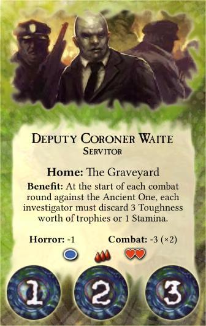

# Walkthrough [work in progress]

This article gives you a practical overview of plug-in development by exploring an existing plug-in. The goal is to give you enough experience with a real plug-in to give you some context for exploring this manual. Once you have gone through this article, you should have a basic feel for things. Depending on your learning style, you can then either read through the rest of this manual to build on that understanding, or start making a plug-in right away and refer back to specific manual sections as you need them.

## The plug-in

The plug-in we are going to look at is "Rise of the Servitors" in the [Plug-in Authoring Kit](dm-pak.md). If you haven't already, download the kit and open it as a [project](um-proj-intro.md) in Strange Eons. You will find the **Rise of the Servitors** folder under **DIY Examples**.

Before we continue, it will help to know what this plug-in actually does. It adds a new type of card (game component) to the board game Arkham Horror. The new card is called a "Servitor" and it represents a kind of mini boss monster. The card looks like this:



As you might be able to tell from this image, the card includes a portrait area at the top for a picture of the villain, a name (Deputy Coroner Waite in this example), a home or starting location, a "benefit" rule, a "special" rule (not used in the example), and some attributes: a horror modifier (and damage, the blue icon), a combat modifier (and damage, the heart icons), and a toughness (the three blood drops).

The font for the card, and the small damage and toughness icons, are part of the plug-in for the main Arkham Horror game that this card expands. The images for this card's design, and the code that ties it together, are all included in this plug-in.

### Trying it out

It isn't strictly necessary, but it might help to play with the new card type a bit. First you'll want to install it's required "Arkham Horror (2nd ed)" plug-in from the [catalogue](um-plugins-catalogue.md) and restart Strange Eons. Now you should be able to build and test the plug-in:

*Right click on the **Rise of the Servitors** folder and choose **Test Plug-in**.*

The plug-in will be packed up into a plug-in bundle, then the test dialog will appear. The defaults in this dialog should work fine.

*Click **Test** to [test the plug-in](dm-test-plugin.md) in a separate copy of Strange Eons.*

The brown test edition of Strange Eons will open in a few moments.

*Locate and click on the new Servitor card type under Enemies and Minions, then click **Create**.*

You can now play with the various controls to get a sense of what they do. When you are done, you can close the test edition window and continue in the original Strange Eons window.

## The root

Let's explore the source code and resources that make up this plug-in, starting from the top-level folder and working inward.

*Open the **DIY Examples** folder, then the **Rise of the Servitors** folder, by clicking their dropdown arrows.*

In the root folder of the plug-in, you will find three entries:

 **resources**  
The meat of the plug-in will all be found in here. About the only exception is if the plug-in [includes Java code](dm-java-api.md#developing-a-compiled-plug-in), which is beyond the scope of this walkthrough.

 **index.html**  
This file contains the [blurb that pops up when the plug-in is installed](dm-installation.md). It's optional, but most plug-ins include one.

 **eons-plugin**  
This is the [plug-in root file](dm-eons-plugin.md). Strange Eons looks at the plug-in root file in order to figure out what files it needs to load in order to start the plug-in. We can use it for the same purpose.

*Double click **eons-plugin** to open the root file editor.*

In the root file editor, on the main **Plug-in Control** tab, you will see a list under **Plug-in Script or Class**. It is a list of script files found in the plug-in. You will see **diy.js**. (This is greyed out because Strange Eons can detect that it is not a valid plug-in script.) Under that you will see **servitors.js**. This script is selected, which tells us that **servitors.js** is the script that Strange Eons will load to start the plug-in. That is where we need to explore next, but where is it? We haven't seen it so far. We'll find it in a moment, but as a tip, if you hover the pointer over the script name, you will see the text `res://cgj/servitors/servitors.js` pop up. This [resource URL](dm-special-urls.md) tells us that the script if found inside the **resources** folder, under the path **cgj/servitors/servitors.js**.

*Have a quick look at the rest of the dialog:*

The **Catalogue Information** section is used by Strange Eons to tell different plug-ins, and different versions of the same plug-in, apart. If you were adapting this plug-in into something else, you would want to **Generate** a new **UUID** so that Strange Eons knows that your adapted code is a totally different plug-in and not an update of "Rise of the Servitors".

The **Catalogue Entry** tab lets us describe how the plug-in should be listed in the [catalogue](um-plugins-catalogue.md).

The **Library Description** tab is only used for the rare [library plug-in type](dm-plugin-types.md#library).

The **Referenced Bundles** tab can be used if your plug-in requires another plug-in to be installed. This particular plug-in is an expansion for the game Arkham Horror, so the plug-in for that game is listed as being required. We could click that entry and use the **Cut** button to the right to remove the requirement.

The **Advanced** tab has less commonly used options. In this case, the **Bundle Priority** is set to `EXPANSION` in order to ensure that this plug-in loads *after* the required Arkham Horror plug-in, and the **For Game** field marks this plug-in as being related to that game. The **Tags** field includes some tags that can be used when searching the catalogue.

*Click the **Cancel** button to close the dialog.*

## Folder structure

We have figured out that the main plug-in file is called `servitors.js` and is stored somewhere under the **resources** folder. In fact, most plug-ins store all of their key files inside of their respective **resources** folder.

*Use the dropdown arrow for **resources** to open that folder in the project view.*

 **cgj**  
This folder contains only one entry, a subfolder called **cgj**. This is because different plug-ins are intentionally allowed to access each others' files. To prevent two plug-ins from creating a conflict by storing two files with the same name in the same folder, every author is encouraged to store all of their files in their own unique subfolder of **resources**. In this case that folder is **cgj**, the initials of the plug-in author.

*Use the dropdown arrow for **cgj** to open that folder in the project view.*

 **servitors**  
This subfolder was created by CGJ in order to store all of the files related to this particular plug-in. Presumably CGJ has written (or plans to write) more than one plug-in. Like the **cgj** folder, this folder keeps files from different plug-ins from accidentally interfering with each other (in this case, other plug-ins written by CGJ).

*Use the dropdown arrow for **servitors** to open that folder in the project view.*

## The main plug-in files

Ah, we've finally dug down into the heart of the plug-in! The **servitors** folder doesn't have any more subfolders. This is reasonable since the plug-in only defines one game component type that expands an existing game, but a more complex plug-in would likely want to add some more organization. A common approach is to create one subfolder for each kind of game component. Let's see what we have:

 **back.jp2**  
This is the [image](dm-res-image.md) used for the card back. You can click this file name to see a thumbnail in the **Properties** tab below the project pane. The `.jp2` extension indicates that this is a JPEG 2000 image. These offer better quality for the same file size as JPEG images, and also support transparency. This helps keep your plug-in smaller, but you can also use PNG or regular JPEG images. (You can also use Strange Eons to [convert other image formats](dm-convert-image.md) to JPEG 2000.)

 **card-layout.settings**  
This [settings file](dm-res-settings.md) defines a group of [settings](dm-settings.html) for the new game component: things like "where to draw the title" and "where to draw the portrait" and "what image to use for the card front". You don't have to put the settings for your component in a separate file like this, but it tends to make tweaking and updating the plug-in easier, especially as it grows in size. We'll come back to this in more detail later.

 **diy.js**  
This is the script file that creates and controls the new card type. The file name [diy](dm-diy.md) refers to name of the subsystem of Strange Eons that lets you create components from script code (instead of compiled Java code). This script contains the code that creates the editing controls and paints the card faces, using the other resources in this folder. Again, we'll explore this further below.

 **front.jp2**  
As you might guess, this is the image for the front of the card. If you look at the preview, you will see that it has a transparent area cut out at the top of the card where the portrait goes. When the card front is painted, we'll paint the portrait image within this area first, then paint the card front overtop of it. This will allow the portrait to show through the cutout.

 **portrait.jp2**  
This is the sample portrait that will be used by default when the user doesn't choose one of their own. It is customary for new components to start filled in with an example. This helps new users come to grips quickly with the purpose of each control. Users that prefer to start fresh can quickly discard the example by choosing **Edit/Clear** from the application menu.

 **rots.classmap**  
This is a [class map file](dm-res-classmap.md). A class map file describes one or more new game component types in a kind of data table. The main plug-in script asks Strange Eons to register these new component types by reading the file. We'll see this when we look at the main plug-in script.

 **servitors.js**  
Here it is, the main [plug-in script]() that was named in the root file. We'll examine it in detail in the next section.

 **servitors.png**  
This file holds the image that will be used as the icon for our plug-in. Although plug-ins can explicitly provide an icon image, if they don't then Strange Eons will look for a file in the same folder and with the same name as the plug-in script, but with a `.png` or `.jp2` file extension.

## The plug-in script

We now know that the plug-in root file names `servitors.js` as the script that contains the plug-in code. When Strange Eons loads the plug-in, it will read this file and then call its functions to get information about it and start it up. Those functions need to use certain reserved names so Strange Eons knows what to call; they can also define other functions for their own use, just like any other script.

> The **Minimal Examples/Basic Plug-in** example in the kit has a plug-in script with annotated examples of these reserved functions.

The script for this plug-in is quite simple, partly because it builds on the required Arkham Horror plug-in. For example, if we wanted our card to to [use certain custom fonts](dm-res-font.md), those would normally be registered by the plug-in script. This card uses custom fonts from Arkham Horror, so they're already registered. You can explore some of the more complex plug-in examples later to see how this works.

*Double click **servitors.js** to open it in the code editor.*

Strange Eons has a code editor built in. You don't have to use it, but it is a good idea for beginners to stick with it since it has special support for working with plug-in resources and knows how to handle certain details (like character encodings) automatically.

The plug-in script isn't very long. Let's look at the whole thing, one section at a time:

```js
useLibrary("extension");
```

This includes one of the [script libraries](dm-script-api.md) in our code. Script libraries are code included with Strange Eons to make your life easier when writing plug-ins. This particular library, the **extension** library, does the work needed to turn a regular plug-in script into a script for an [*extension* plug-in](dm-plugin-types.md#extension). The details are not important for now; all you need to know is that since this plug-in adds new game component types, it has to be an extension that Strange Eons loads when starting up.

```js
function getName() {
    return "Rise of the Servitors";
}

function getDescription() {
    return "Adds Servitor cards";
}

function getVersion() {
    return 2.2;
}
```

As you might guess, these functions are called by Strange Eons to gather basic descriptive information about the plug-in. When a plug-in is loaded, you can find this information by looking the plug-in up in the [plug-in manager](um-plugins-manager.md).

```js
// This function is called when the plug-in is first loaded. If it
// returns false, the plug-in will not be started.
function initialize() {
    // Is Arkham Horror installed?
    // If not, return false so that the plug-in is not installed;
    // otherwise, go ahead and load the settings and class map needed
    // for our component.
    const AH = Game.get("AH");
    if(AH == null) return false;

    AH.masterSettings.addSettingsFrom("cgj/servitors/card-layout.settings");
    ClassMap.add("cgj/servitors/rots.classmap");
    return true;
}
```

Since this plug-in is an extension, it is only run once. As a result, `initialize` is the only other function you need. As the comment states, it will be called when the plug-in is loaded. Let's break the guts of this function down:

```js
const AH = Game.get("AH");
if(AH == null) return false;
```

As the comments state, this code checks whether the "Arkham Horror" plug-in is installed. It works because the Arkham Horror plug-in will [register a game](dm-register-game.md) named *Arkham Horror* and associate it with the ID code `AH`. This ID code is then used as a shorthand for referring to things related to that game. For example, when we look at the class map file below, we will see that it says that the new component belongs to the game with the code `AH`. Registering a game for a group of components is not required, but it is a good idea and it is easy to do. 

> The **DIY Examples/Register Game** example in the kit demonstrates how to register both a game and an expansion for that game.

In this case, we are using the [Game](assets/javadoc/gamedata/Game.html) class to look up the *Arkham Horror* game information by its `AH` code. If no game has been registered with the `AH` code, then this will return `null`. In this case, we know that the Arkham Horror plug-in isn't installed (again, because it would have registered `AH`). Since this plug-in requires the Arkham Horror plug-in work correctly, we return `false` from the `initialize()` function, which signals to Strange Eons that something went wrong with the plug-in.

> If you are wondering how we know that the main "Arkham Horror" plug-in was installed, think back to when we examined the root file. This plug-in was listed as having a priority of `EXPANSION`, meaning that it adds an expansion to an existing game. The main "Arkham Horror" plug-in has a priority of `GAME`, meaning that it is the main plug-in for some game. This is a higher priority than `EXPANSION`, so Strange Eons always starts all of the `GAME` plug-ins before it starts any `EXPANSION` plug-ins.

Looking up `AH` does serve as a check that the required plug-in is installed, but it is not the main reason that the plug-in looks up the game. The main reason is so that we can use the object representing the *Arkham Horror* game on the next line:

```js
AH.masterSettings.addSettingsFrom("cgj/servitors/card-layout.settings");
```

There is a lot going on in this line, so let's break it down step at a time. You have probably already noticed that this line refers to the **card-layout.settings** file, which was mentioned earlier when we explored the plug-in files. We won't get into the nitty gritty of that file until we get to **diy.js**, but we do need to talk a bit about settings at this point.

[Settings](dm-settings.md) are like variables that are not tied to a particular script file. When you define a variable in a script, it only exists as long as the script is running. As mentioned earlier, the settings that are being loaded by the line above have to do with details about how the card should be drawn, like where to draw the portrait.

Now, settings are grouped together into collections: every Servitor card created by our plug-in will have its own collection of settings, called its *private settings*. The plug-in will use these to store the different attributes of the card, like what *name* the user gave their servitor. Since Strange Eons automatically saves all of these private settings as part of the save file for the card, that means that all of those details (name, special rules, and so on) are automatically saved and restored for us.

So far, so good. But remember that the settings in **card-layout.settings** are a little different. They don't control things that the user can change, like *name*. They control details about how the card is laid out. These settings are going to be needed by every Servitor card created by our plug-in, and they generally don't change. We could just add some code to the **diy.js** script that defines these settings when the card is first created, but this code does something a little more clever.

One collection of settings can [*inherit* settings](dm-setting-hierarchies.md) from another collection. In this case, the private settings of every game component inherits settings from the *master settings* of the game that the component is associated with. Suppose Strange Eons is trying look up a setting called `example-layout-setting` in a card's private settings, but it isn't defined there. It will then look for a value in the default settings that all Servitor cards inherit from the `AH` (*Arkham Horror*) game.

That brings us back to the line:

```js
AH.masterSettings.addSettingsFrom("cgj/servitors/card-layout.settings");
```

Now you can see that what this is doing is loading the default layout settings for Servitor cards into the master settings of the Arkham Horror game. So, why did I say this was clever? Suppose that in the future, the plug-in author decides to change the card layout. Maybe bumping one of the text boxes over a bit, or making it a bit bigger. All the author has to do is change the relevant setting definition in the setting file, and as soon as users install the updated plug-in all of their cards will magically switch to the new layout. This happens because they inherit those settings from the master settings for the game. If the plug-in instead used each card's private settings to store the layout information, old save files would be saved with the old layout information built in.

> If all of that is a bit too much to handle, for now it is enough to know that the line of code above loads some default layout settings from a file. You can always read this section over again once you have a little more experience.

Phew. We are down to the last two lines:

```js
ClassMap.add("cgj/servitors/rots.classmap");
return true;
```

From the discussion above, you can probably guess that the last line returns `true` to signal to Strange Eons that the plug-in loaded successfully and everything is OK. That just leaves the penultimate line. You may recall that this was described earlier as a *class map file*, which is used to register new kinds of game components. As you might guess, this line tells Strange Eons to load the named class map file and register its contents. Let's look at that file next.

## The class map file

*Double click **rots.classmap** to open it in the code editor.*

This plug-in only registers one new component type, so the [class map file](dm-res-classmap.md) is short:

```properties
@cat-enemies
  Servitor = diy:cgj/servitors/diy.js | cgj/servitors/servitors.png | AH
```

The first line defines the category that the new card type will be listed under (*Enemies and Minions*). This is a standard category, but it is also possible to define your own.

The second line tells Strange Eons to register a new kind of game component called a *Servitor*. This new component type uses the DIY system and is controlled by the **diy.js** script; in the [**New Game Component** dialog](um-gc-intro.md), this component will be listed with the **servitors.png** icon (the same icon used for the plug-in); and this new component belongs to the game with code `AH` (which we already know is the code for *Arkham Horror*).

As you can see, class map files are fairly straightforward if a bit fiddly. When writing them, just keep the [class map manual page](dm-res-classmap.md) open so you can refer to it as needed.

## The DIY script

We saw that the class map registers **diy.js** as the script that controls the new Servitor card type.

*Double click **diy.js** to open it in the code editor.*

You will immediately see that this is by far the longest script in the plug-in, at around 200 lines. Like a plug-in script, a DIY script is expected to define functions with certain names. The article on [DIY game components](dm-diy.md) already does a good job of introducing how DIY components work and how each function is used, so rather than repeat everything here, [you should give that a read and then come back](dm-diy.md). Then we can examine parts of the Servitor DIY script as a working example.

---

Back? OK, let's have a look at the script.

The first few lines load some script libraries we'll need:

```js
useLibrary("diy");
useLibrary("ui");
useLibrary("markup");
```

These load some boilerplate for creating DIY components, support for building the user interface controls, and support for creating the markup boxes that will be used to format text on the card.

The next bit does some stuff specific to Arkham Horror. Let's skip down to the `create` function. Here's the first block:

```js
diy.version = 2;
diy.extensionName = "ArkhamHorrorRiseOfTheServitors.seext";
diy.faceStyle = FaceStyle.PLAIN_BACK;
diy.frontTemplateKey = "servitor-front-sheet";
diy.backTemplateKey = "servitor-back-sheet";
diy.portraitKey = "servitor";
```

The first line sets the version for this component to 2. This is used to ensure that [new versions of the script can still open files saved from a previous version of the script](dm-compatibility.md).

The second line sets an optional hint for the user; if a user tries to load a Servitor but they don't have the right plug-in installed, this can be used to used to suggest which plug-in to install.

The third line sets the component to the `PLAIN_BACK` type. This means that the script is responsible for drawing the front of the card while the back will consist of a simple image (**back.jp2**).

The next three lines declare base names for the setting keys that will be used to identify the main images (called template images) used to draw the front and back faces, as well as the default portrait image. The template images also determine the physical size of the card faces. These entries refer to some of the setting keys defined in **card-layout.settings**:

```properties
servitor-front-sheet-template = cgj/servitors/front.jp2
servitor-back-sheet-template = cgj/servitors/back.jp2
servitor-portrait-template = cgj/servitors/portrait.jp2
servitor-portrait-clip-region = 12,12,316,172
```

Recall that these settings were added as defaults for components associated with the `AH` game in the main plug-in script. All of these setting names are derived from the base names set in the code in `create`. The first three identify the image resources to use for the card front, card back, and default portrait, respectively. The last defines the rectangular [Region](assets/javadoc/resources/Settings.Region.html) of the front template where the portrait will be drawn.

The rest of the code in the `create` function is responsible for setting the state of a new Servitor card by installing an example. It does this setting private settings to reflect the same example card featured in the sample image above.

```js
diy.name = "Deputy Coroner Waite";
$Home = "$GRAVEYARD";
$HorrorCheck = "-1";
$HorrorDamage = "1";
$CombatCheck = "-3 (<u+d7>2)";
$CombatDamage = "2";
$Toughness = "3";
$Special = "";
$Benefit = "At the start of each combat round against the Ancient One, "
    + "each investigator must discard 3 Toughness worth of trophies or "
    + "1 Stamina.";
```

The code uses [$-notation](dm-dollar-notation.md) for convenience. Otherwise, a line like `$Toughness = "3";` would be written `diy.settings.set("Toughness", "3");`.

The next function, `onClear` is called when the user wants to clear the contents of the card. It sets the same settings as above to blank or default values:

```js
$Home = "$ARKHAMASYLUM";
$HorrorCheck = "+0";
$HorrorDamage = "1";
$CombatCheck = "+0";
$CombatDamage = "1";
$Toughness = "1";
$Special = "";
$Benefit = "";
```

