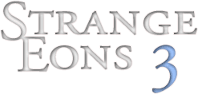
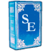
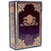
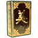

# SE3 Documentation

These pages will help you get the most out of [Strange Eons](cgjennings.ca/eons/), the tool for creating cards and other content for board and tabletop games.

**Note:** this is a work in progress. Content is being moved here from https://basement.cgjennings.ca

## Tomes of knowledge

{: .float-left} [User manual](um-index.md)  
A guide to the major features of Strange Eons. How to create game components, manage plug-ins, create decks and projects, and more.

**Advanced field guides**

{: .float-left} [Developer manual](dm-index.md)  
Plug-ins add support for new games and other features. This manual tells you how to make them. Go, read, learn, create!

{: .float-left} [Translation manual](tm-index.md)  
Guidance for those who want to localize Strange Eons for other languages or improve existing translations.