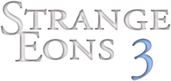

# Translation manual contents

1. Introduction to Strange Eons localization
   1. Locale codes
   2. String tables
2. The string table editor
3. Starting a new translation
4. Testing a translation
5. General tips and guidelines
6. Advanced topics
   1. Translating plural forms
   2. [Adding spelling support for a new language](tm-spelling.md)