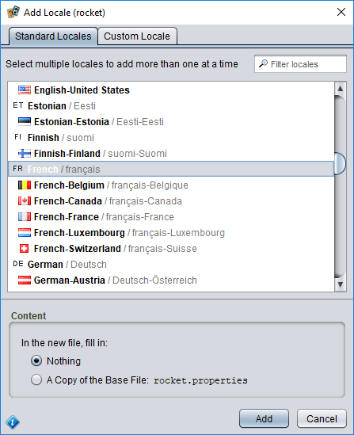
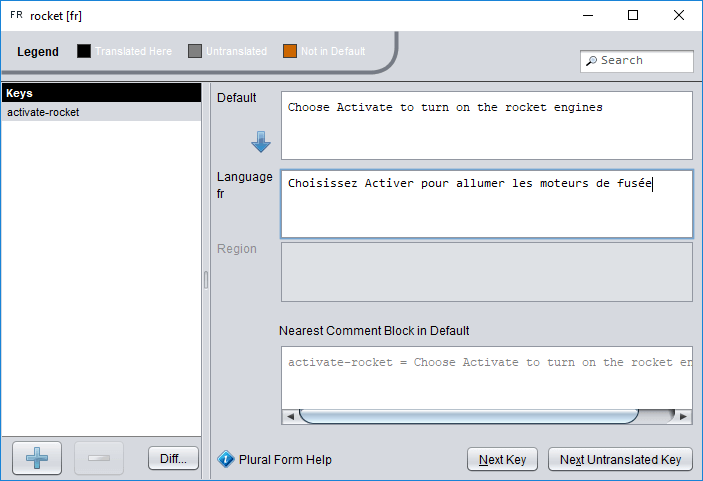

# Adding localization support to a plug-in

The best time to make a plug-in localizable into multiple languages is right from the start, but you can also add it after the fact. This page covers both scenarios, so some of the advice applies only to cases where you are refactoring an existing plug-in.

## Separating strings

The main difference between a plug-in that can be localized and one that can't is the presence of *string literals* that may need to be translated. For example, consider this code:

```js
println("Choose Activate to turn on the rocket engines");
```

Since this string contains *language* that will be *presented to the user*, it would need to be translated to localize the plug-in. That means that the actual value of the string will need to change depending on which language is active. You could add code to check for the active language and choose a different string, like this:

```js
// ⚠ this is a BAD idea!
let s;
switch(language) {
    case "en":
        s = "Choose Activate to turn on the rocket engines";
        break;
    case "fr":
        s = "Choisissez Activer pour allumer les moteurs de fusée";
        break;
    case "de":
        // ...
}
println(s);
```

That would work, but it would make a mess of your code. A better approach is to add a layer of indirection: instead of including the strings themselves, assign a unique *key* to represent that string, then look up the value of the string for the active language. This is exactly what the [string tables](dm-res-string-table.md) mentioned in the [introduction](tm-intro.md) provide.

### Creating a string table and refactoring the code

To create a string table, pick a suitable subfolder of the plug-in's resources, right click on the folder, and choose **New/String Table**. Give the table a name and press <kbd>Enter</kbd>. Then double click the new file to open it, and edit it as follows:

```properties
activate-rocket = Choose Activate to turn on the rocket engines
```

Save the file (choose **File/Save** or press <kbd>Ctrl</kbd>+<kbd>S</kbd>). This is now the *default translation* of a new string table with a single *key*, `activate-rocket`. Let's add a translation for this key as well. Right click on the file in the project pane and choose **Add Locale**. In the list of locales, locate and select **French** (base French, without a region), then choose **Add**.



This will add a new file to your project, in the same folder, with the same name as your base translation but with the suffix `_fr` added (for the French locale). Double click this file to open it in the [string table editor](dm-res-string-table.md). On the left side of the editor is a list of the keys defined in the table. Normally you would select the key for the string you want to translate here, but in this case there is only one key so it is already selected.



On the right side, at the top, you will see the default (English) text for this string, just as we defined it in the base file. Below that is an empty field awaiting our translation. Copy and paste `Choisissez Activer pour allumer les moteurs de fusée` into this field. After you do this, the key name on the left will turn from grey to black, indicating that the key now has a translation for this locale (French). 

Save the modified table.

> Since Strange Eons runs with both an interface language (for buttons, menus, and other user interface features) and a game language (for text drawn on game components), in practice a plug-in typically has at least two string tables: one for interface text and one for game component text. Some also have a third to store strings used in both places (such as the names of expansions).

### Testing your new table

To try the new table out, right click on one of the string table files (it doesn't matter which) and choose **Merge Strings Into/Interface Language**.

Strange Eons will look at the locales in your string table (default and French) and pick the best match it can. Unless your interface language is French (with or without a regional variant), it will pick the default translation. It will then load this file and merge the keys and values defined there into a global interface language string database. To prove it, let's look up the value of the key we defined, `activate-rocket`. Open the Quickscript tool (choose **Toolbox/Quickscript** or press <kbd>Ctrl</kbd>+<kbd>Q</kbd>) and enter:

```js
println(@activate-rocket);
```

Choose **Run** and you will see either the English or French string for the key, depending on your preference settings and operating system language.

### Replacing the string literals

Notice how the string literal has been replaced by an `@` and the string key for the matching string. When the script engine gets to that part, it knows that this is a reference to a translatable string and it will look up the value of the string (for the active language) and substitute the string for the key. This lets us take the localizable parts of the code out of the script file and collect them together in one place to make the translator's job easy and keep the code clean and readable.

To make an existing plug-in localizable, you'll need to locate all of the translatable strings like this, move them into a string table, and replace the string in the script file with the matching key. Boring, perhaps, but certainly doable.

In practice, you will want at least two string tables if your plug-in adds new game component types. This is because Strange Eons can run with a different language for game components than the one it uses for the user interface. Any strings that are printed on game components should be placed in a separate string table, loaded into the game [Language](assets/javadoc/resources/Language.html) instance (rather than the interface Language instance), and looked up with `#key-name` instead of `@key-name`. Sometimes, there will be strings that belong in both groups (game and expansion names are a common example). In this case, you can create a third string table of strings to be shared between the two groups and load them into both Language instances.

> If you are familiar with how [settings](dm-settings.md) work in Strange Eons, you may have noticed the similarity between the use of `@` and `#` to look up strings and the [`$`-notation](dm-dollar-notation.md) used to look up setting values. This is intentional, and there are other parallels between the systems that will be touched on below. One difference is that there is no equivalent to "live settings" for string keys.

## Loading string tables

While the **Merge Strings Into** action works for testing, you will want to add code to your plug-in to load your string tables when it starts. There are two shared [Language](assets/javadoc/resources/Language.html) instances you can use, one for the interface language and one for the game language:

```js
// add string table to interface language strings
Language.getInterface().addStrings("path/to/string/table");
// add string table to game language strings
Language.getGame().addStrings("path/to/string/table");
```

The calls above would attempt to load the string table at `resources/path/to/string/table.properties`. As with all [resource paths](dm-resources.md), the `resources/` part of the path is implied. An extension is not required, but if one is given it will be used in place of the default (`.properties`). Always use the path of the file that contains the default strings, not one with a locale suffix (such as `table_fr.properties`).

If you use the globally shared Language instances, be aware that all of your key names will be in a single shared space with keys from the application and other plug-ins. To prevent conflicts, ensure that all your keys start with some unique prefix, perhaps based on the plug-in name.

### ⚠ Private string tables

A sure way to avoid conflicts is to create your own, private, Language instances and load your strings into those. You can name the global Language instances as parents so that you inherit all of their strings; any keys you define will override keys with the same name in the parent. You can use a [named object](dm-named-objects.md) to share your private Language objects between all the scripts in your plug-in. (By using a named object, you avoid wasting time and memory by having each script load its own separate copy of the strings.)

```js
const uiLang = new Language(Language.interfaceLocale);
uiLang.parent = Language.getInterface();
uiLang.addStrings("path/to/ui_strings");
uiLang.addStrings("path/to/common_to_both");

const gameLang = new Language(Language.gameLocale);
gameLang.parent = Language.getGame();
gameLang.addStrings("path/to/game_strings");
gameLang.addStrings("path/to/common_to_both");

Eons.namedObjects.myStringsAndOtherSharedPluginStuff = {
    uiLang: uiLang,
    gameLang: gameLang,
    // ...
};
```

You will also want to switch `@` and `#` key lookups to use your private Languages instead of the global ones:

```js
useInterfaceLanguage(uiLang);
// now this is looked up in uiLang
@my-key;

useGameLanguage(gameLang);
// and this is looked up in gameLang
#my-key;
```

## More on key look up

No matter how a string is looked up, its string value is ultimately determined by identifying a Language instance and calling its `get` method with the key name. The following code is equivalent to the default behaviour of `@key-name`:

```js
Language.getInterface().get("key-name");
```

### Changing a default Language

As mentioned above, you can change the Language object used with `@` by passing it to `useInterfaceLanguage`. Likewise, you can change the Language object used with `#` by passing it to `useGameLanguage`:

```js
let lang = new Language(Language.interfaceLocale);
lang.set("a-key", "a string");
println(lang.get("a-key")); // prints "a string"

useInterfaceLanguage(lang);
println(@a-key); // also prints "a string"
```

### Formatted strings

Some strings embed [%-formatting codes](tm-printf-strings.md) to indicate places where other content will be inserted into the final string. The Language class defines overloads for each method that look up string keys which take additional formatting objects that will be used to fill in the `%` placeholders. For example, if a string table defines:

```properties
formatted-text = You are %s %.2f percent of the time.
```

then the following code might be used to look up and format the text:

```js
language.get("formatted-text", "happy", 82.365);
```

which would return the following formatted string:

`You are happy 82.37 percent of the time.`

#### Formatting in script code

To fill in a %-formatted string from script code, you can call `string(key, formatObjects...)` for the interface language or `gstring(key, formatObjects...)` for the game language. Assuming that the example string above is defined in the interface language, the equivalent to the above code is:

```js
string("formatted-text", "happy", 82.365);
```

The `string` and `gstring` functions use the same Language objects as `@` and `#` keys (respectively), so they are also affected by `useInterfaceLanguage` and `useGameLanguage`. Alternatively, you could use `sprintf`:

```js
sprintf(@formatted-text, "happy", 82.365);
```

## Language-specific settings and resources

Besides translating strings, some game component designs work best when adjusted for particular languages. For example, you may need to [move a label's region over to make more space for its text](tm-fitting-text.md) in some languages. When redesigning a layout for a language written right-to-left, you may want to begin by essentially mirroring the entire design. The [`Language.getResourceChain`](assets/javadoc/resources/Language.html#getResourceChain-java.lang.String-java.lang.String-) method makes this painless. You pass it a base resource path and a file extension, and it returns an array of 0 to 3 resource paths based on the locale of the Language and the available resource files.

For example, suppose the following resource files exist in `resources/folder`:

```
image.png          (the default image)
image_fr.png       (a French version)
image_fr_CA.png    (a specific image for Canadian French)
image_de.png       (a German version)
```

If you call `Language.getResourceChain("folder/image", ".png")`, you will get different results depending on the Language's locale. For locale `en`:

```js
["folder/image.png"]
```

For locale `de` (also `de_DE`):

```js
["folder/image.png", "folder/image_de.png"]
```

For locale `fr_CA`:

```js
["folder/image.png", "folder/image_fr.png", "folder/image_fr_CA.png"]
```

In this case, we would simply load the *most specific* image in the list, which is always the last entry:

```js
let matches = gameLang.getResourceChain("folder/image", ".png");
let image = ResourceKit.getImage(matches[matches.length-1]);
```

In the case of loading settings, you will probably want the entries in the more specific files to *override* those of the less specific files (while *inheriting* any values from the less specific files that are not explicitly overridden). To do that, you would load each resource in order from least to most specific (which is always in array order) and add its settings to the same [Settings](assets/javadoc/resources/Settings.html) instance:

```js
let settings = new Settings(game.masterSettings);
let matches = gameLang.getResourceChain("folder/layout", ".settings");
for(let i=0, len=matches.length; i<len; ++i) {
  settings.addSettingsFrom(matches[i]);
}
```

> This method only returns resource paths for resources that actually exist. As long as the default resource file exists, the returned array will not be empty.