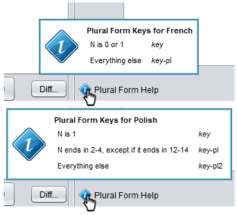

# Translate strings that use plural forms

In many languages, nouns take different *plural forms* depending on the number of objects being referenced. For example, English nouns have two forms, the singular (used when there is one object), and the plural (used for all other cases, including zero). Most English plurals are *regular* and are often formed by simply adding the suffix *-s*. As a result, English software often includes strings like this:

`You have 1024 kilobyte(s) of space remaining.`

This approach doesn't work for most other languages, as they often have more than just two plural forms, more complex rules for forming plurals, or even different sentence constructions for different forms.

| English                     | Irish                        | Polish                    |
| --------------------------- | ---------------------------- | ------------------------- |
| zero **cats** on the fence  | neamh **cait** ar an bhfál   | zero **kotów** na płocie  |
| one **cat** on the fence    | **cat** amháin ar an bhfál   | jeden **kot** na płocie   |
| two **cats** on the fence   | dhá **chait** ar an bhfál    | dwa **koty** na płocie    |
| three **cats** on the fence | trí **cait** ar an bhfál     | trzy **koty** na płocie   |
| four **cats** on the fence  | ceithre **cait** ar an bhfál | cztery **koty** na płocie |
| five **cats** on the fence  | cúig **cait** ar an bhfál    | pięć **kotów** na płocie  |

A programmer who wishes to add a plural-aware string will define multiple keys. The first key will be the singular form. The next will add `-pl` to the key name, and will be the first plural form. If there is more than one plural form, additional keys `-pl2`, `-pl3`, and so on, will be defined. For example:

```properties
eg-num-common = %d Common Item
eg-num-common-pl = %d Common Items
```

When translating this text, you would [define](dm-res-string-table.md#adding-removing-and-navigating-through-keys) as many keys as are needed for the number of plural forms in the language. For example, a Japanese translation would only use the singular form key `eg-num-common` because word forms do not vary based on the number of objects in that language. On the other hand, a Russian translation would need to define both `eg-num-common-pl` and `eg-num-common-pl2`, since that language uses three different word forms.

In languages with three or more forms, it may not be clear which key to use when (`-pl` or `-pl2`?). The general rule is to start at the form for the number 1 (which uses the singular key), and then count upward and use the next key name whenever you reach a number where a new word form is used. For example, Czech uses a singular form for *n* = 1, one plural form for *n* = 2 to *n* = 4, and a second plural form for all other cases. So, you would use `-pl` for the *n* ≤ 4 form and `-pl2` for the *n* > 4 form (since you switch to it at 5, which comes after 2).

To help you remember, the translation editor in Strange Eons will display a blue tip icon that shows a summary of the rules for the language you are editing when the mouse pointer is placed over it. This can be found near the bottom of the translation editor:



## Using plural forms in your code

Support for pluralization is provided by the [`IntegerPluralizer`](assets/javadoc/ca/cgjennings/i18n/IntegerPluralizer.html) class. You can create one for an arbitrary language if needed, but usually you will want one for either the game or interface locale, which you can get using the following script code:

```js
// for the game language (when composing text for game components)
let pl = Language.game.pluralizer;
// or, for the interface language (when creating interface controls)
let pl = Language.interface.pluralizer;
```

If your string table contains keys like this:

```properties
get-apples = You receive %d apple.
get-apples-pl = You receive %d apples.
```

Then you could use the pluralizer instance obtained above as follows:

```js
// the first numApples is used to determine which plural key to use;
// the second numApples is used to replace the %d placeholder
let appleText = pl.pluralize(numApples, "get-apples", numApples);
```

Note that the first `numApples` argument is used by the pluralizer to select which plural key to look up (`get-apples`, `get-apples-pl`, `get-apples-pl2`, etc.). The second `numApples` is used to [replace the the `%d` placeholder](tm-printf-strings.md) in the resulting text. Using `printf` style strings is optional; if you only pass in the number and a base key name you will get the raw text value  of the appropriate key, with no substitutions.

The pluralizer only supports one plural form per string. Arrange your code to avoid sentences that contain multiple variable nouns (like *there are 2 ducks, 1 chicken, and 6 flying horses in the bed*). Since the total number of possible sentence patterns is the product of the number of possible forms for each noun, this quickly grows into an unmanageable number of template sentences.

## Adding plural rules for new languages

Strange Eons includes plural rule support for dozens or languages. If your language isn’t one of them, you can [request it](https://cgjennings.ca/contact.html) or you can add support yourself; see the documentation for [`ca.cgjennings.i18n.IntegerPluralizer`](assets/javadoc/ca/cgjennings/i18n/IntegerPluralizer.html).

To verify whether a language is supported, **Run** the following code in the [Quickscript tool](dm-quickscript.md) (replace `XX` in the third line with the relevant [language code](tm-locales.md)):

```js
println(
    !ca.cgjennings.i18n.IntegerPluralizer.create(
        new java.util.Locale('XX')
    ).isFallbackPluralizer()
);
```

If this prints `true` in the script console, then your language is already supported.