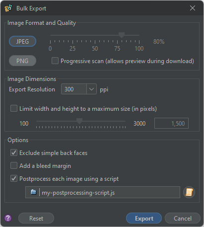

# Bulk exporting to image files

The Bulk Export plug-in lets you create images for any number of `.eon` files in a single step. To use it, you must first install the plug-in from the [plug-in catalogue](um-plugins-catalogue.md). You can use this [cat link](um-plugins-eonscat):

 `eonscat:961f`

Once you choose the **Bulk Export** action, a dialog appears. Select the desired file format, image quality, resolution, and other options. Then choose **Export**. The export will proceed automatically, applying the same options to each face of each of the components you selected. The exported images will be created in the same folder, with names generated automatically from the source files.

*To bulk export game components,* select the desired component files in the [project pane](um-proj-intro.md#the-project-pane), right click, and choose **Bulk Export**.

*To reset all bulk export settings* to their default values, choose the **Reset** button.

> **Tip**:  Hold the <kbd>Ctrl</kbd> or <kbd>Shift</kbd> key to select multiple files in a project.

## Export options

The dialog provides the following options to control the export process:

### Image format and quality

Choose either the **JPEG** or **PNG** image format. The slider determines the **Image quality**. For JPEG files, lower quality levels produce a smaller file, but the image with be less faithful to the original. PNG files reproduce the exported image exactly.

The **Progressive scan** option, if checked, stores the image data in a special order. When displayed in a Web browser, the browser can display progressively more detailed previews of the image as it downloads. This option may increase the size of the exported file significantly.

### Image dimensions

The **Export resolution** determines the [resolution](um-gc-export.md#resolution) of the exported files, in pixels per inch. Larger values lead to much larger file sizes, but retain image sharpness when zoomed in or printed. Several standard values can be chosen from the dropdown, or you can enter a custom value. The default of 300&nbsp;ppi is suitable for most purposes.

The option to **Limit the width and height** can be useful to meet the requirements of particular third-party printing companies. When enabled, any image with an edge that is longer than the specified number of pixels will be resized to fit within the specified limit. The original aspect ratio of the image is maintained. For more control over the result, use a [postprocessing script](#postprocessing-scripts).



### Options

Check **Exclude simple back faces** to skip writing an image for a card back that consists of a fixed image.

Check **Add bleed margin to game components without one** to synthesize a bleed margin when none is included in the component design. Not all component types support this option.

Check **Postprocess** to perform custom postprocessing on each image before it is written. When selected, you must specify a script file in the field below. The script is executed once for each generated image, allowing you to modify it as desired before it is written.

## Postprocessing scripts

If the options provided by the bulk export dialog are not flexible enough, you can completely customize the process using a script file.

The selected script will run once for each image that would be exported. The global variable `bulkItem` will be set to an object with the following properties:

```js
{
  // String that gives the full path to the file being exported
  sourcePath,
  // The GameComponent object being exported
  gc,
  // The Sheet object of the specific face being exported
  sheet,
  // The index of the face (0=front, 1=back, and so on)
  index,
  // The export resolution in pixels per inch
  ppi,
  // The export resolution in pixels per cm
  ppcm,
  // True if this face is a "simple back face"
  simpleBackFace,
  // True if the option to synthesize bleed margins was selected
  synthesizeBleedMargin,

  // The following properties can be modified to affect the final result:

  // String that gives the full path to image file to be written
  exportPath,
  // The image data that will be written (as a BufferedImage)
  image,
  // The image file format to write (one of "bmp", "gif", "jpg", "jp2", "png")
  format,
  // The image compression quality option (0.0 to 1.0)
  quality,
  // Whether or not to save with progressive scan if supported
  progessive
}
```

Your script can use the value of any of these properties to modify the export process. If the `image` property is replaced by a different `BufferedImage`, then the new image will be exported instead of the original. If the `exportPath` property is replaced with a new file path, then the image will be written to that file instead of the original file. If it is set to `null` or an empty string, then the image will be skipped. Changing other properties has no effect.

All postprocessing scripts begin with the following objects defined in addition to those defined by the standard scripting environment:

* the [`imageutils`](assets/jsdoc/modules/imageutils.html) script library (which defines the `ImageUtils` object);
* the [`RenderTarget`](assets/javadoc/ca/cgjennings/apps/arkham/sheet/RenderTarget.html) class;
* the [`ImageUtilities`](assets/javadoc/ca/cgjennings/graphics/ImageUtilities.html) class;
* all classes in the [`ca.cgjennings.graphics.filters`](assets/javadoc/ca/cgjennings/graphics/filters/package-summary.html) package.

> The `bulkItem` object is a specific Java object that is exposed to your script code. Replacing it with a new script object that happens to use the same property names won't work. You must modify the properties of the existing object.

### Examples

Only export back faces:

```js
if (bulkItem.index !== 1) {
    bulkItem.exportPath = null;
}
```

Crop one pixel from each edge (top, left, bottom, and right):

```js
bulkItem.image = ImageUtils.pad(bulkItem.image, -1, -1, -1, -1);
```

Crop 0.5&nbsp;cm from each edge:

```js
const CM_TO_TRIM = 0.5;
const PAD = -Math.round(bulkItem.ppcm * CM_TO_TRIM);
bulkItem.image = ImageUtils.pad(bulkItem.image, PAD, PAD, PAD, PAD);
```

Ignore the chosen resolution and export at 400 ppi:

```js
if (bulkItem.ppi !== 400) {
    bulkItem.image = bulkItem.sheet.paint(RenderTarget.EXPORT, 400, bulkItem.synthesizeBleedMargin);
}
```

Force ink saver mode, and then save even more ink by converting the image to greyscale and making it lighter:

```js
let sheet = bulkItem.sheet;
sheet.setPrototypeRenderingModeEnabled(true);
let image = sheet.paint(RenderTarget.EXPORT, bulkItem.ppi, bulkItem.synthesizeBleedMargin);
new GreyscaleFilter().filter(image, image);
new BrightnessContrastFilter(0.2, 0).filter(image, image);
bulkItem.image = image;
```

Export as BMP files instead of PNG/JPEG:

```js
const FORMAT = "bmp";
let extensionStart = bulkItem.exportPath.lastIndexOf(".") + 1;
bulkItem.exportPath = bulkItem.exportPath.substring(0, extensionStart) + FORMAT;
bulkItem.format = FORMAT;
```

