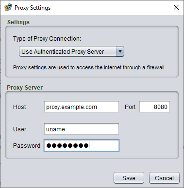

# Troubleshooting

## Catalogue download issues

Most problems related to downloading the [plug-in catalogue](um-plugins-catalogue.md) or plug-ins the catalogue are due to **temporary network issues**. Try again a little later. If you have persistent problems accessing the catalog or downloading a particular plug-in, [you can report it here](https://cgjennings.ca/contact.html).

> If you have a problem with a specific plug-in *after* installing it, or would like to request a new feature, you can try contacting the plug-in author directly. Open the plug-in manager and choose the plug-in in question to see if they have provided contact information.
>
> [See this page if Strange Eons won’t start after installing a plug-in.](um-install-troubleshooting.md)

### Checking for SSL issues

By default, Strange Eons tries to use an encrypted connection to download the catalog. You can try using an unencrypted connection to see if the encryption process is part of the problem. Just edit the address at the top of the catalog dialog to start with `http://` instead of `https://`.

### Proxy settings

If you have persistent problems trying to download the plug-in catalogue itself (or you cannot download *any* plug-in), the problem may be related to the use of a *proxy* to access the Web. This is more likely if you are accessing the Web through a large organization such as a university.

*To configure Strange Eons to access the catalogue through a proxy,* [open the **Preferences** dialog](um-ui=preferences.md), choose the **Plug-ins** category, and under **Catalogue**, choose the **Proxy Settings** button. There are four types of proxy connection to choose from: *None*, *Use System Settings*, *Use Proxy Server*, and *Use Authenticated Proxy Server*. The default is *Use System Settings*, which attempts to use settings from your operating system. The *None* option disables the use of a proxy server and attempts to access the Internet directly. The other two options both allow you to configure your proxy settings directly in Strange Eons. The only difference is that the *Authenticated* connection must be used if your proxy connection requires a user name and password.

If you are not sure whether you access the Internet through a proxy or what your proxy settings are, consult the intranet of your institution or ask a systems administrator.
