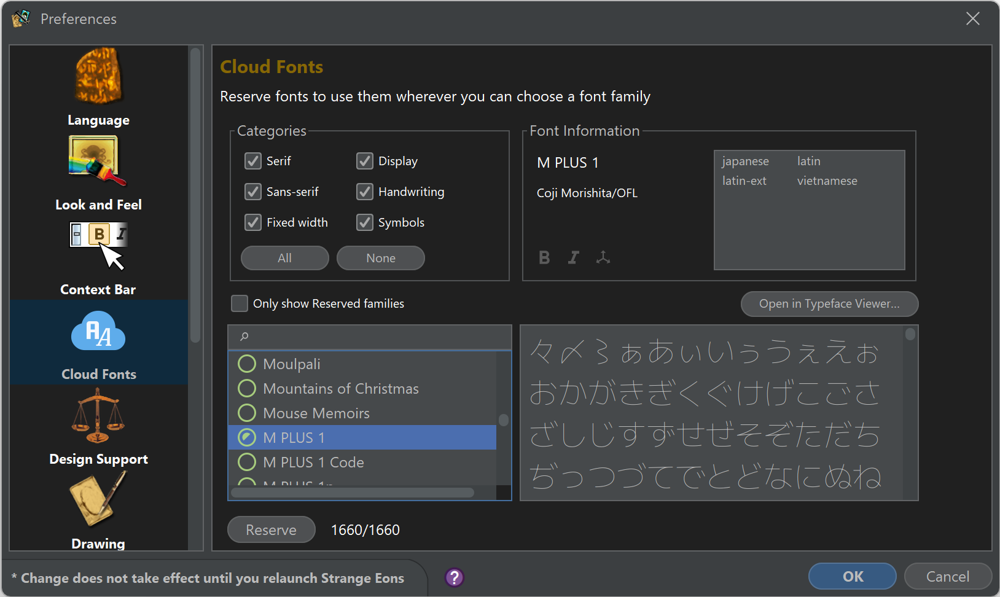

# Cloud fonts

> For more information on using cloud fonts as a plug-in developer, refer to their [developer manual page](dm-cloud-fonts.md).

Cloud fonts let you choose from thousands of free fonts and use them in your projects on demand.

## Reserving fonts

*Reserving* a cloud font makes it available for you to use anywhere in Strange Eons that you can specify a typeface family name. Cloud fonts are reserved from the **Preferences** dialog, in the **Cloud Fonts** category.

### Exploring and choosing fonts

The **Cloud Fonts** preference category includes tools to help you locate specific fonts.

#### The font list and search field

The lower-left area offers a list of available font families. Clicking on a family name will download enough of the font to display a preview in the preview field in the right. To search the list by name, type part of the name in the filter field with the magnifying glass icon to show only matching names in the list.

> Icons in the list describe the current state of the font family: an open circle means the family is available but has not been downloaded. A partially filled circle means that just enough of the family has been downloaded to show a preview. A filled circle means that all fonts in the family have been downloaded. An orange checkmark design indicates that the font family has been reserved. (Reserved fonts are also fully downloaded.)

#### Categories

The **Categories** panel also lets you filter the list of families, but in this case by the general category of font:

<dl>
  <dt>Serif</dt>
  <dd>Fonts with small strokes or lines attached to the ends of the main strokes of the letters, such as Times New Roman.</dd>
  <dt>Sans-serif</dt>
  <dd>Fonts without strokes or lines attached to the ends of the main strokes of the letters, such as Arial or Helvetica.</dd>
  <dt>Fixed width</dt>
  <dd>Fonts with the same horizontal space for each letter, regardless of its shape or size, such as Courier or Consolas.</dd>
  <dt>Display</dt>
  <dd>Fonts designed for large sizes and decorative purposes, such as headlines or logos, such as Impact.</dd>
  <dt>Handwriting</dt>
  <dd>Fonts that mimic the style of handwritten text, cursive, or calligraphy, such as Lucida Handwriting or Brush Script.</dd>
  <dt>Symbols</dt>
  <dd>A font category that consists of symbols, icons, or pictograms, rather than letters, such as Wingdings or Emoji.</dd>
</dl>

Only the selected categories will be included in the list. You can choose **All** or **None** to quickly reset or clear the selected categories.

#### The preview area

Choosing a family in the list will download just enough to display a preview of the primary font in the family. This is usually the “regular” version of the font. The preview area will automatically be filled with text based on some of the available *subsets*. You can also click in this field and enter any sample text you like. For more details, choose **Open in Typeface Viewer**.

> If the family seems to primarily be intended to support characters from non-Latin writing system(s), the automatic preview text will include those characters first followed by Latin characters if available. If the family seems to primarily support Latin characters (those that use the letters A-Z), then a sample of Latin characters is listed first. This may not be completely accurate; it is a guess based on a quick analysis of the available characters.

#### Font Information

This panel provides a quick summary of information about the selected family: the name, the type designer’s name and open license type, a list of the supported *subsets* (types of scripts/languages supported), and a summary of whether key font variants are available: the **B** icon for bold weight, the *I* icon for italic/oblique, and the axes icon for fonts with variable axes.

### Reserving a selected family

To reserve a family, select it in the list and then choose **Reserve**. The font will be fully downloaded and its family name will be registered. A registered font can be used by its family name. (Note that registration will fail if you already have a font with the same family name installed on your computer.) Furthermore, a reserved family will automatically be kept up to date and registered each time you start Strange Eons from now on. You can use the family explicitly in any text field that accepts markup text using `<family "name">` … `</family>`. You can also enter the name in any text field where you are asked to enter a font family name, such as on a generic card’s **Design** tab.

### Removing a previous reservation

If you no longer want to reserve a family, select it in the list and choose **Remove Reservation**. To make it easy to find reserved fonts, check **Only show Reserved families**.

## Specifying cloud fonts with `cloud:`

An alternate way to request a cloud font, without reserving it first, is to prefix the family name with `cloud:`. This is slower than reserving the font since the family needs to checked each time the family is used, but it can be useful if you are sharing game components with others since they do not need to reserve your selected fonts ahead of time themselves. This is supported in most places where a family name is accepted, but might not be supported by some plug-ins.

> Plug-in developers can add support for this feature using `ResourceKit.normalizeFontFamilyName(family)`, which will check for the `cloud:` prefix, and if found ensure that the font is registered and then return the family name without the prefix.