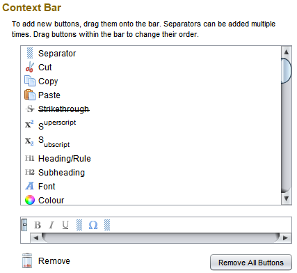

# Context bar

The context bar is a tool bar that floats at the edge of the editor control you are using. The bar shows buttons for the commands that are currently relevant. To avoid obscuring other nearby controls, the context bar is transparent until you move the mouse pointer over it.

## Hiding or collapsing the context bar

You can toggle whether the context bar is visible using the **View/Context Bar** [menu item](um-menu-bar.md). Alternatively, you can *collapse* the bar to momentarily get it out of your way. Clicking on the small button at the left edge of the bar, marked with a minus (-) symbol will collapse the bar. Clicking it again, now marked with a plus (+) symbol, will expand it back to full size. Pressing **Shift+Esc** while using the control that the bar is over will also collapse and expand the bar.

## Customizing the buttons

The **Context Bar** section of the [preferences dialog](um-preferences.md) lets you add, remove, or reorder the context bar buttons. A list at the top of the panel shows currently unused buttons. The bar underneath shows the used buttons currently in the order they would appear.

### Adding buttons

To add a button, drag it from the list and drop it in the desired position. To add a gap between groups of buttons, drag and drop a **Separator**. (The size of the gap shown in the dialog is exaggerated for clarity.)

> The context bar only shows buttons that apply to the control it is floating over, so you won't see the newly added buttons until you use a relevant control.

### Removing buttons

To remove a button, drag it from the bar and drop it on the rubbish bin.

### Changing button order

To change the order of buttons on the bar, drag and drop them on the bar into the desired order.

## Plug-ins and the context bar

Plug-ins can add new button types to extend the standard set. A plug-in for a specific game might add buttons to insert special markup tags used in its game components:

If you make heavy use of the context bar, you may wish to check if a newly installed plug-in has made any new buttons available.