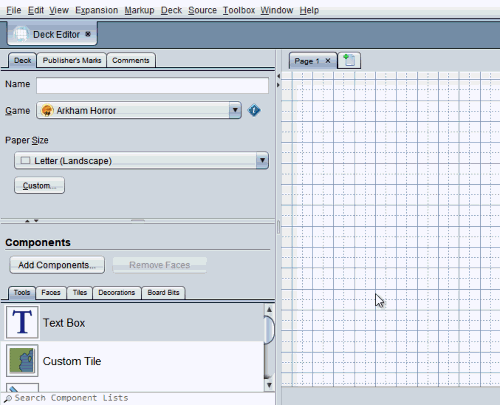

# Adding content to a deck

You can add game components, text, images, shapes, and other objects to decks and expansion boards. Available objects are listed in the **Components** panel in the lower-left corner of the editor and are divided into general categories:

**Tools**  
General purpose objects like text boxes, images ("custom tiles"), and shapes.

**Faces**  
Faces of game components that can be placed in the deck.

**Tiles, Decorations, Board Bits**  
Game-specific graphics used to design new boards. Only shown when the deck's **Game** is set to a game that includes them.

## Adding new objects

To *add a new object to the page*, first choose the appropriate category tab. Then, select the desired object in the list and drag and drop it into position over the page design area.

### Adding game components

To *add game components* such as cards, first you need to add them to the **Faces** tab of the object lists. Click **Add Components** or drag and drop `.eon` save files onto the list to add more. Each face of the added game components will be listed separately: for example, the front and back of a card are separate objects. Once added to the list, you can drag and drop the faces like any other object.

### Searching for specific objects

To *search for objects by name*, type in the **Search Component Lists** field, below the component selector in the lower-left corner of the editor. Components that don't match the typed text will be greyed out. Press <kbd>Enter</kbd> to jump to the next match in the list. Repeat this to cycle through all matches.

To *sort the objects* by name, file name, or size (area), right click on a list and choose the sorting dimension.

If you can't find what you are looking for, check that the deck is not set to the wrong **Game**.

### Snapping

Many deck objects [snap](http://basement.cgjennings.ca/snap) to a slightly different location than the point you drop them. The way they snap together depends on the kind of object. For example, if you drop one card face over another card face it will snap *next to* the existing face rather than cover it up.