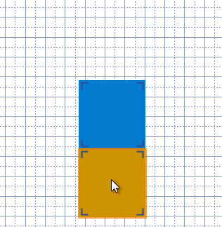
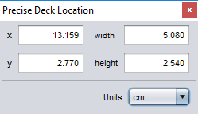

# Adding content to a deck

You can add game components, text, images, shapes, and other objects to decks and expansion boards. Available objects are listed under **Components** panel in the lower-left corner of the editor and are divided into general categories:

**Tools**  
General purpose objects like text boxes, images ("custom tiles"), and shapes.

**Faces**  
Faces of game components that can be placed in the deck.

**Tiles, Decorations, Board Bits**  
Game-specific graphics used to design new boards. Only shown when the deck's **Game** is set to a game that includes them.

## Adding new objects

To *add a new object to the page*, first choose the appropriate category tab. Then, select the desired object in the list and drag and drop it into position over the page design area.

To *move an existing object*, left click and drag it to a new position on the page.

### Adding game components

To *add game components* such as cards, first you need to add them to the **Faces** tab of the object lists. Click **Add Components** or drag and drop `.eon` save files onto the list to add more. Each face of the added game components will be listed separately: for example, the front and back of a card are separate objects. Once added to the list, you can drag and drop the faces like any other object.

### Adding a text box

To *add a text box*, drag and drop the **Text Box** from the **Tools** list onto the page.

To *edit the text in a text box*, double click the text box. Enter the desired [markup text](um-gc-markup.md). Press <kbd>Enter</kbd> to accept the new text, or <kbd>Esc</kbd> to cancel the edit. To insert line breaks, use <kbd>Shift</kbd> + <kbd>Enter</kbd>.

To *change the box size* click the box, then drag one of the corners.

### Adding a custom tile (image)

To *add a custom tile*, drag and drop the **Custom Tile** from the **Tools** list onto the page.

To *change the image*, double click the tile. In the path field, enter the path to the image or click the folder icon to select it with a file chooser.

To *change the tile size* click the tile, then drag one of the corners. Or, double click the tile and enter a specific size under **Image Dimensions**. The original aspect ratio is always maintained.

### Searching for specific objects

To *search for objects by name*, type in the **Search Component Lists** field, below the component selector in the lower-left corner of the editor. Components that don't match the typed text will be greyed out. Press <kbd>Enter</kbd> to jump to the next match in the list. Repeat this to cycle through all matches.

To *sort the objects* by name, file name, or size (area), right click on a list and choose the sorting dimension.

If you can't find what you are looking for, check that the deck is not set to the wrong **Game**.

### Snapping

Many deck objects snap to a slightly different location than the point you drop them. The way they snap together depends on the kind of object. For example, if you drop one card face over another card face it will snap *next to* the existing face rather than cover it up.  
[Learn more](um-deck-snap.md)

To *drop a dragged object without snapping*, hold <kbd>Ctrl</kbd> as you release the mouse button.

## Moving objects precisely

The floating Precise Deck Location window allows you to set the location and (for supported objects) size with entering precise numeric values.

To *display the Precise Deck Location floating window*, choose the **Window/Precise Deck Location** menu item.

To *change the unit used for measurements in the window*, select the desired unit from the **Units** dropdown.

To *set the horizontal and vertical position of an object precisely*, select it and then enter the distance from the left edge of the page in the **x** field and the distance from the top edge of the page in the **y** field of the floating window.

To *set the size of a resizable object precisely*, select it and then enter the dimensions in the **width** and **height** fields of the floating window.

## Deleting objects

To *delete objects from the page*, first select the desired object(s). Then press <kbd>Delete</kbd> or <kbd>Backspace</kbd>.