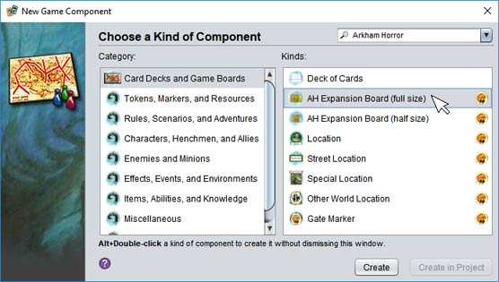
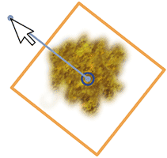

# Creating boards

Some game plug-ins add the ability to create new game boards using the deck editor. Usually they will add a new type of component to get you started quickly. When available this is the best way to go, because it will set the default styles for objects appropriately.

If none is available, or if you want to start with a blank canvas, you can easily do so:

To *add game-specific content to the deck*, select it from the **Game** dropdown on the **Deck** tab.

If the plug-in includes extra content, such as tiles, to help you design the board, they will be added to new categories in the object lists.

To *change the design area to the size of the board*, choose a game-specific size from the **Paper Size** dropdown  on the **Deck** tab.

If the plug-in does not include an appropriate page size, you can always [add it yourself](um-deck-pages.md).

## Designing the background

Board design often happens in two passes: adding static background graphics, and then adding the game content. Some plug-ins provide sets of game-specific graphics to make this easier. The exact pieces will obviously vary, but here are some of the general kinds of things you may expect:

**Tiles**  
One or more graphics, usually large in size. Usually used to make up a backdrop for other graphics to build on. Sometimes the tiles are designed to fit together at the edges so that you can make different background combinations by combining and rotating the tiles. These are used to cover the entire board surface with graphics so that no white shows through. Once the backdrop is in place, you will want to select the tiles and then [**Lock** them](um-deck-commands.md) so that they don't get selected when laying additional objects 

**Decorations**  
More graphics, usually small to medium in size. They can be applied to the background tiles like stickers in order to further personalize the design. They can vary in behaviour depending on their purpose. For example, there may be decal-like objects that can be rotated to any angle using a handle at their center, or brick-like objects that [snap together](um-deck-snap.md) to make decorative borders and separators.

{: .float-right}

**Board Bits**  
This category is typically reserved for graphics that are significant to the game rules but are still essentially just graphics and don't require any special editing. An example might be arrows that restrict the flow of movement or spaces that don't need any additional text or formatting.

Depending on the game design, standard tools like **Line** might also serve this purpose, as when spaces are connected by lines to make a movement graph. In this case, if you created the board as a new component, the plug-in developer will usually have changed the default styles of these objects to suit the game's graphic design.

## Adding game content

Anything more complex than simple shapes and graphics is usually designed separately, as a kind of game component. The easiest way to find these components is to open the **File/New** game component dialog, choose the relevant game in the filter dropdown, and choose the **Card Decks and Game Boards** category.

They are just like any other component, although they only have one face so they will be placed on the board surface. Design and save the needed components, then [add them to board's deck editor](um-deck-adding-content.md) like any other component: use **Add Components** or drag and drop the files onto **Faces**.

Once added to the deck lists, you can drag and drop them onto the board as usual. Unlike card-like components, these are usually designed not to snap to each other but to simply stick where dropped.