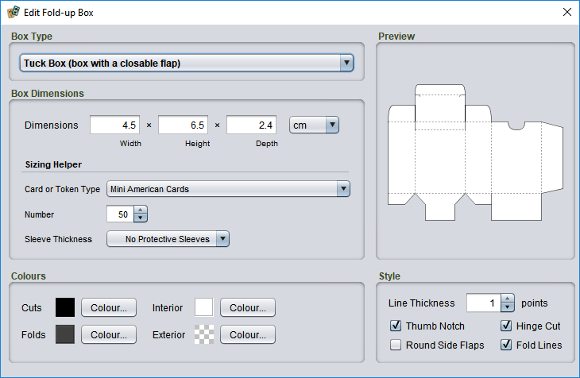

# Creating fold-up boxes

With the deck editor you can easily create boxes for storing your cards and other playing pieces in. These boxes are similar to those that playing cards might come in, sometimes called tuck boxes.

To *create a box template*, drag an drop a **Fold-up Box** from the **Tools** tab. Then double click the new box template to edit the box size and style.

## Choosing the right box options

### Box type

You probably want the default option, **Tuck Box**, for a box with a flap that closes. These can be used to store cards and playing tokens. The other option is **Open Face**, which is a simple open box with no top. This can be used to make dividers or containers for organizing other boxes.

### Dimensions

#### Calculating the size automatically with sizing helpers

There are some standard deck sizes commonly used in game manufacturing. If your cards are one of these standard sizes, you can calculate the box dimensions automatically. (Game plug-ins can also register their own sizing helpers to add entries for specific card or token types for that game.)

To *set the dimensions automatically*, first choose the **Card or Token Type** from the dropdown list, then choose the **Number** of components to be stored in the box. If the cards in this box will be stored in protective plastic sleeves, choose the **Sleeve Thickness** in µm (micrometres) from the dropdown to account for the extra thickness. If you are unsure how thick your sleeves are, check the packaging or consult the manufacturer, or just choose the thickest option.

#### Setting the size manually

To set the size manually, measure the width, height and depth (stack height) of the card deck. Add about 0.5 cm (0.25 inches) to each dimension so the fit is not too tight. If your final measurements are tiny, you might want to use minimums of about 4 cm (1.5 inches) for width and height and 1 cm (0.5 inches) so the template is not too fiddly to work with.

### Style options

You can customize the design to suit your preferences. If you have difficulty cutting or just want to get done faster, you might want to turn some of these off:

**Thumb Notch**  
Adds a semicircular notch that makes opening the lid easier. Requires more careful cutting.

**Hinge Cut**  
Adds a small hinge to the back of the box that also makes opening the lid easier. This requires slight cuts into on two of the box corners and an extra fold.

**Round Side Flaps**  
Adds an extra curve to the top box flaps to make them more symmetrical. It doesn't significantly affect the box's functionality to leave these off.

**Fold Lines**  
You may wish to turn these off if your box features graphics.

**Colours**  
Click the colour wells to choose different colours for cut and fold lines, the box interior, and the box exterior.

> **Tip:** To decorate your box with a pattern or picture, add a *custom tile* set to the desired image and place your box template over it. Then make the interior colour fully transparent and the exterior solid white.

## Assembling your box

Assembling a box is not difficult. There are several ways to do it, but if you are looking for a basic, reliable approach then the following methods are well tested:

### Materials

1. Thick card paper (Bristol board/poster board/poster paper, card stock, or even a cereal box)
2. Scissors or a craft knife and cutting mat
3. Glue or double-sided tape
4. Masking tape (optional)

### Adhesives

Any glue that bonds paper can be used. Glues that remain flexible when dry, such as regular white glue, will work best since the box will flex slightly during use. Glue sticks may not work well as some become brittle after drying. For easy assembly, you can also use double-sided tape. If you don't care what the box looks like, regular tape works, too!

### Printing

The templates are meant to be cut from thick card (about 0.15 mm thick or 220-250 g/m²). If your printer supports it, you can print the template onto the card. Otherwise, you can print the template on plain paper and tape or trace it onto the card. If the template has a design, you can print it onto sticker paper and then stick it onto the card before cutting.

### Cutting

You can use a draft knife to cut the template out and a knife and ruler to score the fold lines. However, the templates are designed to tolerate a reasonable amount of error. A pair of scissors and patience during folding is usually all that's needed.

### Assembly

Don't let the length of this list scare you off. Assembly is much easier to do than to describe. With a little practice, you can fold up a set of boxes very quickly:

1. *Carefully cut along all solid lines.* Don't fold anything until all the cuts are complete. Note that, depending on your style options, some lines may appear to cut into the box body. This is intentional.
2. *Pre-fold the flaps along the top and bottom of the design.* Do not attempt to assemble anything, just fold along the lines so that folding will be easy when you get to assembly.
3. *Pre-fold the four long lines that limn the box sides.* As above, you are not assembling anything. Just fold along the lines so that the sections will fold easily later.
4. *Do a test assembly*, roughly folding the box together to familiarize yourself with its structure.
5. *Tuck the long side flap behind the opposite side of the box* (so it is inside the finished box).  
   **Optional:** Using a tiny piece of masking tape, temporarily and lightly tape this edge. This will help you to get a nicely squared bottom. You will remove the tape again before finishing.
6. *Locate the bottom flaps.* The bottom flaps have simple angular cuts, while the top flaps are rounded.
7. Of the four bottom flaps, *fold the two small side flaps up and into the box* so that they are held inside the box.
8. Of the two remaining bottom flaps, the one with pieces cut out is the "top", and will go inside the finished box. The large, uncut flap is the "bottom" and will cover the entire bottom of the box. Fold these two flaps away from each other so that they do not touch when the box is resting. *Fold the "top" flap up inside the box a bit, and fold the "bottom" flap out and away from the box a bit.*
9. *Cover the top of the large "bottom" flap in adhesive.*
10. *Fold the "bottom" flap up and against the "top" flap.* If needed, insert a pencil or other object into the top of the box to help press the "top" flap into the "bottom" flap.
11. If necessary, gently twist and shift the box sides to *square the four corners* so that the inside of the box's cross section has a rectangular shape, with all sides making 90 degree angles. Check that you can fold the box top together and close the box; reopen the box before continuing.
12. Once you are happy with the shape, use a pencil or other object to *flip down the two small side flaps and press them into the adhesive on the bottom flap*. You may wish to let the bottom set before continuing.
13. *Set the box on its side*, so that the side with the long side flap is pointing down.
14. *Pull the long side flap away from the box side, apply adhesive, and press it against the side.* If you temporarily taped the flap in step 5, carefully remove the tape now.
15. *Assembly complete.* Once the adhesive is dry, you can add cards or tokens and close the box top.