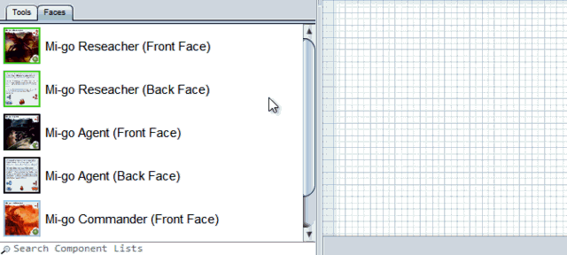

# Creating decks

The deck editor makes it easy to print sheets of cards to cut out for testing or making homebrew designs. If you are having your cards printed commercially, the printer will usually require a very specific format that you must follow, such as a PDF with exactly one card face per page. In  that case you are probably better off [using a script](um-proj-automation.md) to [export the components as images](um-export.md) and then compiling the images into the required format.

With the deck editor you can lay out the cards in your deck exactly as you wish. If you want certain cards next to each other or you want to put an instruction sheet on page 1, you can do it. Before you go down the road of manually laying out a deck, though, you might want to look at [building a deck automatically](um-proj-deck-task.md) with a project. It can pack decks into as few pages as possible, all by itself, even if your components vary wildly in size.

## Manually laying out a deck

Still here? OK, this is how you do it.

First, decide if you will make your deck double sided (with card backs on a second page). It may seem counterintuitive, but it usually [works better to put the fronts and backs touching each other](um-deck-print-tips.md) on a single page, cutting them out, and folding the front and backs together. In fact, Strange Eons provides [special feedback](um-deck-pubmarks.md) when you put the front and back of the same card next to each other such that they will fold together properly. If you still wan to try a double-sided layout, [reconsider building the deck automatically](um-proj-deck-task.md). Doing it properly is tricky because the card backs for the back side need to be laid our in mirror image order (right to left).

Now that you're convinced to put the fronts and backs next to other, here is the basic procedure.

### 1. Add the cards (or other components) to the **Faces** list

To *tell the deck editor which cards you will include*, add them to the **Faces** list by choosing **Add Components** or dragging and dropping the `.eon` files onto the list.

### 2. Add a card

To *add a card face to the deck*, first drag and drop the front face from the list to the page near the upper left corner. Then drag and drop the matching back face over the front face, towards the right side. The back face will snap into place perfectly next to the front face, and dashed lines will appear to remind you to fold instead of cut.

> If you will be mixing cards of different sizes together, it is easier to start with the largest cards and work down.

### 3. Add more cards as needed

It makes less work to pack the cards into a tight grid, with edges aligned where possible. It means less cutting when you [assemble the deck](um-deck-print-tips.md).

To *add another card*, drag and drop its front face over the right edge back face of the previous card. It will snap tight against the right edge of the last face and solid lines will appear to indicate that you should cut here. Now drag and drop the back face over the front just as you did in step 2.

When the row gets full, move the last card down to start a new row. (Make sure you keep the front and back together.)

To *move a face to a new row*, drag and drop it over the bottom of the face in the same column of the previous row.

### 4. Add more pages as needed

When you can't fit more rows on the page, add a new page and start again.

To *center the objects neatly*, choose **Deck/Center Content on Page**.

To *add another page to the deck*, click the rightmost tab in the page list.  
[More about organizing pages](um-deck-pages.md)

### 5. If desired, add text boxes and other extras

You can use a [text box](um-deck-adding-content.md#adding-a-text-box) to add some instructions, credits, or other information.

