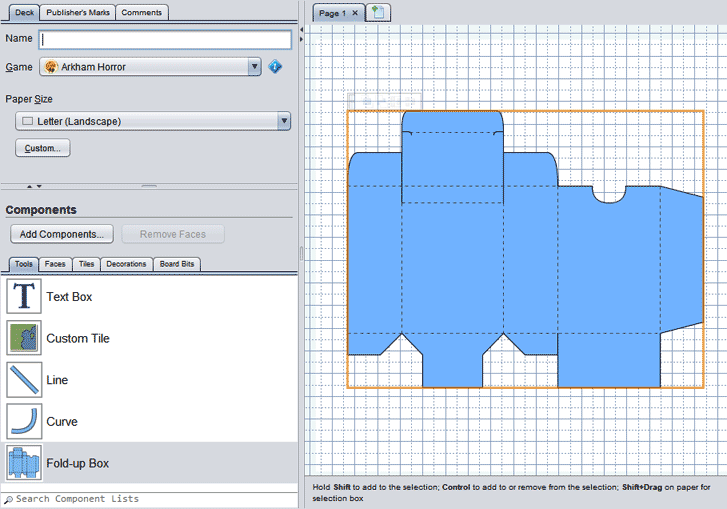

# The deck editor

The deck editor is used to lay out printed pages. It is most commonly used to:

1. Prepare a [deck of related components](um-deck-decks.md) for printing.
2. Design [custom boards](um-deck-boards.md) (when supported by a game's plug-in).
3. Make [custom boxes](um-deck-boxes.md) for storing cards and tokens.

## Quick start

### A tour of the deck editor

The deck editor has three basic parts. The upper left corner controls the deck's basic properties, such as [paper size](um-deck-pages.md) and [crop marks](um-deck-pubmarks.md). Below that are [objects that can be added to the deck](um-deck-adding-content.md), including shapes, text, game components, and game-specific tiles and decorations. On the right side is the design area. You can [add, switch between, and organize pages](um-deck-pages.md) using the tabs above the design area.

### Moving around the page

To *move to different parts of the page into view*, left click on the paper and drag.

To *zoom in or out*, use the mouse wheel or <kbd>+</kbd> and <kbd>-</kbd> keys.

[Learn more](um-deck-commands.md)

### Adding objects

To *add objects to the deck*, drag them from the lists to the page.

To *add game components*, first drag and drop the `.eon` file onto the object lists, or click **Add Components**.

[Learn more](um-deck-adding-content.md)

### Editing objects

To *select an object*, left click on it. Hold <kbd>Shift</kbd> to add objects to the selection.

To *select an area*, <kbd>Shift</kbd> + left click on the paper and drag.

To *move and object*, left click on it and drag or use the arrow keys. When you drop an object over an existing object, it may [snap into place](deck-snap.md) as indicated by a blue rectangle. For the most part it just does the right thing and you don't need to worry about it.

To *edit an object's content*, double click on it.

To *change the object's style* (such as line colour), right click on it and choose **Style**.

[Learn more](um-deck-commands.md)

## About the **Game** setting

To *set the game associated with a deck*, choose the game from the **Game** dropdown of the **Deck** tab. Setting a specific game is usually only relevant if you want to design a [game board](um-deck-boards.md). The default is **All Games**, which is all you need if you are creating a [deck of cards](um-deck-decks.md).

Changing the **Game** adds game-specific content to different parts of the deck editor:

- new objects  (and new categories of objects)  to add to deck pages;
- new paper sizes for things like custom game boards;
- new sizing helpers for use with the [**Fold-up Box** tool](um-deck-boxes.md).

Not all games add new content, or add every possible kind of new content.

