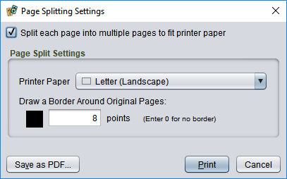
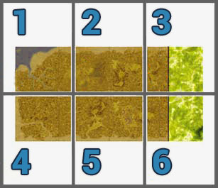

# Splitting large pages when printing

The paper size that you select is the size that you will *design* for. Sometimes this will be larger than the actual paper available for your printer. Game boards are a common example. When you **File/Print** the deck, there will be an option to tile or split large pages over multiple physical pages automatically.

When this option is checked, **Printer Paper** sets the printer's actual paper size. You can also elect to draw a border around the full-sized page. This is often used when printing expansion boards to indicate the fabric board edge. If you do not want a border, set the border size to 0. Otherwise, choose a size in points (1 point = 1/72 inch). The default border colour is black; click the colour well to pick something else.

## Assembling the split pages

Split pages are printed in order from left to right and from top to bottom. Each physical page will have an overlap zone the same size as the [**Margin** setting](um-deck-pages.md) of the selected printer paper. The graphics from adjoining pages are repeated in the overlap zone to make it easier to line up and attach pages. Slide the edge of one tile over the matching edge of its adjoining tile. When the graphics are lined up, carefully hold the tiles in place while lifting back the overlap zone of the top page. Apply adhesive, then carefully press the page back down while ensuring that it is still aligned correctly.

