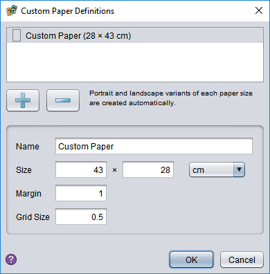

# Pages and paper size

Decks contain one or more pages. Every page in a deck is the same size.

## Deck pages

Pages are managed from the tab strip over the design area:

To *add a new page*, click the last tab in the list.

To *remove a page*, click the tab's remove button; if the last page is removed, a new, empty page is inserted automatically.

To *rename a page*, double click the tab label and enter the desired name.

To *reorder the pages*, drag and drop the tabs into the new sequence.

## Paper size

You can change deck's page size using the **Deck** tab's **Paper Size** dropdown. (If you have selected a game for the deck, there may also be additional page sizes listed. These are sized for making game boards or other game-specific objects.)

You can define a new paper size by choosing **Custom**:

At the top of this dialog is a list of custom sizes (initially empty). You can add a new size with the **+** button, and delete it again with the **-** button. To define the size's properties, select it in the list and then edit the details:

The **Name** field can be anything you wish and is used to identify the size when selecting.

The rest of the fields are measurements. You can choose whether you wish to use centimetre (cm) or inch measurements from the dropdown.

The **Size** defines the width and height of the paper (or height and width, the order doesn't matter).

The **Margin** sets the size of the light blue margin drawn along the edge of each page. This is only meant as a guide and does not affect where you can place objects.

The **Grid Size** defines the spacing of the major grid lines in the deck. The minor lines (dashed) are placed at half this interval automatically.