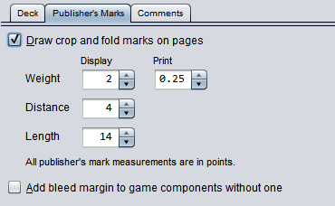
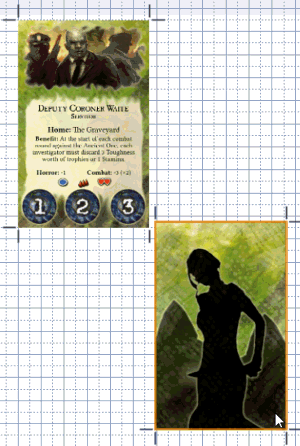
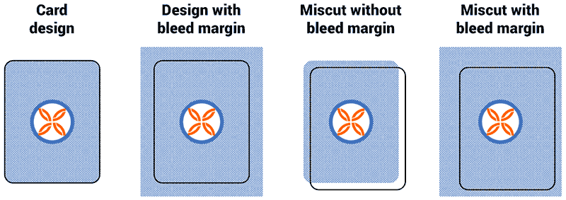
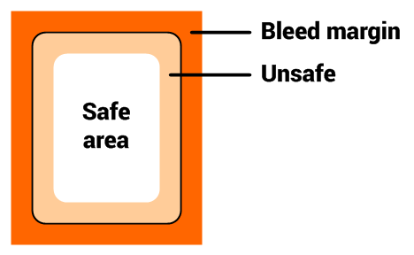

# Publisher's marks and bleed margins

The deck editor includes features designed to make it easier to cut and assemble your published projects on the your projects. These features can managed from the **Publisher's Marks** tab.

## Crop and fold marks

Strange Eons will automatically add solid crop marks (cut lines) and dashed fold marks. Crop marks let you line up your scissors correctly when cutting out a component face. Fold marks show which edges should be folded rather than cut.

To *hide crop and fold marks*, uncheck the **Draw crop and fold marks on pages** option.

To *change the appearance of the marks*, adjust the following numeric settings:

**Weight**  
Sets the thickness of the marks, in points. There is a second field to set the thickness when the line is printed. Printed marks are typically very thin and would be hard to see on screen.

**Distance**  
Sets the distance of the mark from the edge it is marking, in points.

**Length**  
Sets the length of the line that is drawn, in points.

### Magic fold marks

Game component designs can include explicit fold marks on a face, but this is rare. Fold marks are usually added implicitly when the front and back of the same card face are snapped together in a compatible way. Compatible means that when you cut around the two faces and then fold on their common edge, the result is a proper two-sided card. (If you align the two faces along a top or bottom edge, one of the faces must be rotated 180° for them to fold together correctly.) When things are aligned correctly, the crop mark that would normally appear will change into a fold mark.

> The deck editor does not consider the visual appearance of the components, only if they are paired front and back faces from the same file. So even if two cards have backs that *look* the same, you can't mix and match the backs and fronts and get a fold line.

## Bleed margins

Bleed margins are an extra margin added around the outside of a card face or other printed material. Graphics on the edge of the design are continued onto the bleed margin. This allows for the imprecision of machine cutting during the publishing process. When a card is miscut, it will be slightly off center but will still look acceptable because the graphics in the bleed margin avoid an obvious hard edge.

### Designs with bleed margins

Plug-in developers have the option of [including a bleed margin](dm-diy-bleed-margins.md) when creating a new component. Most components in Strange Eons are not designed with a bleed margin, but plug-in developers have the option of including one. When a component defines a bleed margin, the crop marks in the deck editor are adjusted automatically.

### Faking bleed margins

To *add fake bleed margins* to components that don't have real ones, check **Simulate bleed margins on components without one** on the **Publisher's Marks** tab. This will add a 9 point bleed margin to faces that don't define one, unless they are transparent. The margin simulator will sample the existing edge and attempt to extend it. If it detects a solid border, it will extend the border colour. Otherwise it will draw mirrored copies of the face to cover the margin.

### Designing for bleed margins

When creating a new card design with a bleed margin, keep in mind that content near the edge of the card may be cut off. There should be a zone on the *inside* of the design the same size as the bleed margin. No important content (such as rule text) should be placed inside in this zone.

