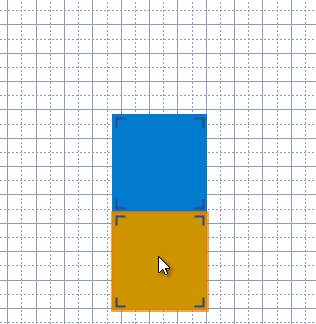

# Object snapping

Certain combinations of objects *snap* when dropped on top of each other. For example, when you drop one card face onto another it snaps beside it so that their edges touch, to make them easier to cut out. For the most part, snapping just does the right thing and you don't need to worry about it. However, it is possible to change an object's snapping rules or stop it from snapping altogether.

To *drop a dragged object without snapping*, hold <kbd>Ctrl</kbd> as you release the mouse button.

## Normal snapping rules

The various objects are divided into 6 types. Each type of object has a set of other object types that it will snap to, and a target that describes what relative position it snaps to.

### Object types

**Card**  
Game component faces

**Tile**  
Expansion board graphics and other large background decorations

**Overlay**  
Objects that are placed over other objects without snapping to them, like stickers

**Inlay**  
Decorative objects designed to snap together like blocks

**Other**  
Objects that don't fit the other categories, such as shapes

**Paper**  
The page gridlines, which can be snapped against by other types

### Targets

**Outside**  
This object snaps to the outside of objects it is dropped on. This makes the objects line up in a grid, like game component faces.

**Inside**  
This object snaps to the inside of objects it is dropped on. None of the standard objects use this, but some plug-ins use it for objects designed to go on game boards. One use for this type is to add a decorative border to a tile or other background graphic.

**Mixed**  
These snap to the outside of objects of the same type, and to the inside of objects of other types.

### Rules

| Object type | Snaps to types | Targets |
| ----------- | -------------- | ------- |
| Card        | Paper, Card    | Outside |
| Tile        | Paper, Tile    | Outside |
| Overlay     | None           | Outside |
| Inlay       | Tile, Inlay    | Mixed   |
| Other       | None           | Outside |

## Changing an object's snapping behaviour

To *change the object types that the selected object will snap to*, choose one or more types from the **Deck/Snap To** menu. A check mark next to an object type indicates the object will snap to that type. The special items **Everything** and **Nothing** will check and uncheck all of the types at once, respectively.

