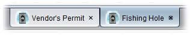
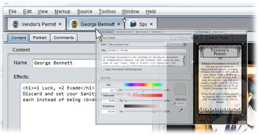
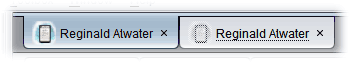

# Document tabs

The tab strip along the top of the app shows one tab for each open document, much like a Web browser. Left clicking a tab switches to that document for editing. Right clicking displays a context menu with common actions like saving or closing the document. Different editors can customize the menu contents.

To close a document you can left click the small close button (×)  on its tab. <kbd>Alt</kbd> + left clicking this button will close all *other* documents. <kbd>Shift</kbd> + left clicking will close everything.

Documents with unsaved changes will warn you when you attempt to close them. Unsaved changes are indicated visually by a dark disk behind the close button:

## Organizing tabs

You can organize your work by dragging and dropping the tabs into a different order. A small arrow indicates where the tab will be inserted when dropped:

## Detaching documents to separate windows

You can normally only see one document at a time, but sometimes it is convenient to compare documents side by side or copy information from one window to another. You can do this by *detaching* a tab into a separate window. To do this, right click the tab and choose **Detach** or drag the tab out of the tab strip and drop it. The contents will appear in a new window. The tab will be drawn with a *ghost pattern* to indicate that it is detached:

To reattach the document to the main app window, close the detached window or right click its tab and choose **Reattach**.