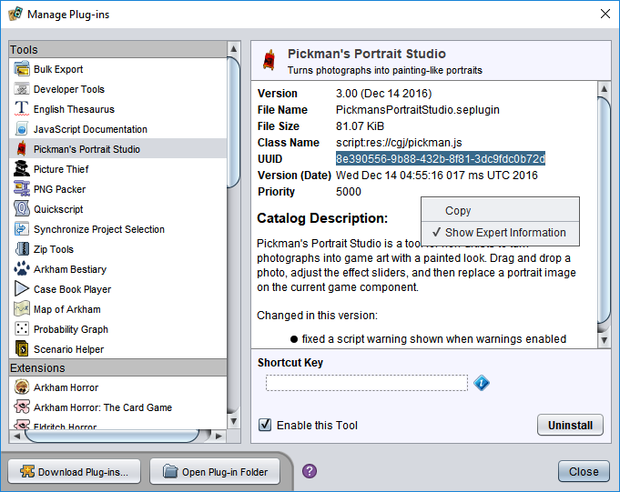

# `eonscat` links

Its often useful to be able to point people to a specific plug-in when posting on forums and social media sites. To make this easy, Strange Eons supports a feature called `eonscat` ("eons cat") links. It works like this: you type the special marker `eonscat:` followed by text that identifies the plug-in(s) you want to point out to readers. The reader can then select this text, copy it, and switch to (or start) Strange Eons. Strange Eons will notice the special marker on the clipboard, open the plug-in catalogue, and use the following text to fill in the search filter.

Here is an example:

`eonscat:game=AH`

If you select this line and copy it to the clipboard, then switch to Strange Eons, it will open the catalogue and list all plug-ins related to the board game *Arkham Horror*.

## Linking to a specific plug-in

Most of the time, you'll want to point the user to a specific plug-in. The surest way to do this is to use the plug-in's UUID (Universally Unique ID). Each plug-in is assigned one when it is first created, so Strange Eons can tell them apart.

To find a plug-in's UUID, open the choose the **Toolbox/Manage Plug-ins** menu item and select the plug-in in question. Then right click on the plug-in details and ensure that **Show Expert Information** is checked. This will show some additional fields, including the UUID, which you can then copy and paste. For example, the UUID information in this listing:

would yield the link text `eonscat:8e390556-9b88-432b-8f81-3dc9fdc0b72d`. And if you copy this text onto the clipboard and switch to Strange Eons, it will indeed offer to install the Pickman's Portrait Studio plug-in.