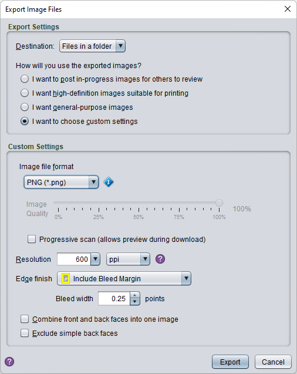

# Exporting images

Most game components can be exported as images using the **File/Export** menu item. You can then choose how the images will be packaged and choose how you will use the images to let Strange Eons choose the best format options for you.

The first step is to choose a **Destination**. This determines how the files are stored. Two destinations are built in:

**Files in a folder**  
Exported files are saved in a folder of your choice.

**ZIP archive**  
Exported files will be saved in a `.zip` archive in a folder of your choice.

Plug-ins can add additional destination options. Some of these may have additional settings that you can configure by choosing **Destination Options**. For example, a destination that uploaded the export to an image sharing service might let you specify your account credentials here.

The second step is to choose the format and quality of the exported images. The first three options let you pick settings automatically based on what you want to do with the images. The last option lets you choose all options yourself (see below for details). The basic options are:

**I want to post in-progress images for others to review**  
Create medium-sized, medium-quality images that are large enough to be legible but still download quickly. Simple card backs will be omitted.

**I want high-definition images suitable for printing**  
Create large, high-quality images. Files typically take up 50–100 times more disk space than those produced by the first option.

**I want general purpose images**  
Create images in between the first two options. They will take up only a little more space that the images produced by the first option, but the quality is sufficient that you could print them if you had to.

Choose **Export** to create the images. Depending on the destination, you may be prompted for more information. For example, if you are exporting to a ZIP archive, a file chooser will be displayed so you can choose the folder and file name to use.

## Custom image format settings

For complete control over the image format, select the **custom settings** option. The dialog will expand to display detailed format options.

### File format

Choose from PNG, JPEG, JPEG 2000, BMP, or GIF. PNG image files are generally larger than the other image types, but they will reproduce the image exactly (they are *lossless*). JPEG images are generally smaller, but do not reproduce the image exactly (they are *lossy*). JPEG 2000 images can either be *lossy* or *lossless*, and are typically smaller than either PNG or JPEG files. However, they are not as widely supported by other applications. BMP and GIF files are outdated image formats and should only be selected if you need to work with a tool that doesn't support a better format.

> **Transparency:** Some components produce images with transparent areas. The most common example is a component with non-rectangular edges. The JPEG format does not support transparency and will have a solid colour background added automatically.

### Image quality

This slider controls the compression level for lossy formats. Higher quality means the images a more exact reproduction but also larger file sizes. For JPEG 2000, the 100% quality setting results in lossless images.

### Progressive scan

When checked, the image is saved in multiple passes. When shown in a Web browser, a low quality version of the image will appear immediately and improve progressively until the entire image is downloaded. Progressive scan images can be larger than regular images, especially for the PNG format.

### Resolution

The resolution that the images are drawn at. Higher resolution images are higher in quality because they use more pixels to represent the same physical area. Resolution is measured in pixels per inch (ppi) or pixels per centimetre (ppcm). Typical resolution for print purposes is 300 ppi. Typical resolution for screen use is 150-200 ppi.

### Combine front and back faces

When checked, front and back faces of the same component will be joined into a single image. You can then print this image and fold along the join to make a two-sided card.

### Exclude simple back faces

Many game components have a simple back face that consists of a either a fixed image or are an identical copy of the front face. Checking this option skips these simple faces.

### Add bleed margin to game components without one

If the component design does not include a bleed margin, Strange Eons will synthesize a fake one. Not all component types support this option.