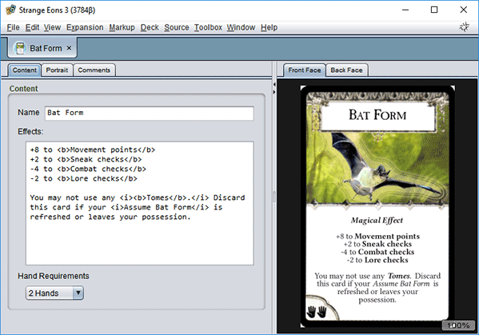

# Creating a game component

*Game component* is a generic term for pretty much everything you can make in Strange Eons. It usually means a card, but it could also be a token, booklet, game board, or anything else you can print on paper.

To *create a new game component*, choose the **File/New** menu item. This will open the **New Game Component** dialog. Choose the component type and then click **Create**.

## Choosing a component type

The available types of components are divided into categories. Choose a category on the left side, and then choose from one of the members of that category on the right. If you are not sure what category to look in, you can always choose **Everything**.

## Filtering

To *filter the lists by keyword*, enter a search term in the filter field in the upper left corner of the dialog.

To *filter the lists by game*, choose a game from the dropdown list on the filter field.

Components that don't match your criteria will be (temporarily) removed from the list.

## Design the component

Clicking **Create** opens a new editor for the selected component. Nearly all component editors are divided into editing controls on the left, and a [preview area](um-preview-area.md) on the right that shows you what the result will look like. There may be multiple groups of editing controls divided into tabs. There may also be multiple faces shown in the preview area, divided into a separate group of tabs.

### The initial example

Usually, the new component will come prefilled with an example. This will help you get your bearings and see which editing controls do what. It may also demonstrate how to use some game- or component-specific [markup tags](um-markup-text.md). This can be very useful to get you up to speed quickly, but might become a hindrance as you become familiar with how the component works.

To reset the component to a blank state, choose the **Edit/Clear** menu item.

### Trying ideas safely

An important element of good design is trying out a number of alternative different ideas. It can be handy to work from a copy of the current design state when trying an idea. This ensures that you can return to the current state if the new design doesn't work out. You can also use a [detached tab](um-document-tabs.md) to compare the two versions side-by-side.

To *create a clone of the current component* to experiment with, choose the **Edit/Spin Off** menu item.