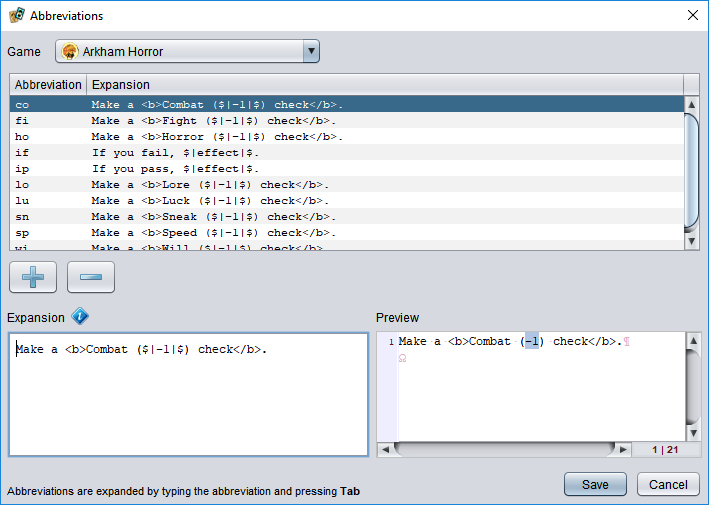

# Abbreviations

Abbreviations are short, mnemonic letter sequences that can be expanded into longer replacements. They can be used in text fields in game component editors and in the source code editor. Learning to use them can greatly enhance your productivity.

## Expanding an abbreviation

To expand an abbreviation, you first type in the name of the abbreviation and then press <kbd>Tab</kbd>. The abbreviation text will be replaced with its expanded form. For example, in a script editor typing `fn` and  pressing <kbd>Tab</kbd> will insert skeleton code for a function declaration.

## Listing and editing abbreviations

The set of abbreviations that are active at any given time depends upon the kind of content you are editing. When you are editing a game component, the abbreviations depend on the game that the component belongs to. When editing source code, the abbreviations depend on the source type (language). You can view and edit abbreviation sets by choosing the **Markup/Abbreviations** or **Source/Abbreviations** menu item.

At the top of the abbreviation editor is a dropdown list of the available abbreviation sets (games or source languages). Below that is a table showing the abbreviations in the set. To add a new abbreviation, choose the **+** button below the table; to remove one select it and press the **-** button. To edit an abbreviation, select it in the list and use the text box at the bottom of the editor to modify it. The following special codes can be included in the expansion text:

`$|` ... `|$`  
You can choose to select part of the expanded text by surrounding it with these characters. If there is no text between the symbols, the caret will be placed at that location without selecting anything. If the symbols are left out of the expansion, the caret will be placed at the end of the expanded text just as if it were pasted.

`{@string-key}` and `{#string-key} `  
These can be used to insert localized text with the specified key from the user interface or game language strings, respectively. (Refer to the developer manual for details.)

`${INDENT}`  
When used at the start of a line, duplicates the indentation on the line where the abbreviation was expanded. This can be used in source code editors to insert nested code blocks. To increase the indent level for a line, use `${INDENT}` followed by a normal <kbd>Tab</kbd> character.

The preview area next to the editing box shows how the expanded text will appear, including the effect of the special codes.
