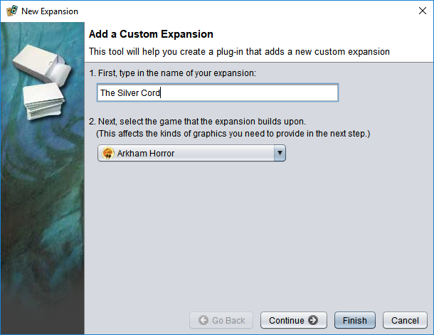
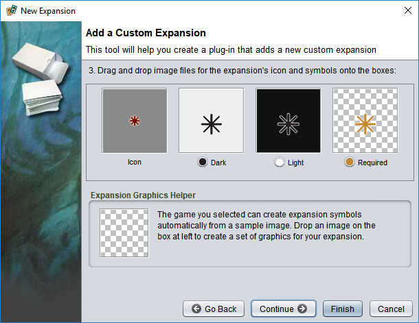

# Expansion symbols

An expansion is a separate product that mixes new content into an existing game (called the base game).  Often, expansions will introduce a special symbol used to mark the cards that belong to it. This makes it easy to separate out the expansion content from the base game content and to tell content from different expansions apart.

Strange Eons lets you flag game components as belonging to a certain expansion. If the plug-in for the relevant game supports it, it will also automatically draw expansion symbols on flagged game components.  You can use this to easily create your own custom expansion to a product or to mark homebrew game components as requiring a certain (official) expansion product.

> These instructions only work if the relevant game supports expansion symbols. Some plug-ins may not include support, or may implement their own system. If you have questions about how a particular plug-in works, contact the plug-in developer.

## Setting a component's expansion

A game component's expansions are set from the **Expansion** menu. This will show an option for the **Base Game** and a list of any expansions available for the game. Typically the game's plug-in will add entries to this list for any official expansions. You can also [define new expansions of your own](#custom-expansions). Choosing an entry from the list assigns an expansion to the edited component. If the game plug-in and the particular game component support expansion symbols, the selected symbol will appear on the card.

*To mark a component as belonging to an expansion,* choose that expansion's entry in the **Expansion** menu.

*To clear a previously set expansion from a component,* choose the **Expansion/Base Game** menu item.

### Variants

Some games include *style variants* for their expansion symbols. For example, one variant might be used for light cards, while another is used for dark cards. Or, one variant might indicate that the card *belongs* to a certain expansion, while another variant indicates that it *requires* a certain expansion. When supported by a game, you can switch between variants through the **Expansion/Variant** menu. Note that sometimes a symbol happens appear the same in both variants, so you might not see a difference. This can be true even when another expansion for the same game does change appearance depending on the selected variant.

*To choose a style variant for an expansion symbol,* choose a style from the **Expansion/Variant** submenu.

### Selecting multiple expansions

In some cases, multiple expansion symbols may apply to a component. For example, if the symbols indicate that an expansion is required and a component happens to require more than one.

*To add to or remove from the set of selected expansions,* hold down <kbd>Ctrl</kbd> while selecting an expansion from the menu.

*To clear all selected expansions,* choose the **Expansion/Base Game** menu item.

*To modify multiple expansions at once,* choose the **Expansion/Choose** menu item to list them in a dialog window.

*To change the order that expansions are listed in on a component,* choose the **Expansion/Choose** menu item and drag the selected expansions into the desired order.

## Custom expansions

You can add new expansions for your own use with **Expansion/New**. A window will appear to guide you through the process. On the first page, fill in the expansion name and the game it belongs to. It is important to select the correct game, as the expansion will only be listed for components from that game.

Choose **Continue** to move to the next step. Here you can set the graphics to use for the expansion. A box will be shown for each required graphic. Drag and drop an image onto each box to set the graphic. The first box is the icon used for the new expansion in the **Expansion** menu. The remaining boxes are the symbols that will be drawn on your game components (one for each variant).

Some game plug-ins can automatically create a set of graphics for you from a single example image. If the game supports this, you will see an extra box below the main set, labelled **Expansion Graphics Helper**. Drop a sample image on this box to use it as a template for the other graphics.

Choose **Continue** to move to the last step. The **New Expansion** tool actually builds and installs a mini plug-in that registers the new expansion for you. This makes it easy to share the new expansion symbol with others: all they have to do is install your plug-in. (If they load one of your components without the plug-in installed, they won't see the symbol.) This last step gives you a chance to save a copy of the plug-in somewhere, to make it easier to share. If you skip this step, you can always find the plug-in in [your plug-in folder](um-plugins-manager.md).

Commands that let you change the [expansion symbol](um-gc-expansions.md) displayed on supported game components. An expansion is a collection of related content that builds on a base game but is released together as a separate product. Manufacturers often mark the expansion content with a small graphical symbol so it can be easily separated out from the base game again. This menu lets you mark your own components with one or more expansion symbols, when supported by the game's plug-in.

### Editing a custom expansion

If you want to change the name or graphics of a custom expansion, you have two options. Option one is to create a new expansion with the same name, uninstall the old plug-in, and update your components to use the new version. Option two is to modify the expansion's mini plug-in. This is not difficult:

1. Copy the plug-in bundle file (`.seext`) for the expansion symbol into a [project](um-proj-intro.md).
2. Uninstall the existing plug-in.
3. In the project, right click on the plug-in bundle and choose **Import Plug-in**.
4. A new task folder will be added to the project. Open it, then look through the subfolders until you find the script and image files.
5. If you want to change the graphics, replace the image files.
6. If you want to change the name, open the script file and edit just the name, being careful not to change anything else.
7. Right click the task folder and choose **Make Plug-in Bundle**. 
8. The contents of the folders will be repacked into a plug-in bundle file. Double click it to install the plug-in.