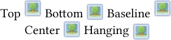

# Markup text

Most text blocks on components can be formatted using *markup tags*. If you are familiar with HTML tags, the the tags in Strange Eons will be familiar. If not, don't worry, it is easy to learn.

To *insert a markup tag*, write the tag name between angle brackets (a less than and greater than symbol), like this: `<tagname>`.

Most tags are written in pairs that surround a block of text, one to open a style and one to close it. The effect of the tag applies to all of text between the open and close tags.

To *close a markup tag*, write the tag with a `/` before the tag name, like this: `</tagname>`.

Notice how in the illustration below, the text between `<b>` and`</b>` is shown in **bold**:


## Common tags

{: .float-right}

```
Here are examples of some of the most commonly used tags:
You can produce text that is <b>bold</b>, <i>italicized</i>,
or <u>underlined</u>. You can also <colour #bc0000>change
the colour</colour>, <size 11>size</size>, and
<family "Sans Serif">typeface</family>, and insert pictures:
<image "d:\my pictures\example.png">.
```

Common shortcuts that you may be familiar with, such as using <kbd>Ctrl</kbd> + <kbd>B</kbd> to bold the selected text will work as expected. Check the **Markup** menu. You can also format markup text using the [context bar](um-ui-context-bar.md).

To *typeset a heading, title or rule name* where relevant, surround the heading in `<h1>Rule name</h1>`.

To *typeset a subheading, subtitle or secondary rule name* where relevant, surround the heading in `<h2>Minor rule</h2>`.

### Tag parameters

Some tags accept *parameters*, extra information that alters the behaviour of the tag. You can see several in the above examples: the `<colour>`, `<family>`, `<size>` and `<image>` tags all include parameters. Parameters are separated by spaces. If a parameter contains a space, you must surround it in `"`...`"` quotes.

## Tag reference

### Typeface style

`<b>`**bold text**`</b>` 

`<i>`*italic text*`</i>`

`<u>`<u>underlined text</u>`</u>`

`<del>`~~deleted text~~`</del>`

`<sup>`<sup>superscript text</sub>`</sup>`

`<sub>`<sub>subscript text</sub>`</sub>`

`<tt>`<span style="font-family:monospace">typewriter type</span>`</tt>`

`<family "name">`...`</family>`

Uses the font family with the specified name.

`<body>`...`</body>` 

Uses the main body font family.

`<size pt>`...`</size>`

Uses a font size of *pt* points.

`<size n%>`...`</size>`

Uses a font size that is *n*% of current size.

`<width w>`...`</width>`

Uses a font width of *w*, one of: `condensed`, `semicondensed`, `regular`, `semiextended`, `extended`.

`<tracking n>`...`</tracking>` 

Adjusts letter spacing by *n*; useful values are about -0.1 to 0.2 and a value of 0 means no change.

`<no ligatures>`...`</no ligatures>`

Prevents ligature substitution (replacement letter shapes that improve readability when certain letters appear together).

`<no kerning>`...`</no kerning>`

Prevents kerning; kerning adjusts the spacing between pairs letters to balance the negative space between them.

### Text colour

> To choose colours interactively, select the desired text and choose **Markup/Colour** from the menu.

`<colour #rrggbb>`...`</colour>`  
`<color #rrggbb>`...`</color>`

Sets the text colour using hexadecimal red, green, and blue values, each from 00 to ff. For example, `<colour #ff0000>` would produce pure red text.

`<colour #aarrggbb>`...`</colour>`  
`<color #aarrggbb>`...`</color>`

Sets the text colour using hexadecimal alpha (opacity), red, green, and blue values, each from 00 to ff.

`<colour hue saturation brightness>`...`</colour>`  
`<color hue saturation brightness>`...`</color>`

Sets the text colour from hue (colour wheel angle, 0–360°), saturation (0–1), and brightness (0–1) values. This is the same colour model used by a [tint control](um-gc-tints.md).

You can also use these named colour tags: `<black>`, `<grey>`, `<gray>`, `<dark grey>`, `<dark gray>`, `<light grey>`, `<light gray>`, `<white>`, `<red>`, `<orange>`, `<yellow>`, `<green>`, `<blue>`, `<purple>`, `<brown>`.

> Plug-ins may define new game-specific colour tags, or redefine the existing tags.

Use `<bgcolour>` instead of `<colour>` to change the text background.

### Headings

`<h1>`...`</h1>` main heading

`<h2>`...`</h2>` subheading

> Headings and subheadings often have a specific purpose in a game component. For example, a heading might be used to introduce new rules.

### Lines and paragraphs

`<left>`, `<center>`, `<right>`

Aligns subsequent lines to the left, center, or right, respectively. If a paragraph starts with characters from a language written right-to-left, the meaning of `<left>` and `<right>` switches.

`<tabwidth w1 [w2...]>`

Sets tab stops at widths *w1*, *w2* and so on. Any number may be specified. If there are not enough to cover the entire line, they will repeat as needed. For example, `<tabwidth 0.5in 1in 0.25in>` will set tab stops at 0.5 inches, 1.5 inches, 1.75 inches, 2.25 inches, 3.75 inches, 4 inches, and so on.

`<tight>`, `<loose>`

Decreases or increases the leading (space between lines).

### Whole text

`<top>`, `<middle>`, `<bottom>`

Aligns the whole text to the top, middle or bottom of the text box, respectively.

`<ragged>`, `<justified>`

Changes all lines to either ragged (unjustified), or full justified.

### Punctuation and symbols

Straight quotes (`'` and `"`) are turned into ‘curly’ “quotes” automatically. Double and triple hyphens (`--` and `---`) are turned into en (–) and em dashes (—). Triple periods (`...`) are turned into an ellipsis (…). This automatic conversion can be disabled using `<no punctuation>`...`</no punctuation>`.

| Tag               | Symbol                  | Tag        | Symbol                     |
| ----------------- | ----------------------- | ---------- | -------------------------- |
| `<lq>` or `<">`   | left double quote (“)   | `<lg>`     | left guillemet («)         |
| `<rq>` or `</">`  | right double quote (”)  | `<rg>`     | right guillemet (»)        |
| `<lsq>` or `<'>`  | left single quote (‘)   | `<lsg>`    | left single guillemet (‹)  |
| `<rsq>` or `</'>` | right single quote (’)  | `<rsg>`    | right single guillemet (›) |
| `<lt>`            | less than symbol (<)    | `<endash>` | en dash (–)                |
| `<gt>`            | greater than symbol (>) | `<emdash>` | em dash (—)                |
| `<nbsp>` or `< >` | non-breaking space      | `<ensp>`   | en space                   |
| `<thsp>`          | thin space              | `<emsp>`   | em space                   |
| `<hsp>`           | hair space              | `<...>`    | ellipsis ( …)              |
| `<infinity>`      | lemniscate (∞)          | `<u+xxxx>` | Unicode character u+*xxxx* |

### Images

`<image "url" [width [height]] [alignment [offset]]>`

Inserts an image at the current position in the text:

The *url* is either a local file path such as `d:\mypic.png` or a URL. Like all tag parameters, if *url* contains a space it must be surrounded by `"quotes"`.

The *width* parameter sets the width of the image, such as `3cm`, `1.25in`, or `72pt`. If none is given, the *width* is set automatically (by assuming a 150 ppi resolution).

The *height* parameter sets the height of the image. It can only be given if the *width* is given first. If no *height* is given, it is calculated from the *width* to maintain the image's aspect ratio (shape).

An optional *alignment* value changes how the image is aligned against the line's text. It can be any one of the following values:

`top` align the top of the image to the top of the line  
`bottom` align the bottom of the image to the bottom of the line  
`baseline` align the *offset position* to the Roman baseline  
`center`, `centre`, `middle` align the *offset position* to the center baseline  
`hanging` align the *offset position* to the hanging baseline



If no *alignment* if given, `baseline` is used. If the *alignment* uses an *offset position*, then the default is the middle of the image. If an *offset* is given after the *alignment*, then the *offset position* is that distance from the top of the image.

#### Examples

`<image d:\pictures\smile.jpg top>`  
Insert an image from a file, at the default size, and aligned to the top of the line.

`<image https://cgjennings.ca/media/projects/fiend.jpg 2in>`  
Insert an image from a web address. The image will be 2 inches wide and the height will be set automatically.

`<image project://images/attack-icon.png 12pt 12pt hanging>`  
Insert an image from a special URL pointing to a file in the open project. The image will be 12 points wide and 12 points high and the center will be aligned to the hanging baseline.

`<image "/home/abby/images/Giant Squirrel 3.jpg">`  
Insert an image from a local file. Notice that quotes are used because the path contains spaces.

### Game-specific tags

Games often define their own custom tags to do things like insert rule icons. Check the documentation for the plug-in. You might also wish to check if you the plug-in provides buttons for the [context bar](um-ui-context-bar.md).

## Variable tags

Variable tags are replaced by values from other parts of the component. Which variables are defined is up to the plug-in developer, but `<name>` will nearly always print the name of the component. If the component uses separate fields for given and family names, then `<name>` will usually be set to print the first name, `<lastname>` the family name, and `<fullname>` will print both together.

## Gender-adaptive tags

Some components allow you to specify a gender and then use tags to adapt text automatically to the selected gender. These have the form `<m/f>` where `m` is the masculine text and `f` is the feminine:

`<He/She> became the High Priest<-/ess> of Set.`

Notice that `-` is used to indicate no text. This prevents confusion with closing tags.

## Advanced tags

### Macros

`<repeat n text>`

Repeats *text* a total of *n* times. The text can contain markup tags.

`<define tagname replacement>`

Defines a macro tag `<tagname>` that will be replaced by the text *replacement*. As with all parameters, if the *replacement* contains spaces it must be put in quotes (`"`). If the quoted material itself contains a quote, then it must be escaped: `\"`.

The newly defined tag can be passed parameters. The value of the *n*th parameter can be inserted into the replacement text by including `@n;` in the replacement text. For example: `<define bi "<b><i>@1;</i></b>">` defines a tag `<bi>` that takes 1 parameter and puts it inside both a `<b>` and `<i>` tag. So `<bi "hello you">` would be replaced with `<b><i>hello you</i></b>`.

### ⚠️ Script code

`<script url [param1 param2...]>`

Runs a script, calling its `main()` function. If it returns a non-null value, that value is converted to a string and used to replace the `<script>` tag as if it were a macro.

`<eval expression>`

Evaluates the expression that is passed to and uses the result to replace the `<eval>` tag as if it were a macro. Example: `<eval "Math.pow(2,10).toFixed(0);">`

Use caution: tags that run script code can significantly slow down redrawing. If the script contains bugs it could even cause the app to freeze.  They are intended mainly for components that need to make complex use of the markup system and will be redrawn infrequently.