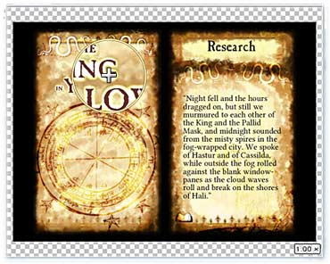

# Preview area

When editing a game component, the preview area shows how the finished component will look. For components with more than one face (such as front and back sides), the previewer will include a tab for each face so you can choose which face to preview.

## Navigating around a component

Initially the component will be sized to fit nicely in the preview area. You can zoom in and out by spinning the mouse wheel while the pointer is over the preview. The current zoom level is shown in the lower right corner. When zoomed in, you can drag with the left mouse button to pan around. To return to the default zoom, right click the mouse.

As you move the pointer over the preview, a circular *loupe* will appear under the pointer if you are viewing the preview at less than the actual size it was drawn at. The loupe shows the area under it at full size. (Increasing the preview quality setting generally causes the preview's actual size to increase.)

## Quality settings

You can change the quality of previews from the **View** menu. On most systems, one of the two highest settings will work best. On low end computers you may want to lower this setting for a smoother workflow. Be aware that, depending on your graphics hardware, the lowest setting can actually be slower than the medium setting.

## Backdrop

You can change the background behind the preview area using **View/Preview Backdrop**. The available options are **Dark** (the default), **Light**, and **Checked**. The **Checked** option (shown above) can be useful when working with shaped or translucent components.

## Ink Saver

You can switch to a simplified rendering of your game component using **View/Ink Saver**. By default, this renders only the component's text and shapes on a white background. (Some components may optionally render other elements.) Note that this option is global, and also affects printing and exporting.