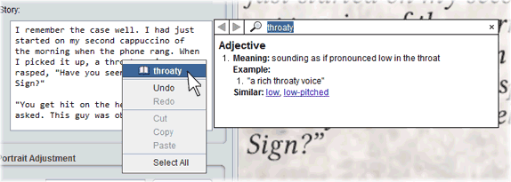
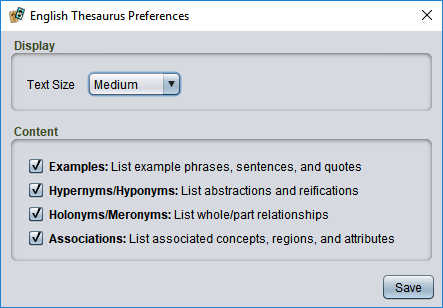

# Lexical look-up services

Strange Eons does not have support for a thesaurus built in, but it includes a feature called *lexical look-up services* that allows plug-ins to add this functionality. Note that the services that will be offered for a particular component will be tied to the [game language](um-language-settings.md). If you are not seeing the a service when you expect one, check this setting.

## General use

When a look-up service is installed, you can look up words in any field that supports spelling checking. Right click on a correctly spelled word to look it up. At the top of the pop-up menu you will see a menu item that shows a book icon and the word under the pointer. Selecting this will display the look-up service results for the word. If the menu item is disabled (greyed out), then the look-up service does not have an entry for that word.

Installed services are listed in the **[Preferences](um-ui-preferences.md)** dialog, in the **Language** section. Some services have configurable settings; these can be edited by selecting them in the service list and choosing **Service Preferences**.

## English

For English, there is an **English Thesaurus** plug-in available from the catalogue:  
`eonscat:6ff316b8-1dc7-4ca5-af50-e0397e212729`

When looking up a word, clicking on a link in the pop-up window will look up that word in turn. (The arrow buttons in the top left corner allow you to move through your word history.) If you <kbd>Ctrl</kbd> + click a link, you will replace the looked-up word in the text you are editing. You can enter words to look up directly in the search box. Press <kbd>Enter</kbd> in the box to look up a word, or <kbd>Ctrl</kbd> + <kbd>Enter</kbd> to replace the original text.

The thesaurus uses a powerful lexical database called WordNet. It can provide much more than synonyms and antonyms. You can change the kinds of information displayed in the **Service Preferences** (see above).

The thesaurus always displays definitions, synonyms, and antonyms where available. You can control the display of:

**Examples:** Many meanings have example sentences to aid understanding.

**Hyponyms and hypernyms:** Words that have a similar meaning but are more general or more specific. For example, "intellectual" is a more general term than "genius", while "prodigy" is more specific.

**Holonyms and meronyms:** Words that are parts of the chosen word, or that the chosen word is a part of. For example, the foot is part of the human body, while the instep of part of the foot.

**Associations:** Various semantic relationships related to the chosen word. For example, cell is *associated* with the subject of biology while sushi is *associated* with the region of Japan.