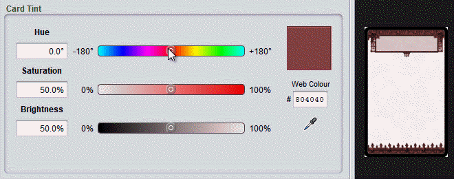

# Tints

Some types of components use tinting. Tinting recolours selected parts of the card design to create design variants.

Tinted components include a tint editing panel. It works like a colour selector: you choose a base colour and the component's features will be recoloured to match.The overall colour of the result will be similar to the selected base colour, though not exact since details of the original design are retained.

