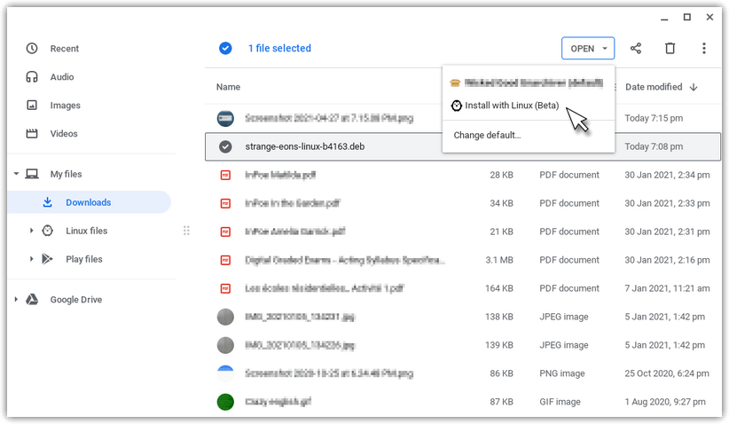
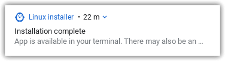
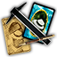

# Installation on Chromebooks

This page describes the steps needed to install Strange Eons on Chromebooks.

## System requirements

Not all Chromebooks are supported. Your Chromebook must support the [Linux (Beta) feature](https://support.google.com/chromebook/answer/9145439?hl=en), and it must use a compatible processor (64-bit Intel or ARM).

At least 2 GB of RAM is recommended.

## Installation steps

1. If you have not already done so, [enable Linux (Beta)](https://support.google.com/chromebook/answer/9145439?hl=en).

2. [Download the latest version of Strange Eons for Linux systems.](http://cgjennings.ca/eons/download/update.html?platform=nix) This version is provided as a Debian package (`.deb`). Choose the download that matches your device's processor type: amd64 for Intel-compatible processors, or arm64 for ARM processors.

3. In your **Downloads** list, select the downloaded file. Then click **Open ▾**  and choose **Install with Linux (Beta)**.
   
    
    
4. Installation will begin; it may take several minutes and it may appear "stuck" from time to time. Be patient. A notification will appear once installation is complete.
   
    
    
5. An icon for the app should be added to the Launcher automatically. In the corner of the screen, choose the Launcher **◯**, then the upward-pointing arrow ([more information](https://support.google.com/chromebook/answer/6206362?hl=en)). Choose the Strange Eons app in the list . If for some reason it is not listed, you can also start the app by opening a terminal window and entering the command `strangeeons`.
   
    
    
6. After installation, it is safe to delete the downloaded `.deb` package.

## Troubleshooting

Installation problems are rare but frustrating.

If unpacking the `.deb` package fails, it may mean that the file did not download correctly. Try downloading it again. If it fails again, it may be corrupt on the server: [please report the issue](https://cgjennings.ca/contact.html).

Since the Chromebook version is Linux-based, you can also try the [Linux installation guide](um-install-linux.md).

For issues that occur after installation, such as failing to start at the splash screen, refer to the [Troubleshooting](um-install-troubleshooting.md) page.