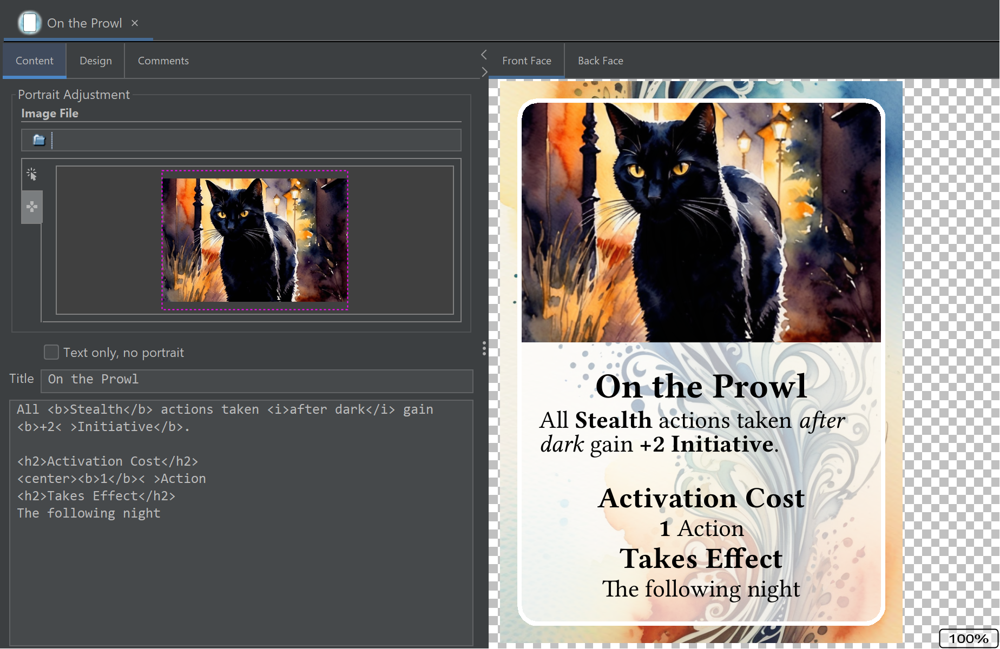

# Welcome!
Strange Eons is a design tool for creating custom content for board, card, and role-playing games. Use it to expand existing games with your own content, or as a tool for making new games from scratch.

This **quick start guide** will have you making new stuff in a couple of minutes. Let's go!

## Downloading and installing
To get started, [download](http://cgjennings.ca/eons/download/update.html) the latest version of Strange Eons for your computer. For help with installation, refer to the page for your specific platform:

[Windows](um-install-win.md)  
[macOS](um-install-mac.md)  
[Linux and other platforms](um-install-other.md)

## Your first card

Out of the box, Strange Eons has support for making generic cards and tokens, as well as decks of components. Generic cards offer a quick way to get started that you can build on at your own pace. They are offered in a wide variety of sizes that match common sizes offered by card printing services, so it’s up to you whether you print and hand cut your designs yourself or send them off to be professionally printed. Let’s make one now!

> If you are running Strange Eons for the first time, you might be prompted to install some plug-ins or take other steps. Don’t worry about that just yet! Choose **No** for now. We’ll come back to that at the end of this introduction.

1. Choose the **File/New** menu item to be presented with a dialog that lets you choose from different kinds of components.
2. Choose the **Everything** category to get a complete list. Since you haven’t installed additional plug-ins, there will only be 20 or so options, and most of these will be generic cards in various sizes.
3. Choose any size you like; it doesn’t matter for the purpose of this introduction. They all work the same and have the same features. If you really can’t decide, just pick the **Poker** size.
4. Choose **Create**.

The dialog will close, and a new tab will open with your card. It will look something, though not exactly, like this:

### Editing your card

**On the left side,** there are controls that let you edit the picture (called a *portrait* displayed on the card), along with the text of the title and the card’s rules. If you don’t want a portrait, you can choose the **Text only** option to remove it and gain more space for your rule text.

> You may notice the use of *markup* in the text body. These HTML-like *tags* can produce a variety of effects, but one of the most common is to modify the text style. For example, if you write `here is some <b>important</b> text`, the word *important* will be rendered in **bold**. There are a [wide range of built-in markup tags](um-gc-markup.md), and plug-ins can define new ones. (For example, they might define tags to insert game-specific icons.)

To change the portrait image, you can drag-and-drop a new picture your platform’s file explorer onto the portrait area (near the top of the left side). The initial size of the image is chosen automatically to cover the portrait area on the card, but you can left click and drag inside the purple frame to move it around, and drag at the corners or use the mouse wheel to change the size. For more precise control, click on the little tab to the left of the portrait area to switch to precision editing where you can move a step at a time or enter exact values.

**On the right side,** you will see a preview of what your editing choices will produce. You can zoom in or out using the mouse wheel over this area, and drag the portrait around with the left button to see different parts if it doesn’t all fit at once. A right click will reset the zoom and pan so you can see the whole thing at once. The tabs at the top let you switch between whether the front or back face (side) of the card is shown.

> It is most common for game components to have only two of these tabs: a front and back face. But a few kinds of game components will have more than two tabs, or just one.

### Customizing the card design

A game component designed to go with a specific game will generally have a fixed design. The card back, fonts, and other decorative elements will be chosen to match the game in question. With generic cards, you have extra flexibility.

Click on the **Design** tab at the top of the left side to get a new set of editing options. You can choose which font family to use for the main (body) text and for headings like the title. You can choose a base font size, in points. This is the size used for body text. For headings, an appropriate size is chosen automatically from the base size.

> **Note:** Because Strange Eons will try to *shrink* text that is too long to make it fit, the actual size can be smaller than what you select.

The subpanels marked **Front face design** and **Back face design** work like the portrait editor, but they let you change the designs used for the background of the front face, and for the card back.

> When setting a custom front or back design, you might notice that the initial size that is selected when you change the image is slightly bigger than the card face. This is because all generic cards include an industry standard 3&nbsp;mm [bleed margin](um-deck-pubmarks.md#bleed-margins). If there is any chance you will have your cards professionally printed, then you should be careful about changing the default size and position. To see what the full card design will look like, including the bleed margin area, choose **View/Edge Finish/Include Bleed Margin**.

The **Portrait goes under design** option needs some explanation. You can use this if you want to use a custom front face design that includes a decorative border or other complex shape around the portrait. To do this, create a design that includes transparency (an alpha channel) where you want the portrait to show through and select the “under” option so that the portrait is drawn first and the design (with transparent cutout) is drawn overtop of it. The location and size of the portrait won’t change, so it may be useful to export a high resolution image of the card with a portrait but no text. This will help you to create a design that lets the portrait show through exactly as you want it to.

### Changing the size

A feature of all of the generic cards is that you are not locked into a card size. You can convert a card of any size into a card of another size without losing the contents of the card. Just choose **Edit/Convert to/Other card size** and then choose the desired size. You might want to make a few minor adjustments, such as touching up the text size or adjusting the portrait to better focus on the subject, but all of the original content and design choices will be transferred.

> If you created a custom card front design with a cutout for the portrait to show through, you may need to adjust the design to match the new size if it has a different aspect ratio.

### Next steps

Now that you have one card, here are a few things you can do:

1. [Print it out as a one off](um-gc-print.md) using **File/Print**.
2. [Create image files to share with friends or prepare it for a print service](um-gc-export.md) with **File/Export**.
3. Make some more cards with the same basic size and design to build up a whole [deck](um-deck-intro.md).

## Adding support for specific games

As promised, we’ll end this introduction by explaining how to add support for components from specific games. If you read somewhere that you could make cards for your favourite game with a plug-in for Strange Eons, you’ll want to read on.

### Open the plug-in catalogue

Choose the **Toolbox/Catalogue** menu item to open the plug-in catalogue. Locate the plug-in(s) you are looking for, choose their check box so that they are selected, then choose **Download and Install**.

> No plug-in for the game you want? You can always [make one yourself](dm-index.md). For now, just pick something so you can continue with the guide and get a sense of what's possible. (Try Arkham Horror!)

If the plug-in you want is not listed in the catalogue, you may need to download it directly from the plug-in author. *Exercise caution, as unknown plug-ins are a security risk.* You may want to recommend that the plug-in author [submit it for inclusion in the catalogue](https://strangeeons.cgjennings.ca/upload.html), as this makes it easier for users to find consistently.

### Relaunch to finish plug-in installation

After it downloads your plug-ins, Strange Eons will want to [relaunch](um-plugins-relaunching.md) (quit and restart). Let it.

### Finding your game components

When it starts back up, you will be ready to [create game components](um-gc-intro.md) for the selected game(s). Choose the **File/New** menu item, and you'll be shown a dialog of available components. Just like you did above, look through the categories and pick the kind of component you want. Then choose **Create**. If you get lost, try the **Everything** category. You can filter the listed components by name, or choose to show only a specific game, using the search field.

## Create!

Your new component will appear in an editor in the middle of the app window. Just as with the generic card described above, on the left side you'll find editing controls, and on the right side the [preview area](um-gc-preview.md) shows you what the result will look like. Play around with the editing controls and watch the preview area change.

