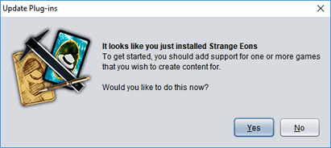
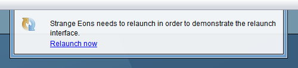
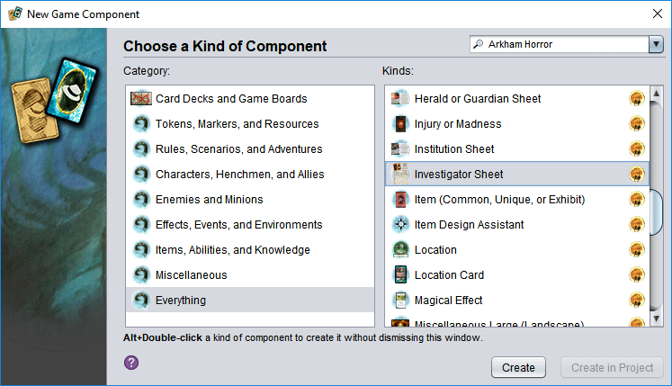

# Welcome!
Strange Eons is a design tool for creating custom content for board, card, and role-playing games. Use it to expand existing games with your own content, or as a tool for making new games from scratch.

This **super duper quick start guide** will have you making new stuff in a couple of minutes. Let's go!

## Downloading and installing
To get started, [download](http://cgjennings.ca/eons/download/update.html) the latest version of Strange Eons for your computer. For help with installation, refer to the page for your specific platform:

[Windows](um-install-win.md)  
[macOS](um-install-mac.md)  
[Linux and other platforms](um-install-other.md)

## Adding support for specific games

Out of the box, Strange Eons will let you make [decks](um-deck-intro.md) and generic tokens. It doesn't support any specific game. That's why the first time you run it, it will suggest that you install some *plug-ins*.

Agree and it will show you a [catalogue](um-plugins-catalogue.md) of options to choose from. Pick some and then click **Download and Install**.

> No plug-in for the game you want? You can always [make one yourself](dm-index.md). For now, just pick something so you can continue with the guide and get a sense of what's possible. (Try Arkham Horror!)

## Relaunch to finish plug-in installation

After it downloads your plug-ins, Strange Eons will want to [relaunch](um-plugins-relaunching.md) (quit and restart). Let it.

## Your first game component

When it starts back up, you will be ready to create your first [game component](um-gc-intro.md). Choose the **File/New** menu item, and you'll be shown a dialog of available components. Look through the categories and pick the kind of component you want. (If you get lost, try the **Everything** category.) Then choose **Create**.

## Create!

Your new component will appear in an editor in the middle of the app window. On the left side you'll find editing controls, and on the right side the [preview area](um-gc-preview.md) shows you what the result will look like. Try playing around with the editing controls and watch the preview area change.

## What next?
OK, so you have created something and you are happy with it. Now what? Here are a few suggestions to start with:

* [save it so you can edit it some more later](um-ui-menu.md#save)
* [print it](um-gc-print.md)
* [export it (turn it into images)](um-gc-export.md)
* [make some more components and combine them into a deck](um-deck-intro.md)

Go ahead and explore. You can [come back anytime](um-index.md) to learn more.